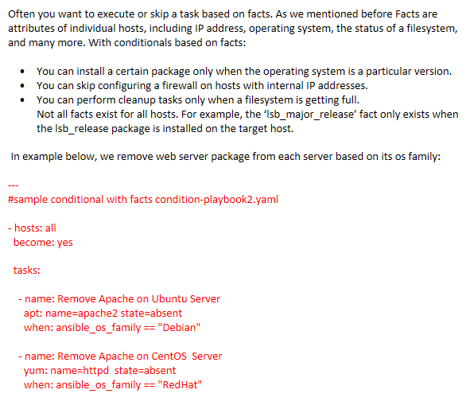

[[Catagories]] 

Conditionals are used where one needs to run a specific step based on a condition.

~~~~

#Tsting

---

- hosts: all

   vars:

      test1: "Hello Vivek"

   tasks:

      - name: Testing Ansible variable

      debug:

         msg: "Equals"

         when: test1 == "Hello Vivek"

  

~~~~

  

# Conditions based on registered variables:

  

Often in a playbook you want to execute or skip a task based on the outcome of an earlier task. To create a conditional based on a registered variable:  

  

  1. Register the outcome of the earlier task as a variable.

  2. Create a conditional test based on the registered variable.You create the name of the registered variable using the register keyword. A registered variable always contains the status of the task that created it as well as any output that task generated. You can use registered variables in conditional , also it is possible to access the string contents of the registered variable :

  
  
  

## sample playbook for conditionals condition-playbook1.yaml

~~~~

---

- hosts: all

  become: yes

  

  tasks:

    - name: install apache2

      apt: name=apache2 state=latest

      ignore_errors: yes

      register: results

  

    - name: install httpd

      yum: name=httpd state=latest

      failed_when: "'FAILED' in results"

~~~~

  
  

play scope: Ansible playbook supports defining the variable in two forms, Either a Single liner variable declaration like we do in any common programming languages or as a separate file with full of variables and values like a properties file.

  

  • vars to define inline variables within the playbook

  • vars_files to import files with variables  

 Lets repeat previous example by moving variables in to the playbook ,It can be done with vars like this:

  
  

## sample firewall playbook with vars firewall-playbook.yaml

  

play scope: Ansible playbook supports defining the variable in two forms, Either a Single liner variable declaration like we do in any common programming languages or as a separate file with full of variables and values like a properties file.

  

  • vars to define inline variables within the playbook

  • vars_files to import files with variables  

 Lets repeat previous example by moving variables in to the playbook ,It can be done with vars like this:

  
  
  
  

## sample firewall playbook with vars firewall-playbook.yaml

~~~~

---

  name: Set Firewall Configurations

  hosts: centos

  become: true

  vars:

    http_port: 8080

    snmp_port: 161-162

    internal_ip_range: 192.168.100.0

  tasks:

    -  firewalld:

         service: https

         permanent: true

         state: enabled

  

    -  firewalld:

         port: "{{ http_port }}/tcp"

         permanent: true

         state: disabled

  

    -  firewalld:

         port: "{{ snmp_port }}/udp"

         permanent: true

         state: disabled

  

    -  firewalld:

         source: "{{ internal_ip_range }}/24"

         permanent: true

         zone: internal

         state: enabled

~~~~

~~~~

---

  

  name: Set Firewall Configurations

  hosts: centos

  become: true

  vars:

    http_port: 8080

    snmp_port: 161-162

    internal_ip_range: 192.168.100.0

  tasks:

    -  firewalld:

         service: https

         permanent: true

         state: enabled

  

    -  firewalld:

         port: "{{ http_port }}/tcp"

         permanent: true

         state: disabled

  

    -  firewalld:

         port: "{{ snmp_port }}/udp"

         permanent: true

         state: disabled

  

    -  firewalld:

         source: "{{ internal_ip_range }}/24"

         permanent: true

         zone: internal

         state: enabled

~~~~

  

If you want to keep the variables in a separate file and import it with vars_filesYou have to first save the variables and values in the same format you have written in the playbook and the file can later be imported using vars_files like this:

  

# vars.yaml

~~~~

http_port: 8080

snmp_port: 161-162

internal_ip_range: 192.168.100.0

~~~~

  
  
  

## sample firewall playbook with var_files firewall-playbook.yaml

~~~~

---

  name: Set Firewall Configurations

  hosts: centos

  become: true

  vars_files:

    - vars.yaml

  tasks:

    -  firewalld:

         service: https

         permanent: true

         state: enabled

  

    -  firewalld:

         port: "{{ http_port }}/tcp"

         permanent: true

         state: disabled

  

    -  firewalld:

         port: "{{ snmp_port }}/udp"

         permanent: true

         state: disabled

  

    -  firewalld:

         source: "{{ internal_ip_range }}/24"

         permanent: true

         zone: internal

         state: enabled

~~~~

~~~~

[user1@controller demo-var]$ ansible-playbook  firewall-playbook.yaml

~~~~

  

~~~~

Jinja2 templating : the format {{ }} we are using to use variables is called Jinja2 templating. Be careful about Quotes :

  • source: {{ http_port }}

  • source: "{{ http_port }}"

  • source: " Somthing {{ http_port }} Somthing "

~~~~

  
  

Variable in playbooks are very similar to using variables in any programming language. It helps you to use and assign a value to a variable and use that anywhere in the playbook. One can put conditions around the value of the variables and accordingly use them in the playbook.

  
  

## Example

  

~~~~

- hosts : <your hosts>

vars:

tomcat_port : 8080

~~~~

In the above example, we have defined a variable name tomcat_port and assigned the value 8080 to that variable and can use that in your playbook wherever needed.

  
  

Now taking a reference from the example shared. The following code is from one of the roles (install-tomcat) −

  

~~~~

block:

   - name: Install Tomcat artifacts

      action: >

      yum name = "demo-tomcat-1" state = present

      register: Output

   always:

      - debug:

         msg:

            - "Install Tomcat artifacts task ended with message: {{Output}}"

            - "Installed Tomcat artifacts - {{Output.changed}}"

~~~~

Here, the output is the variable used.

  
  

Let us walk through all the keywords used in the above code −

  
  

block − Ansible syntax to execute a given block.

  
  

name − Relevant name of the block - this is used in logging and helps in debugging that which all blocks were successfully executed.

  
  

action − The code next to action tag is the task to be executed. The action again is a Ansible keyword used in yaml.

  
  

register − The output of the action is registered using the register keyword and Output is the variable name which holds the action output.

  
  

always − Again a Ansible keyword , it states that below will always be executed.

  
  

msg − Displays the message.

  
  

Usage of variable - {{Output}}

This will read the value of variable Output. Also as it is used in the msg tab, it will print the value of the output variable.

  
  

Additionally, you can use the sub properties of the variable as well. Like in the case checking {{Output.changed}} whether the output got changed and accordingly use it.

  
  

## Conditionals based on ansible_facts

  

Often you want to execute or skip a task based on facts. As we mentioned before Facts are attributes of individual hosts, including IP address, operating system, the status of a filesystem, and many more. With conditionals based on facts:

  

  • You can install a certain package only when the operating system is a particular version.

  • You can skip configuring a firewall on hosts with internal IP addresses.

  • You can perform cleanup tasks only when a filesystem is getting full.

  Not all facts exist for all hosts. For example, the ‘lsb_major_release’ fact only exists when the lsb_release package is installed on the target host.

 In example below, we remove web server package from each server based on its os family:

  

---

## sample conditional with facts condition-playbook2.yaml

~~~~

---

- hosts: all

  become: yes

  

  tasks:

  

    - name: Remove Apache on Ubuntu Server

      apt: name=apache2 state=absent

      when: ansible_os_family == "Debian"

  

    - name: Remove Apache on CentOS  Server

      yum: name=httpd  state=absent

      when: ansible_os_family == "RedHat"

~~~~

  

# Loops

  

Below is the example to demonstrate the usage of Loops in Ansible.

  
  

The tasks is to copy the set of all the war files from one directory to tomcat webapps folder.

  
  

Most of the commands used in the example below are already covered before. Here, we will concentrate on the usage of loops.

  
  

Initially in the 'shell' command we have done ls *.war. So, it will list all the war files in the directory.

  
  

Output of that command is taken in a variable named output.

  
  

To loop, the 'with_items' syntax is being used.

  
  

with_items: "{{output.stdout_lines}}" --> output.stdout_lines gives us the line by line output and then we loop on the output with the with_items command of Ansible.

  
  

Attaching the example output just to make one understand how we used the stdout_lines in the with_items command.

  

~~~~

---

#Tsting

- hosts: tomcat-node

   tasks:

      - name: Install Apache

      shell: "ls *.war"

      register: output

      args:

         chdir: /opt/ansible/tomcat/demo/webapps

      - file:

         src: '/opt/ansible/tomcat/demo/webapps/{{ item }}'

         dest: '/users/demo/vivek/{{ item }}'

         state: link

      with_items: "{{output.stdout_lines}}"

  

~~~~

  
  
  
  

# Multi-package Installation with loops

  

When automating server setup, sometimes you’ll need to repeat the execution of the same task using different values. For instance, you may need to install  multiple packages , or ... .  

  
  
  

## sample playbook install packages noloop-playbook.yaml

~~~~

---

- hosts: ubuntu

  become: yes

  

  tasks:

    - yum: name=vim state=present

    - yum: name=nano state=present

    - yum: name=apache2 state=present

~~~~

  
  

## Loops with_items

~~~~

[user1@controller demo-var]$ cat loop-playbook1.yaml

~~~~

  

## sample loop with with_itemp loop-playbook1.yaml

~~~~

---

- hosts: ubuntu

  become: yes

  

  tasks:

   - name: install pakcages

     apt: name={{ item }} update_cache=yes state=latest

     with_items:

      - vim

      - nano

      - apache2

  
  

[user1@controller demo-var]$ ansible-playbook loop-playbook1.yaml

  

PLAY [ubuntu] *********************************************************************************

  

TASK [Gathering Facts] ************************************************************************

ok: [ubuntu]

  

TASK [install pakcages] ***********************************************************************

changed: [ubuntu] => (item=[u'vim', u'nano', u'apache2'])

  

PLAY RECAP ************************************************************************************

ubuntu                     : ok=2    changed=1    unreachable=0    failed=0    skipped=0    rescued=0    ignored=0

  
  

[user1@controller demo-var]$ ansible-playbook loop-playbook1.yaml

  

PLAY [ubuntu] ***************************************************************************************************************************

  

TASK [Gathering Facts] ******************************************************************************************************************

ok: [ubuntu]

  

TASK [install pakcages] *****************************************************************************************************************

ok: [ubuntu] => (item=[u'vim', u'nano', u'apache2'])

  

PLAY RECAP ******************************************************************************************************************************

ubuntu                     : ok=2    changed=0    unreachable=0    failed=0    skipped=0    rescued=0    ignored=0

~~~~

  
  

## Loops with_file

  
  

## sample loop with with_file loop-playbook2.yaml

  

~~~~

---

  

- hosts: ubuntu

  become: yes

  

  tasks:

   - name: show file(s) contents

     debug: msg={{ item }}

     with_file:

      - myfile1.txt

      - myfile2.txt

  
  

[user1@controller demo-var]$ cat myfile1.txt

This is myfile1.txt, first line :-)

[user1@controller demo-var]$

[user1@controller demo-var]$ cat myfile2.txt

This is myfile2.txt, first line :-0

  
  

[user1@controller demo-var]$ ansible-playbook loop-playbook2.yaml

  

PLAY [ubuntu] ***************************************************************************************************************************

  

TASK [Gathering Facts] ******************************************************************************************************************

ok: [ubuntu]

  

TASK [show file(s) contents] ************************************************************************************************************

ok: [ubuntu] => (item=This is myfile1.txt, first line :-)) => {

    "msg": "This is myfile1.txt, first line :-)"

}

ok: [ubuntu] => (item=This is myfile2.txt, first line :-0) => {

    "msg": "This is myfile2.txt, first line :-0"

}

  

PLAY RECAP ******************************************************************************************************************************

ubuntu                     : ok=2    changed=0    unreachable=0    failed=0    skipped=0    rescued=0    ignored=0

  

~~~~

## Include statement

~~~~  

include plays and tasks

Using include statements is our trick to split a large playbook into smaller pieces. We can also move task to a separate file and use include statement to include tasks from:

  

  

[user1@controller demo-file]$ cat update-systems-play.yaml

---

  

- hosts: all

  become: yes

  

  tasks:

   - name: update apt

     apt: upgrade=dist update_cache=yes

     when: ansible_os_family == "Debian"

  

   - name: update yum

     yum: name=* state=latest update_cache=yes

     when: ansible_os_family == "RedHat"  

  

[user1@controller demo-file]$ cat install-web-task.yaml

---

  

- name: install on debian

  apt: name=apache2 state=latest update_cache=yes

  when: ansible_os_family == "Debian"

  

- name: install on centos

  yum: name=httpd state=latest update_cache=yes

  when: ansible_os_family == "RedHat"

  

- name: start debian service

  service: name=apache2 enabled=yes state=started

  when: ansible_os_family == "Debian"

  

- name: start centos service

  service: name=httpd enabled=yes state=started

  when: ansible_os_family == "RedHat"

  

[user1@controller demo-file]$ cat include-playbook.yaml

---

  

- include: update-systems-play.yaml

  

- hosts: all

  become: yes

  tasks:

   - include: install-web-task.yaml

~~~~

## Loops with sequence

~~~~

---

  

# sample loop with with_sequenece loop-playbook3.yaml

  

- hosts: ubuntu

  become: yes

  

  tasks:

   - name: show file(s) contents

     debug: msg={{ item }}

     with_sequence: start=1 end=5

  

[user1@controller demo-var]$ ansible-playbook loop-playbook3.yaml

  

PLAY [ubuntu] ***************************************************************************************************************************

  

TASK [Gathering Facts] ******************************************************************************************************************

ok: [ubuntu]

  

TASK [show file(s) contents] ************************************************************************************************************

ok: [ubuntu] => (item=1) => {

    "msg": "1"

}

ok: [ubuntu] => (item=2) => {

    "msg": "2"

}

ok: [ubuntu] => (item=3) => {

    "msg": "3"

}

ok: [ubuntu] => (item=4) => {

    "msg": "4"

}

ok: [ubuntu] => (item=5) => {

    "msg": "5"

}

  

PLAY RECAP ******************************************************************************************************************************

ubuntu                     : ok=2    changed=0    unreachable=0    failed=0    skipped=0    rescued=0    ignored=0

  

~~~~

[[Catagories]] 