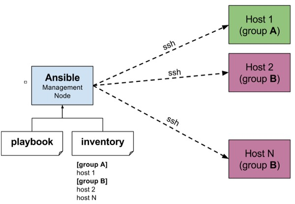

[[Catagories]] 

## What is Configuration Management      

  

• Configuration management in terms of Ansible means that it maintains configuration of the product performance by keeping a record and updating detailed information which describes an enterprise’s hardware and software.  

  

• Such information typically includes the exact versions and updates that have been applied to installed software packages and the locations and network addresses of hardware devices. For e.g. If you want to install the new version of WebLogic/WebSphere server on all of the machines present in your enterprise, it is not feasible for you to manually go and update each and every machine.  

  

• You can install WebLogic/WebSphere in one go on all of your machines with Ansible playbooks and inventory written in the most simple way. All you have to do is list out the IP addresses of your nodes in the inventory and write a playbook to install WebLogic/WebSphere. Run the playbook from your control machine & it will be installed on all your nodes.                    

  

## How Ansible Works?              

  

The picture given below shows the working of Ansible.

Ansible works by connecting to your nodes and pushing out small programs, called "Ansible modules" to them. Ansible then executes these modules (over SSH by default), and removes them when finished. Your library of modules can reside on any machine, and there are no servers, daemons, or databases required.  

  

  

• The management node in the above picture is the controlling node (managing node) which controls the entire execution of the playbook. It’s the node from which you are running the installation. The inventory file provides the list of hosts where the Ansible modules needs to be run and the management node does a SSH connection and executes the small modules on the hosts machine and installs the product/software.  

  

• Beauty of Ansible is that it removes the modules once those are installed so effectively it connects to host machine , executes the instructions and if it’s successfully installed removes the code which was copied on the host machine which was executed.

  
  

## Variables

  

Just like any other Scripting or programming language we can use variable in ansible playbooks. Variables could store different values for different items. Variables help us to have shorter and more readable playbooks. Imagine we want to apply patches on hundreds of servers, the only thing we need is single playbook with some variables for all hundred servers! It's the variables that store information about different IP addresses, host names, username or passwords,...

  

## Naming Variables

~~~~

Variable names must start with a letter, and they can only contain letters, numbers, and underscores. The following table illustrates the difference between invalid and valid variable names.

INVALID VARIABLE NAMES

VALID VARIABLE NAMES

web server

web_server

remote.file

remote_file

1st file

file_1, file1

remoteserver$1

remote_server_1, remote_server1

~~~~

  

## Inventory

  

Default:

  

~~~~

/etc/ansible/hosts:

  

[root@control1 ~]# cat /etc/ansible/hosts

# This is the default ansible 'hosts' file.

#

# It should live in /etc/ansible/hosts

#

#   - Comments begin with the '#' character

#   - Blank lines are ignored

#   - Groups of hosts are delimited by [header] elements

#   - You can enter hostnames or ip addresses

#   - A hostname/ip can be a member of multiple groups

  

# Ex 1: Ungrouped hosts, specify before any group headers.

  

## green.example.com

## blue.example.com

## 192.168.100.1

## 192.168.100.10

  

# Ex 2: A collection of hosts belonging to the 'webservers' group

  

## [webservers]

## alpha.example.org

## beta.example.org

## 192.168.1.100

## 192.168.1.110

  

# If you have multiple hosts following a pattern you can specify

# them like this:

  

## www[001:006].example.com

  

# Ex 3: A collection of database servers in the 'dbservers' group

  

## [dbservers]

##

## db01.intranet.mydomain.net

## db02.intranet.mydomain.net

## 10.25.1.56

## 10.25.1.57

  

# Here's another example of host ranges, this time there are no

# leading 0s:

  

## db-[99:101]-node.example.com

  

~~~~

  

## Inventory File samples

  

~~~~

#Sample Inventory File

server1.company.com

192.168.10.2

  

#Grouping servers

server1.company.com

192.16.10.2

  

[mail]

192.168.10.3

server4.company.com

  

[db]

server5.company.com

server6.company.com

~~~~

  

## Using alias ##

  

~~~~

  

web1 ansible_host=server1.company.com

  

db1 ansible_host=server2.company.com

  

mail1 ansible_host=192.168.10.3

  

web2 ansible_host=server4.company.com

  

~~~~

  

Create Inventory

  

~~~~

[user1@controller ~]$ mkdir demo-inventory

[user1@controller ~]$ cd demo-inventory/

[user1@controller demo-inventory]$ ll

total 0

[user1@controller demo-inventory]$ vim inventory.txt

[user1@controller demo-inventory]$ cat inventory.txt

ubuntu  

~~~~

  

The list of machines in the inventory can be found out through the ansible --list-hosts all command :

  

~~~~

[user1@controller demo-inventory]$ ansible --list-hosts all -i inventory.txt

  hosts (1):

    ubuntu

  

We can specify a different inventory file at the command line using the -i <path> option.

 And now, First Ansible Task! You can ping all of your inventory machines using the following command:

  

[user1@controller demo-inventory]$  ansible ubuntu -m ping -i inventory.txt

ubuntu | SUCCESS => {

    "ansible_facts": {

        "discovered_interpreter_python": "/usr/bin/python3"

    },

    "changed": false,

    "ping": "pong"

}

  

so that confirms that our ansible controller can successfully communicate or connect to the target machines. lets update inventory.txt file by adding second target:

  

[user1@controller demo-inventory]$ cat inventory.txt

ubuntu

centos

  

and lets  see the results:

  

[user1@controller demo-inventory]$ ansible all  -m ping -i inventory.txt

centos | SUCCESS => {

    "ansible_facts": {

        "discovered_interpreter_python": "/usr/bin/python"

    },

    "changed": false,

    "ping": "pong"

}

ubuntu | SUCCESS => {

    "ansible_facts": {

        "discovered_interpreter_python": "/usr/bin/python3"

    },

    "changed": false,

    "ping": "pong"

}

~~~~

There is a group that Ansible creates by default and that's called theall group. The all group is a built-in group that Ansible creates and it has all the servers in our inventory file part of that group.

If there is a problem with python on one of your target nodes, you can send a raw module (we will talk about it later):

~~~~

[user1@controller demo-inventory]$ ansible -m raw -a "/usr/bin/uptime" -i inventory.txt all

centos | CHANGED | rc=0 >>

 10:12:35 up 23:33,  2 users,  load average: 0.00, 0.01, 0.05

Shared connection to centos closed.

  

ubuntu | CHANGED | rc=0 >>

 22:42:35 up 19:20,  2 users,  load average: 0.00, 0.00, 0.00

Shared connection to ubuntu closed.

  

And if you like to see which python version has been installed on remote machines use shell module(we will talk about it later):

  

[user1@controller demo-inventory]$ ansible -m shell -a "python -V" -i inventory.txt all

centos | CHANGED | rc=0 >>

Python 2.7.5

[DEPRECATION WARNING]: Distribution Ubuntu 18.04 on host ubuntu should use

/usr/bin/python3, but is using /usr/bin/python for backward compatibility with

prior Ansible releases. A future Ansible release will default to using the

discovered platform python for this host. See https://docs.ansible.com/ansible/

2.9/reference_appendices/interpreter_discovery.html for more information. This

feature will be removed in version 2.12. Deprecation warnings can be disabled

by setting deprecation_warnings=False in ansible.cfg.

ubuntu | CHANGED | rc=0 >>

Python 2.7.17

  

Deprecation warnings can be disabled by setting deprecation_warnings=False in ansible.cfg

~~~~

Now that you know about inventory files let put our targets nodes information on /etc/ansible/hosts :

~~~~

[root@controller ~]# tail -n7 /etc/ansible/hosts

  

ubuntu

centos

  

[lab]

ubuntu

centos

  

~~~~

[[Catagories]] 