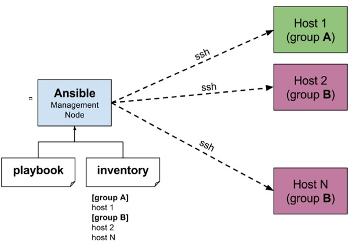

[[Catagories]] 

• Ansible is simple open source IT engine which automates application deployment, intra service orchestration, cloud provisioning and many other IT tools. Ansible is easy to deploy because it does not use any agents or custom security infrastructure. 
	
• Ansible uses playbook to describe automation jobs, and playbook uses very simple language i.e. YAML (It’s a human-readable data serialization language & is commonly used for configuration files, but could be used in many applications where data is being stored)which is very easy for humans to understand, read and write. Hence the advantage is that even the IT infrastructure support guys can read and understand the playbook and debug if needed (YAML – It is in human readable form). 

• Ansible is designed for multi-tier deployment. Ansible does not manage one system at time, it models IT infrastructure by describing all of your systems are interrelated. Ansible is completely agentless which means Ansible works by connecting your nodes through ssh(by default). But if you want other method for connection like Kerberos, Ansible gives that option to you. 

• After connecting to your nodes, Ansible pushes small programs called as “Ansible Modules”. Ansible runs that modules on your nodes and removes them when finished. Ansible manages your inventory in simple text files (These are the hosts file). Ansible uses the hosts file where one can group the hosts and can control the actions on a specific group in the playbooks.             




## Sample Hosts File 

This is the content of hosts file −      
~~~
#File name: hosts
#Description: Inventory file for your application. Defines machine type abc
node to deploy specific artifacts
~~~ 

# Defines machine type def node to upload metadata. 
~~~
[abc-node]
#server1 ansible_host = <target machine for DU deployment> ansible_user = <Ansible
user> ansible_connection = ssh
server1 ansible_host = <your host name> ansible_user = <your unix user>
ansible_connection = ssh
[def-node]
#server2 ansible_host = <target machine for artifact upload>
ansible_user = <Ansible user> ansible_connection = ssh
server2 ansible_host = <host> ansible_user = <user> ansible_connection = ssh 
~~~

# 3 Node Set-Up 
~~~~
Step 1: Install Python on RHEL 8 / CentOS 8

	• sudo dnf -y install python3-pip  
	
	• sudo pip3 install --upgrade pip
For Python2 users you have to install python2-pip
	• sudo dnf -y install python2-pip  
	
	• sudo pip2 install --upgrade pip 
~~~~ 

## Step 2: Install Ansible on RHEL 8 / CentOS 8 

There are two methods from which you can install Ansible on CentOS 8 / RHEL 8.

Method 1: Install Ansible on CentOS 8 / RHEL 8 from EPEL 

Add EPEL repository to your CentOS 8 / RHEL 8 system. 
~~~~
	• sudo dnf -y install https://dl.fedoraproject.org/pub/epel/epel-release-latest-8.noarch.rpm 
	
Then Enable EPEL playground repository and install Ansible on CentOS 8 / RHEL 8 from it. 

	• sudo dnf install  --enablerepo epel-playground  ansible 
~~~~

This will default to using Python 3, so some Python 3 packages are installed.

Dependencies resolved.
```
===================================================================================================================================================
 Package                            Arch                     Version                                       Repository                         Size
===================================================================================================================================================
Installing:
 ansible                            noarch                   2.8.5-2.epel8.playground                      epel-playground                    15 M
Installing dependencies:
 python3-jmespath                   noarch                   0.9.0-11.el8                                  AppStream                          45 k
 python3-pyasn1                     noarch                   0.3.7-6.el8                                   AppStream                         126 k
 python3-bcrypt                     x86_64                   3.1.6-2.epel8.playground.1                    epel-playground                    44 k
 python3-pynacl                     x86_64                   1.3.0-5.epel8.playground                      epel-playground                   100 k
 sshpass                            x86_64                   1.06-9.epel8.playground                       epel-playground                    27 k
 libsodium                          x86_64                   1.0.18-2.el8                                  epel                              162 k
Installing weak dependencies:
 python3-paramiko                   noarch                   2.4.3-1.epel8.playground                      epel-playground                   289 k


Transaction Summary
===================================================================================================================================================
Install  8 Packages
Total download size: 15 M
Installed size: 81 M
Is this ok [y/N]: y 
```

## Check the version of Ansible installed on your CentOS 8 / RHEL 8 system. 

~~~~
• $ ansible --version 
~~~~
~~~~
ansible 2.8.5
  config file = /etc/ansible/ansible.cfg
  configured module search path = ['/home/cloud-user/.ansible/plugins/modules', '/usr/share/ansible/plugins/modules']
  ansible python module location = /usr/lib/python3.6/site-packages/ansible
  executable location = /usr/bin/ansible
  python version = 3.6.8 (default, Jul  1 2019, 16:43:04) [GCC 8.2.1 20180905 (Red Hat 8.2.1-3)]
~~~~ 

## Method 2: Install Ansible on CentOS 8 / RHEL 8 using pip 

Once you have Pip installed, you can use it to get Ansible installed in your CentOS 8 / RHEL 8 machine.
~~~~
$ pip3 install ansible --user
~~~~
For Python2 pip, use: 
~~~~
$ pip2 install ansible --user
~~~~
You can see Ansible installed using the following command: 
~~~~
$ ansible --version
ansible 2.7.5
config file = None
configured module search path = ['/home/jmutai/.ansible/plugins/modules', '/usr/share/ansible/plugins/modules']
ansible python module location = /home/jmutai/.local/lib/python3.6/site-packages/ansible
executable location = /home/jmutai/.local/bin/ansible
python version = 3.6.6 (default, Oct 16 2018, 01:53:53) [GCC 8.2.1 20180905 (Red Hat 8.2.1-3)] 
~~~~


## Step 3: Testing Ansible on CentOS 8 / RHEL 8 Linux  

~~~~
To test Ansible, you should have OpenSSH service running on the remote server.
$ sudo systemctl status sshd
● sshd.service - OpenSSH server daemon
Loaded: loaded (/usr/lib/systemd/system/sshd.service; enabled; vendor preset: enabled)
Active: active (running) since Sat 2018-12-29 20:17:11 EAT; 39min ago
Docs: man:sshd(8)
man:sshd_config(5)
Main PID: 820 (sshd)
Tasks: 1 (limit: 11510)
Memory: 4.6M
CGroup: /system.slice/sshd.service
└─820 /usr/sbin/sshd -D -oCiphers=aes256-gcm@openssh.com,chacha20-poly1305@openssh.com,aes256-ctr,aes256-cbc,aes128-gcm@openssh.com,aes128->
Dec 29 20:17:11 rhel8.local systemd[1]: Starting OpenSSH server daemon…
Dec 29 20:17:11 rhel8.local sshd[820]: Server listening on 0.0.0.0 port 22.
Dec 29 20:17:11 rhel8.local sshd[820]: Server listening on :: port 22.
Dec 29 20:17:11 rhel8.local systemd[1]: Started OpenSSH server daemon.
Dec 29 20:19:03 rhel8.local sshd[1499]: Accepted publickey for jmutai from 192.168.122.1 port 35902 ssh2: RSA SHA256:b/8AoYgbThoBYPcFh7CetJuGY/Tl7s4fi>
Dec 29 20:19:03 rhel8.local sshd[1499]: pam_unix(sshd:session): session opened for user jmutai by (uid=0)
~~~~ 

## Create Ansible inventory file, default is /etc/ansible/hosts 

I like creating inventory file in my working directory. 

~~~~
$ vim hosts
Copy the IP address of your remote server(s) to manage and add to Ansible inventory file.
$ echo "192.168.122.197" > hosts
You can also create a group of hosts like below: 
~~~~
~~~~
[web]
192.168.122.197

[db]
192.168.122.198

[staging]
192.168.122.199
192.168.122.200
192.168.122.201 
~~~~ 