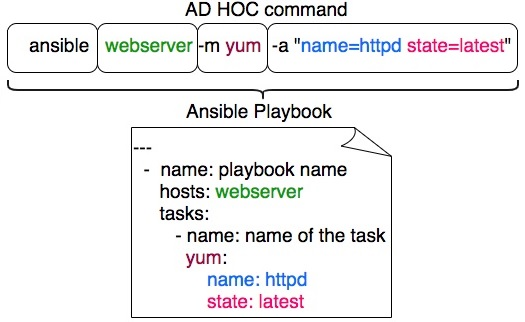
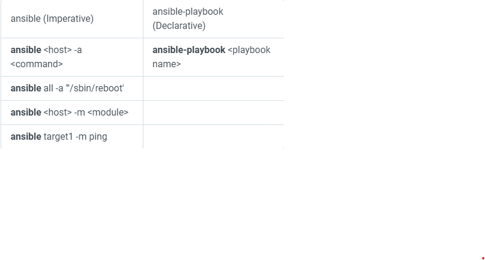
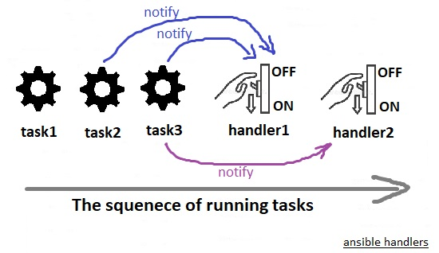
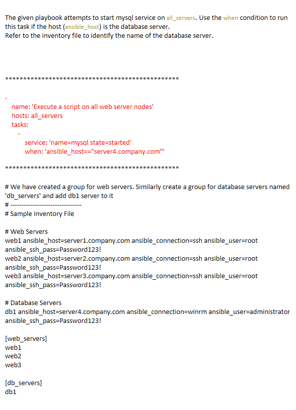

[[Catagories]] 

## There are Two ways of running Ansible:

  

ansible command (ad-hoc commands) : Used when we want to use ansible for One task, such as Testing connectivity between ansible controller and target, Shutting down a set of server, ... . In that case we can run ansible with out writing a playbook.  

~~~~

command used when you have a playbook: 

ansible-playbook test.yml  

~~~~

## Copy File Playbook

  

Creating a test file

~~~~

[user1@controller demo-playbook]$ cat > /tmp/test-file.txt

Sample Text File!!!

^C  

~~~~

  

~~~~

---

-

  name: Copy file to target server(s)

  hosts: all

  tasks:

    - name:  Copy file

      copy:

        src: /tmp/test-file.txt

        dest: /tmp/test-file.txt

  

[user1@controller demo-playbook]$ ansible-playbook copy-playbook.yaml

  

PLAY [Copy file to target server(s)] ****************************************************************************************************

  

TASK [Gathering Facts] ******************************************************************************************************************

ok: [centos]

ok: [ubuntu]

  

TASK [Copy file] ************************************************************************************************************************

changed: [centos]

changed: [ubuntu]

  

PLAY RECAP ******************************************************************************************************************************

centos                     : ok=2    changed=1    unreachable=0    failed=0    skipped=0    rescued=0    ignored=0

ubuntu                     : ok=2    changed=1    unreachable=0    failed=0    skipped=0    rescued=0    ignored=0

  

root@ubuntu:~# su - user1

$ cat /tmp/test-file.txt

Sample Text File!!!

$

  

[user1@controller demo-playbook]$ ansible-playbook copy-playbook.yaml

  

PLAY [Copy file to target server(s)] ****************************************************************************************************

  

TASK [Gathering Facts] ******************************************************************************************************************

ok: [centos]

ok: [ubuntu]

  

TASK [Copy file] ************************************************************************************************************************

ok: [centos]

ok: [ubuntu]

  

PLAY RECAP ******************************************************************************************************************************

centos                     : ok=2    changed=0    unreachable=0    failed=0    skipped=0    rescued=0    ignored=0

ubuntu                     : ok=2    changed=0    unreachable=0    failed=0    skipped=0    rescued=0    ignored=0

~~~~

  

## Terms  

~~~~  

Ansible playbooks tend to be more of a configuration language than a programming language. Ansible playbook commands useYAML format.

  • Playbook -A single YAML file

    ○ Play - Defines a set of activities (tasks) to be run on hosts

      § Task - An action to be performed on the host. examples:

        □ Execute a command

        □ Run a script

        □ Install a package

        □ Shutdown/Restart

~~~~

  

## Debugging Ansible

  

 Use ansible-playbook with-v or--verbose switches to get more information, use -vv or even-vvv for more information. -vvvv enables connection debugging!

~~~~

ansible-playbook -i <play_book_name>.yml -v

~~~~

## Privilege Escalation:

add a line become: yes or become: true inside playbook, this allows the playbook to run commands as root

  
## Sample whoami-playbook.yaml

~~~~

---

 - hosts: all

   become: true

   tasks:

       - name: do a uname

         shell: uname -a > /home/user1/results.txt

  

       - name: whoami

         shell: whoami >> /home/user1/results.txt

~~~~

  

## Switch to other User:

  

Use become_user the user name that we want to switch to like compare it with sudo su - user .

  

~~~~

---

- name: Run a command as the apache user

  command: somecommand

  become: yes

  become_user: apache

~~~~

  

## Handlers:

  

Sometimes you want a task to run only when a change is made on a machine. For example, you may want to start a service if a task updates the configuration of that service, but not if the configuration is unchanged. Ansible uses handlers to address this use case. Handlers are tasks that only run when notified. If a handler get notified multiple times, it just runs once. Each handler should have a globally unique name.  

  

## sample handler-playbook.yaml

~~~~

---

- hosts: all

  become: yes

  tasks:

    - name: install vsftpd on ubuntu

      apt: name=vsftpd update_cache=yes state=latest

      ignore_errors: yes

      notify: start vsftpd

  

    - name: install vsftpd on centos

      yum: name=vsftpd state=latest

      ignore_errors: yes

      notify: start vsftpd

  

  handlers:

    - name: start vsftpd

      service: name=vsftpd enabled=yes state=started

  

As there is no apt on centos, ignore_error cause playbook continue running other tasks even if this task fails. So if there is an error keep going!

  

[user1@controller demo-playbook]$ ansible-playbook handler-playbook.yaml

  

PLAY [all] ******************************************************************************************************************************

  

TASK [Gathering Facts] ******************************************************************************************************************

ok: [centos]

ok: [ubuntu]

  

TASK [install vsftpd on ubuntu] *********************************************************************************************************

[WARNING]: Updating cache and auto-installing missing dependency: python-apt

fatal: [centos]: FAILED! => {"changed": false, "cmd": "apt-get update", "msg": "[Errno 2] No such file or directory", "rc": 2}

...ignoring

changed: [ubuntu]

  

TASK [install vsftpd on centos] *********************************************************************************************************

ok: [ubuntu]

changed: [centos]

  

RUNNING HANDLER [start vsftpd] **********************************************************************************************************

ok: [ubuntu]

changed: [centos]

  

PLAY RECAP ******************************************************************************************************************************

centos                     : ok=4    changed=2    unreachable=0    failed=0    skipped=0    rescued=0    ignored=1

ubuntu                     : ok=4    changed=1    unreachable=0    failed=0    skipped=0    rescued=0    ignored=0

~~~~

  
  

## Running Playbooks locally

  

Using localhost in ansible playbook hosts argument

we can run ansible playbook locally or in ansible control machine by mentioning ‘localhost’ in ansible playbook in hosts argument. In the hosts argument mention localhost so this entire playbook will run on locally or ansible control machine.

root<a target="_blank" href="https://www.decodingdevops.com/profile/maniprabu/">maniprabu</a>-172-31-37-35:~#

  

~~~~

---

- hosts: localhost

gather_facts: no

  

tasks:

- name: run ansible playbook locally

debug:

msg: "Hi This Is DecodingDevOps"

~~~~

This playbook will run on your local machine.

Note: you can also mention 127.0.0.1 in the place of localhost the playbook, Both localhost and 127.0.0.1 represents local machine only.  

  

## Running as Targets

  

~~~~

---

- hosts: "{{ target_env }}"

gather_facts: no

  

tasks:

- name: run ansible playbook locally

debug:

msg: "Hi This Is DecodingDevOps"

~~~~

  

## Defining Variables

  

Variables can be defined in a variety of places in an Ansible project. However, this can be simplified to three basic scope levels:

  • Global scope: Variables set from the command line or Ansible configuration.

  • Play scope: Variables set in the play and related structures.

  • Host scope: Variables set on host groups and individual hosts by the inventory, fact gathering, or registered tasks.

If the same variable name is defined at more than one level, the level with the highest precedence wins. A narrow scope takes precedence over a wider scope: variables defined by the inventory are overridden by variables defined by the playbook, which are overridden by variables defined on the command line.

  

Host scope: We have already seen using variables when we talked about Ansible inventory files. As as example lets write down a playbook to configure multiple firewall configuration. We want to make it reusable for some one else to change ports, for that lets move variables to the inventory file:

  

## Sample inventory file with variables-inventory.txt  

  

~~~~

centos http_port=8080 snmp_port=161-162 internal_ip_range=192.168.100.0

~~~~

  

## sample firewall playbook  firewall-playbook.yaml

~~~~ 

---

-

  name: Set Firewall Configurations

  hosts: centos

  become: true

  tasks:

    -  firewalld:

         service: https

         permanent: true

         state: enabled

  

    -  firewalld:

         port: "{{ http_port }}/tcp"

         permanent: true

         state: disabled

  

    -  firewalld:

         port: "{{ snmp_port }}/udp"

         permanent: true

         state: disabled

  

    -  firewalld:

         source: "{{ internal_ip_range }}/24"

         permanent: true

         zone: internal

         state: enabled

~~~~

~~~~

[user1@controller demo-var]$  ansible-playbook -i inventory.txt  firewall-playbook.yaml

~~~~

# Variables Example:

  

The playbook is used to update name server entry into resolv.conf file on localhost. The name server information is also updated in the inventory file as a variable nameserver_ip. Refer to the inventory file.

Replace the ip of the name server in this playbook to use the value from the inventory file, so that in the future if you had to make any changes you simply have to update the inventory file.

  
  

~~~~

Playbook Entry

---

-

    name: 'Update nameserver entry into resolv.conf file on localhost'

    hosts: localhost

    tasks:

        -

            name: 'Update nameserver entry into resolv.conf file'

            lineinfile:

                path: /etc/resolv.conf

                line: 'nameserver {{  nameserver_ip  }}'

~~~~

  
  

# Sample Inventory File

~~~~

localhost ansible_connection=localhost nameserver_ip=10.1.250.10

~~~~

  

# Example 2:

We have added a new task to disable SNMP port in the playbook. However the port is hardcoded in the playbook. Update the inventory file to add a new variable snmp_port and assign the value used here. Then update the playbook to use value from the variable.

  

~~~~  

---

-

    name: 'Update nameserver entry into resolv.conf file on localhost'

    hosts: localhost

    tasks:

        -

            name: 'Update nameserver entry into resolv.conf file'

            lineinfile:

                path: /etc/resolv.conf

                line: 'nameserver {{ nameserver_ip }}'

        -

            name: 'Disable SNMP Port'

            firewalld:

                port: '{{ snmp_port }}'

                permanent: true

                state: disabled

  

~~~~

~~~~

---

-

    hosts: localhost

    vars:

        car_model: 'BMW M3'

        country_name: USA

        title: 'Systems Engineer'

    tasks:

        -

            command: 'echo "My car''s model is {{ car_model }}"'

        -

            command: 'echo "I live in the {{ country_name }}"'

        -

            command: 'echo "I work as a {{ title }}"'

~~~~

  

## When Condition

  
  

The given playbook attempts to start mysql service on all_servers. Use the when condition to run this task if the host (ansible_host) is the database server.

Refer to the inventory file to identify the name of the database server.

  
  
  

~~~~

---

-

    name: 'Execute a script on all web server nodes'

    hosts: all_servers

    tasks:

        -

            service: 'name=mysql state=started'

            when: 'ansible_host=="server4.company.com"'

~~~~  

## When using Ansible facts

Often you want to execute or skip a task based on facts. As we mentioned before Facts are attributes of individual hosts, including IP address, operating system, the status of a filesystem, and many more. With conditionals based on facts:

  

  • You can install a certain package only when the operating system is a particular version.

  • You can skip configuring a firewall on hosts with internal IP addresses.

  • You can perform cleanup tasks only when a filesystem is getting full.

  Not all facts exist for all hosts. For example, the ‘lsb_major_release’ fact only exists when the lsb_release package is installed on the target host.

 In example below, we remove web server package from each server based on its os family:

## sample conditional with facts condition-playbook2.yaml

~~~~ 

---

- hosts: all

  become: yes

  

  tasks:

  

    - name: Remove Apache on Ubuntu Server

      apt: name=apache2 state=absent

      when: ansible_os_family == "Debian"

  

    - name: Remove Apache on CentOS  Server

      yum: name=httpd  state=absent

      when: ansible_os_family == "RedHat"

  

  

~~~~

## We have created a group for web servers. Similarly create a group for database servers named 'db_servers' and add db1 server to it

  
~~~~

# Sample Inventory File

  

# Web Servers

web1 ansible_host=server1.company.com ansible_connection=ssh ansible_user=root ansible_ssh_pass=Password123!

web2 ansible_host=server2.company.com ansible_connection=ssh ansible_user=root ansible_ssh_pass=Password123!

web3 ansible_host=server3.company.com ansible_connection=ssh ansible_user=root ansible_ssh_pass=Password123!

  

# Database Servers

db1 ansible_host=server4.company.com ansible_connection=winrm ansible_user=administrator ansible_ssh_pass=Password123!

  

[web_servers]

web1

web2

web3

  

[db_servers]

db1

  
~~~~  
  

## Sample Inventory File

~~~~

localhost ansible_connection=localhost nameserver_ip=10.1.250.10 snmp_port=160-161

~~~~

  
  
  
  

# Exception Handling

  

Exception handling in Ansible is similar to exception handling in any programming language. An example of the exception handling in playbook is shown below.

  

~~~~

---

tasks:

   - name: Name of the task to be executed

      block:

         - debug: msg = 'Just a debug message , relevant for logging'

         - command: <the command to execute>

      rescue:

         - debug: msg = 'There was an exception.. '

         - command: <Rescue mechanism for the above exception occurred)

      always:

         - debug: msg = "this will execute in all scenarios. Always will get logged"

~~~~

  

Following is the syntax for exception handling.

  
  

rescue and always are the keywords specific to exception handling.

  
  

Block is where the code is written (anything to be executed on the Unix machine).

  
  

If the command written inside the block feature fails, then the execution reaches rescue block and it gets executed. In case there is no error in the command under block feature, then rescue will not be executed.

  
  

Always gets executed in all cases.

  
  

So if we compare the same with java, then it is similar to try, catch and finally block.

[[Catagories]] 