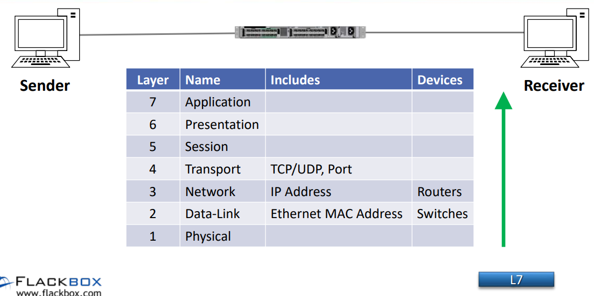

## Difference between Routing and Switching:

Routing and switching are the basic functions of network communication. Routing and Switching are different functions of network communications. The main differences between Routing and Switching are as below.

The function of Switching is to switch data packets between devices on the same network (or same [LAN - Local Area Network](https://www.omnisecu.com/basic-networking/lan-and-wan-local-area-network-and-wide-area-network.php)). The function of Routing is to Route packets between different networks (between different [LANs - Local Area Networks](https://www.omnisecu.com/basic-networking/lan-and-wan-local-area-network-and-wide-area-network.php)).  

Switches operate at Layer 2 of the [OSI Model](https://www.omnisecu.com/tcpip/osi-model.php) (Datalink Layer). A switch knows where to send a data packet by using Layer 2 addresses ([MAC address](https://www.omnisecu.com/tcpip/media-access-control-mac-addresses.php) - hardware address of a network adapter).

A switch maintains a table of MAC addresses (MAC Address table or CAM Table) and what physical switch port they are connected to. The Switching function can be explained more simply that, Switching is the function of moving data packets ([Ethernet Frames](https://www.omnisecu.com/tcpip/ethernet-frame-format.php)) within the same LAN (Local Area Network).

Application

Presentation 

Session   

Transport              

Network                    

Datalink                    

Physical