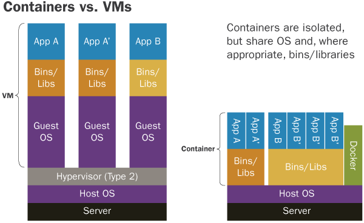

[[Docker-Compose]] [[Kubernetes]]  [[Catagories]] [[Kubernetes Troubleshooting]]

# Container

- [Stateless](#stateless)
- [Image](#image)
	+ [Image pull policy](#image-pull-policy)
	+ [Cache](#cache)
	+ [Tag](#tag)

## Stateless

---

Before designing any solution, it's important to review all the basic and important points ~~we are tired of knowing~~:
scale, maintenance, architecture ... **infrastructure**. To build a service that will run in a container, you need to
keep in mind a basic and extremely important point:

- **Information must be stored externally**: The container has the basic characteristic of not caring about the state,
  that is, it can be restarted. Thus, it is necessary to ensure that the container works normally, even if this happens.
  If state storage is needed, such as a database, it's indicated that this is done on an external disk; In kubernetes
  this is done via [persistence volume](https://kubernetes.io/docs/concepts/storage/persistent-volumes/).

## Image

---

> Smallest and fastest possible!

In services that need to scale (in most cases), it's important to pay attention to the time it takes the service to be
ready for use, aka cold start. Specifically in kubernetes, we need to pay attention to the following steps:

#### Image pull policy

- **Never**: The agent (kubelet) starts the container if it has the image locally. Otherwise it fails to start.
- **Always**: The agent searches the image locally based on the same digest, if it doesn't exist, the agent searches
  externally. (**Preferred**)
- **IfNotPresent**: The agent looks for the external image only if it doesn't exist locally.

Default rules can be viewed [here](https://kubernetes.io/docs/concepts/containers/images/#imagepullpolicy-defaulting).

#### Cache

Just like pretty code, we don't want to repeat the same thing over and over again. So make sure the build follows at
least the following specifications:

- **If possible don't repeat the same thing over and over**: Imagine building a service that has external libs where
  they are downloaded every time to the container environment. This build tends to be very costly, as much of the
  process is consumed by downloading dependencies. In that case, cache the quirks and avoid rework.
- **Cache**: Each docker instruction is a layer with the result. Therefore, it is important to optimize this as much as
  possible, in addition to using other solutions like [Kaniko](https://github.com/GoogleContainerTools/kaniko). A
  crucial piece of information that few people pay attention to is that the layer order matters, that is, if the first
  instruction constantly changes, the remaining steps also need to be rebuilt, even if they are the same as the previous
  version. So keep the instructions that change frequently at the end of the build whenever possible.
- **Multi-stage build**: Separating the build into stages helps with readability and also helps to reduce the image size
  as the last stage is what really matters and the rest is discarded.

#### Tag

In productive environments, always keep tags explicit, this prevents image versions with unwanted ~~bugs~~ updates or
unexpected behavior from happening.

Here is an example of how to build a dockerfile:

```dockerfile
FROM debian:9 (Set image tag)
WORKDIR /myapp/
RUN apt-get update && apt-get install -y  \
  git \
  gcc (Avoid running commands that need local caching on different layers)
... 
(Always leave the constantly changing instructions like code last to take advantage of the cache)

FROM alpine:3.14 (Use multiple stages to simplify and reduce the image)
WORKDIR /root/
COPY --from=0 /myapp/ ./
CMD ...
```


# Docker 101


Docker is an application that simplifies the process of managing application processes in containers. Containers let you run your applications in resource-isolated processes. They’re similar to virtual machines, but containers are more portable, more resource-friendly, and more dependent on the host operating system. 



# Step 1 — Installing Docker

In this tutorial, you’ll install and use Docker Community Edition (CE) on Ubuntu 18.04. You’ll install Docker itself, work with containers and images, and push an image to a Docker Repository.

Prerequisites

To follow this tutorial, you will need the following:

	• One Ubuntu 18.04 server set up by following the Ubuntu 18.04 initial server setup guide, including a sudo non-root user and a firewall.

	• An account on Docker Hub if you wish to create your own images and push them to Docker Hub, as shown in Steps 7 and 8.

The Docker installation package available in the official Ubuntu repository may not be the latest version. To ensure we get the latest version, we’ll install Docker from the official Docker repository. To do that, we’ll add a new package source, add the GPG key from Docker to ensure the downloads are valid, and then install the package.

First, update your existing list of packages:
~~~~
• sudo apt update
~~~~
Next, install a few prerequisite packages which let apt use packages over HTTPS:

~~~~
• sudo apt install apt-transport-https ca-certificates curl software-properties-common
~~~~
 
Then add the GPG key for the official Docker repository to your system:
~~~~
• curl -fsSL https://download.docker.com/linux/ubuntu/gpg | sudo apt-key add -
~~~~

Add the Docker repository to APT sources:
~~~~
• sudo add-apt-repository "deb [arch=amd64] https://download.docker.com/linux/ubuntu bionic stable" 
~~~~

Next, update the package database with the Docker packages from the newly added repo:
~~~~
• sudo apt update
~~~~

Make sure you are about to install from the Docker repo instead of the default Ubuntu repo:

~~~~
• apt-cache policy docker-ce
~~~~

You’ll see output like this, although the version number for Docker may be different:
Output of apt-cache policy docker-ce
docker-ce:
  Installed: (none)
  Candidate: 18.03.1~ce~3-0~ubuntu
  Version table:
     18.03.1~ce~3-0~ubuntu 500
        500 https://download.docker.com/linux/ubuntu bionic/stable amd64 Packages
 
Notice that docker-ce is not installed, but the candidate for installation is from the Docker repository for Ubuntu 18.04 (bionic).
Finally, install Docker: 

~~~~
• sudo apt install docker-ce
~~~~

Docker should now be installed, the daemon started, and the process enabled to start on boot. Check that it’s running: 
• sudo systemctl status docker
 
The output should be similar to the following, showing that the service is active and running:
~~~~
Output
● docker.service - Docker Application Container Engine
   Loaded: loaded (/lib/systemd/system/docker.service; enabled; vendor preset: enabled)
   Active: active (running) since Thu 2018-07-05 15:08:39 UTC; 2min 55s ago
     Docs: https://docs.docker.com
 Main PID: 10096 (dockerd)
    Tasks: 16
   CGroup: /system.slice/docker.service
           ├─10096 /usr/bin/dockerd -H fd://
           └─10113 docker-containerd --config /var/run/docker/containerd/containerd.toml
~~~~

Installing Docker now gives you not just the Docker service (daemon) but also the docker command line utility, or the Docker client. We’ll explore how to use the docker command later in this tutorial. 

# Step 2 — Executing the Docker Command Without Sudo (Optional)

By default, the docker command can only be run the root user or by a user in the docker group, which is automatically created during Docker’s installation process. If you attempt to run the docker command without prefixing it with sudo or without being in the docker group, you’ll get an output like this:

Output
docker: Cannot connect to the Docker daemon. Is the docker daemon running on this host?.
See 'docker run --help'.

If you want to avoid typing sudo whenever you run the docker command, add your username to the docker group:

~~~~
sudo usermod -aG docker ${USER}
~~~~

To apply the new group membership, log out of the server and back in, or type the following:

~~~~
su - ${USER}
~~~~
 
You will be prompted to enter your user’s password to continue.
Confirm that your user is now added to the docker group by typing:

~~~~
id -nG
~~~~                            
 
 
Output

sammy sudo docker
If you need to add a user to the docker group that you’re not logged in as, declare that username explicitly using:
~~~~
sudo usermod -aG docker username 
~~~~           
 
 
The rest of this article assumes you are running the docker command as a user in the docker group. If you choose not to, please prepend the commands with sudo.
Let’s explore the docker command next.

# Step 3 — Using the Docker Command

• docker [option] [command] [arguments]
 
To view all available subcommands, type:

~~~~ 
docker
~~~~ 
 
As of Docker 18, the complete list of available subcommands includes:

~~~~
Output
 
  attach      Attach local standard input, output, and error streams to a running container
  build       Build an image from a Dockerfile
  commit      Create a new image from a container's changes
  cp          Copy files/folders between a container and the local filesystem
  create      Create a new container
  diff        Inspect changes to files or directories on a container's filesystem
  events      Get real time events from the server
  exec        Run a command in a running container
  export      Export a container's filesystem as a tar archive
  history     Show the history of an image
  images      List images
  import      Import the contents from a tarball to create a filesystem image
  info        Display system-wide information
  inspect     Return low-level information on Docker objects
  kill        Kill one or more running containers
  load        Load an image from a tar archive or STDIN
  login       Log in to a Docker registry
  logout      Log out from a Docker registry
  logs        Fetch the logs of a container
  pause       Pause all processes within one or more containers
  port        List port mappings or a specific mapping for the container
  ps          List containers
  pull        Pull an image or a repository from a registry
  push        Push an image or a repository to a registry
  rename      Rename a container
  restart     Restart one or more containers
  rm          Remove one or more containers
  rmi         Remove one or more images
  run         Run a command in a new container
  save        Save one or more images to a tar archive (streamed to STDOUT by default)
  search      Search the Docker Hub for images
  start       Start one or more stopped containers
  stats       Display a live stream of container(s) resource usage statistics
  stop        Stop one or more running containers
  tag         Create a tag TARGET_IMAGE that refers to SOURCE_IMAGE
  top         Display the running processes of a container
  unpause     Unpause all processes within one or more containers
  update      Update configuration of one or more containers
  version     Show the Docker version information
  wait        Block until one or more containers stop, then print their exit codes
 ~~~~
To view the options available to a specific command, type:

~~~~ 
docker docker-subcommand –help
~~~~ 
 
 
 
To view system-wide information about Docker, use:

~~~~ 
docker info
~~~~ 
 
Let’s explore some of these commands. We’ll start by working with images.

# Step 4 — Working with Docker Images

	Docker containers are built from Docker images. By default, Docker pulls these images from Docker Hub, a Docker registry managed by Docker, the company behind the Docker project. Anyone can host their Docker images on Docker Hub, so most applications and Linux distributions you’ll need will have images hosted there.
	To check whether you can access and download images from Docker Hub, type:
	
```
docker run hello-world 
```
 
	The output will indicate that Docker in working correctly:

```
Output

    
	Unable to find image 'hello-world:latest' locally
	latest: Pulling from library/hello-world
	9bb5a5d4561a: Pull complete
	Digest: sha256:3e1764d0f546ceac4565547df2ac4907fe46f007ea229fd7ef2718514bcec35d
	Status: Downloaded newer image for hello-world:latest
```


```

```


	Hello from Docker!
	This message shows that your installation appears to be working correctly.
	...
	Docker was initially unable to find the hello-world image locally, so it downloaded the image from Docker Hub, which is the default repository. Once the image downloaded, Docker created a container from the image and the application within the container executed, displaying the message.

	You can search for images available on Docker Hub by using the docker command with the search subcommand. For example, to search for the Ubuntu image, type:
    
 ```
	docker search ubuntu
```


```

	The script will crawl Docker Hub and return a listing of all images whose name match the search string. In this case, the output will be similar to this:
	Output

   
	NAME                                                      DESCRIPTION                                     STARS               OFFICIAL            AUTOMATED
	ubuntu                                                    Ubuntu is a Debian-based Linux operating sys…   7917                [OK]
	dorowu/ubuntu-desktop-lxde-vnc                            Ubuntu with openssh-server and NoVNC            193                                     [OK]
	rastasheep/ubuntu-sshd                                    Dockerized SSH service, built on top of offi…   156                                     [OK]
	ansible/ubuntu14.04-ansible                               Ubuntu 14.04 LTS with ansible                   93                                      [OK]
	ubuntu-upstart                                            Upstart is an event-based replacement for th…   87                  [OK]
	neurodebian                                               NeuroDebian provides neuroscience research s…   50                  [OK]
	ubuntu-debootstrap                                        debootstrap --variant=minbase --components=m…   38                  [OK]
	1and1internet/ubuntu-16-nginx-php-phpmyadmin-mysql-5      ubuntu-16-nginx-php-phpmyadmin-mysql-5          36                                      [OK]
	nuagebec/ubuntu                                           Simple always updated Ubuntu docker images w…   23                                      [OK]
	tutum/ubuntu                                              Simple Ubuntu docker images with SSH access     18
	i386/ubuntu                                               Ubuntu is a Debian-based Linux operating sys…   13
	ppc64le/ubuntu                                            Ubuntu is a Debian-based Linux operating sys…   12
	1and1internet/ubuntu-16-apache-php-7.0                    ubuntu-16-apache-php-7.0                        10                                      [OK]
	1and1internet/ubuntu-16-nginx-php-phpmyadmin-mariadb-10   ubuntu-16-nginx-php-phpmyadmin-mariadb-10       6                                       [OK]
	eclipse/ubuntu_jdk8                                       Ubuntu, JDK8, Maven 3, git, curl, nmap, mc, …   6                                       [OK]
	codenvy/ubuntu_jdk8                                       Ubuntu, JDK8, Maven 3, git, curl, nmap, mc, …   4                                       [OK]
	darksheer/ubuntu                                          Base Ubuntu Image -- Updated hourly             4                                       [OK]
	1and1internet/ubuntu-16-apache                            ubuntu-16-apache                                3                                       [OK]
	1and1internet/ubuntu-16-nginx-php-5.6-wordpress-4         ubuntu-16-nginx-php-5.6-wordpress-4             3                                       [OK]
	1and1internet/ubuntu-16-sshd                              ubuntu-16-sshd                                  1                                       [OK]
	pivotaldata/ubuntu                                        A quick freshening-up of the base Ubuntu doc…   1
	1and1internet/ubuntu-16-healthcheck                       ubuntu-16-healthcheck                           0                                       [OK]
	pivotaldata/ubuntu-gpdb-dev                               Ubuntu images for GPDB development              0
	smartentry/ubuntu                                         ubuntu with smartentry                          0                                       [OK]
	ossobv/ubuntu
	...
	

```


 
	In the OFFICIAL column, OK indicates an image built and supported by the company behind the project. Once you’ve identified the image that you would like to use, you can download it to your computer using the pull subcommand.
	Execute the following command to download the official ubuntu image to your computer:


```
docker pull ubuntu 
```

```
You’ll see the following output:


	
	Output

   
	Using default tag: latest
	latest: Pulling from library/ubuntu
	6b98dfc16071: Pull complete
	4001a1209541: Pull complete
	6319fc68c576: Pull complete
	b24603670dc3: Pull complete
	97f170c87c6f: Pull complete
	Digest: sha256:5f4bdc3467537cbbe563e80db2c3ec95d548a9145d64453b06939c4592d67b6d
	Status: Downloaded newer image for ubuntu:latest
	
```

   After an image has been downloaded, you can then run a container using the downloaded image with the run subcommand. As you saw with the hello-world example, if an image has not been downloaded when docker is executed with the run subcommand, the Docker client will first download the image, then run a container using it.

To see the images that have been downloaded to your computer, type:

```
	
	• docker images 
    
	 
The output should look similar to the following:
	
    
    Output
	REPOSITORY          TAG                 IMAGE ID            CREATED             SIZE
	ubuntu              latest              113a43faa138        4 weeks ago         81.2MB
	hello-world         latest              e38bc07ac18e        2 months ago        1.85kB

```

	As you’ll see later in this tutorial, images that you use to run containers can be modified and used to generate new images, which may then be uploaded (pushed is the technical term) to Docker Hub or other Docker registries.
	Let’s look at how to run containers in more detail.
	 
# Step 5 — Running a Docker Container

The hello-world container you ran in the previous step is an example of a container that runs and exits after emitting a test message. Containers can be much more useful than that, and they can be interactive. After all, they are similar to virtual machines, only more resource-friendly.
As an example, let’s run a container using the latest image of Ubuntu. The combination of the -i and -t switches gives you interactive shell access into the container:

```
docker run -it ubuntu
```
 
Your command prompt should change to reflect the fact that you’re now working inside the container and should take this form:

```
Output
root@d9b100f2f636:/#
```

Note the container id in the command prompt. In this example, it is d9b100f2f636. You’ll need that container ID later to identify the container when you want to remove it.
Now you can run any command inside the container. For example, let’s update the package database inside the container. You don’t need to prefix any command with sudo, because you’re operating inside the container as the root user:

~~~~
• apt update
~~~~              
 
Then install any application in it. Let’s install Node.js:
~~~~
• apt install nodejs
~~~~
 
This installs Node.js in the container from the official Ubuntu repository. When the installation finishes, verify that Node.js is installed:
~~~~
• node -v 

• node.js -v
~~~~

You’ll see the version number displayed in your terminal:

Output
v8.10.0

Any changes you make inside the container only apply to that container.

To exit the container, type exit at the prompt.

Let’s look at managing the containers on our system next

# Step 6 — Managing Docker Containers


After using Docker for a while, you’ll have many active (running) and inactive containers on your computer. To view the active ones, use:
~~~~
• docker ps 
~~~~

You will see output similar to the following: 

Output
CONTAINER ID        IMAGE               COMMAND             CREATED             
 
In this tutorial, you started two containers; one from the hello-world image and another from the ubuntu image. Both containers are no longer running, but they still exist on your system.

To view all containers — active and inactive, run docker ps with the -a switch:

~~~~
• docker ps -a
~~~~

You’ll see output similar to this:
d9b100f2f636        ubuntu              "/bin/bash"         About an hour ago   Exited (0) 8 minutes ago                           sharp_volhard
01c950718166        hello-world         "/hello"            About an hour ago   Exited (0) About an hour ago                       festive_williams
 
 
To view the latest container you created, pass it the -l switch:
~~~~
• docker ps -l
~~~~

•  
• CONTAINER ID        IMAGE               COMMAND             CREATED             STATUS                      PORTS               NAMES
•  
• d9b100f2f636        ubuntu              "/bin/bash"         About an hour ago   Exited (0) 10 minutes ago                       sharp_volhard 
 
 
To start a stopped container, use docker start, followed by the container ID or the container’s name. Let’s start the Ubuntu-based container with the ID of d9b100f2f636:
~~~~
• docker start d9b100f2f636
~~~~
 
The container will start, and you can use docker ps to see its status:

```

CONTAINER ID        IMAGE               COMMAND             CREATED             STATUS              PORTS               NAMES
d9b100f2f636        ubuntu              "/bin/bash"         About an hour ago   Up 8 seconds                            sharp_volhard

```

To stop a running container, use docker stop, followed by the container ID or name. This time, we’ll use the name that Docker assigned the container, which is sharp_volhard:

~~~~
• docker stop sharp_volhard
~~~~ 
Once you’ve decided you no longer need a container anymore, remove it with the docker rm command, again using either the container ID or the name. Use the docker ps -a command to find the container ID or name for the container associated with the hello-world image and remove it. 

~~~~
• docker rm festive_williams
~~~~

You can start a new container and give it a name using the --name switch. You can also use the --rm switch to create a container that removes itself when it’s stopped. See the docker run help command for more information on these options and others.

Containers can be turned into images which you can use to build new containers. Let’s look at how that works.

# Step 7 — Committing Changes in a Container to a Docker Image

When you start up a Docker image, you can create, modify, and delete files just like you can with a virtual machine. The changes that you make will only apply to that container. You can start and stop it, but once you destroy it with the docker rm command, the changes will be lost for good.
This section shows you how to save the state of a container as a new Docker image.

After installing Node.js inside the Ubuntu container, you now have a container running off an image, but the container is different from the image you used to create it. But you might want to reuse this Node.js container as the basis for new images later.

Then commit the changes to a new Docker image instance using the following command. 

~~~~
• docker commit -m "What you did to the image" -a "Author Name" container_id repository/new_image_name
~~~~
 
The -m switch is for the commit message that helps you and others know what changes you made, while -a is used to specify the author. The container_id is the one you noted earlier in the tutorial when you started the interactive Docker session. Unless you created additional repositories on Docker Hub, the repository is usually your Docker Hub username.

For example, for the user sammy, with the container ID of d9b100f2f636, the command would be:

~~~~
• docker commit -m "added Node.js" -a "sammy" d9b100f2f636 sammy/ubuntu-nodejs
~~~~
 
When you commit an image, the new image is saved locally on your computer. Later in this tutorial, you’ll learn how to push an image to a Docker registry like Docker Hub so others can access it.

Listing the Docker images again will show the new image, as well as the old one that it was derived from:

~~~~
• docker images
~~~~
 
You’ll see output like this:
~~~~
Output
REPOSITORY               TAG                 IMAGE ID            CREATED             SIZE
sammy/ubuntu-nodejs   latest              7c1f35226ca6        7 seconds ago       179MB
ubuntu                   latest              113a43faa138        4 weeks ago         81.2MB
hello-world              latest              e38bc07ac18e        2 months ago        1.85kB
~~~~

In this example, ubuntu-nodejs is the new image, which was derived from the existing ubuntu image from Docker Hub. The size difference reflects the changes that were made. And in this example, the change was that NodeJS was installed. So next time you need to run a container using Ubuntu with NodeJS pre-installed, you can just use the new image.

You can also build Images from a Dockerfile, which lets you automate the installation of software in a new image. However, that’s outside the scope of this tutorial.
Now let’s share the new image with others so they can create containers from it.


# Step 8 — Pushing Docker Images to a Docker Repository

	The next logical step after creating a new image from an existing image is to share it with a select few of your friends, the whole world on Docker Hub, or other Docker registry that you have access to. To push an image to Docker Hub or any other Docker registry, you must have an account there.
	This section shows you how to push a Docker image to Docker Hub. To learn how to create your own private Docker registry, check out How To Set Up a Private Docker Registry on Ubuntu 14.04.

	To push your image, first log into Docker Hub.

```  
docker login -u docker-registry-username 
```
	
	
	You’ll be prompted to authenticate using your Docker Hub password. If you specified the correct password, authentication should succeed.
	Note: If your Docker registry username is different from the local username you used to create the image, you will have to tag your image with your registry username. For the example given in the last step, you would type:

```  
docker tag sammy/ubuntu-nodejs docker-registry-username/ubuntu-nodejs
```
   


	Then you may push your own image using:
	
``` 
docker push docker-registry-username/docker-image-name
``` 
	 
	To push the ubuntu-nodejs image to the sammy repository, the command would be:

```  
docker push sammy/ubuntu-nodejs
``` 
 
The process may take some time to complete as it uploads the images, but when completed, the output will look like this:

``` 
    Output
	The push refers to a repository [docker.io/sammy/ubuntu-nodejs]
	e3fbbfb44187: Pushed
	5f70bf18a086: Pushed
	a3b5c80a4eba: Pushed
	7f18b442972b: Pushed
	3ce512daaf78: Pushed
	7aae4540b42d: Pushed
   ```  

 


After pushing an image to a registry, it should be listed on your account’s dashboard, like that show in the image below.


	If a push attempt results in an error of this sort, then you likely did not log in:

``` 
 Output
	The push refers to a repository [docker.io/sammy/ubuntu-nodejs]
	e3fbbfb44187: Preparing
	5f70bf18a086: Preparing
	a3b5c80a4eba: Preparing
	7f18b442972b: Preparing
	3ce512daaf78: Preparing
	7aae4540b42d: Waiting
	unauthorized: authentication required

``` 

   
    

	Log in with docker login and repeat the push attempt. Then verify that it exists on your Docker Hub repository page.
	You can now use docker pull sammy/ubuntu-nodejs to pull the image to a new machine and use it to run a new container.

  	The next logical step after creating a new image from an existing image is to share it with a select few of your friends, the whole world on Docker Hub, or other Docker registry that you have access to. To push an image to Docker Hub or any other Docker registry, you must have an account there.
	This section shows you how to push a Docker image to Docker Hub. To learn how to create your own private Docker registry, check out How To Set Up a Private Docker Registry on Ubuntu 14.04.
	To push your image, first log into Docker Hub.

    ~~~~
	docker login -u docker-registry-username
    ~~~~
	 
	You’ll be prompted to authenticate using your Docker Hub password. If you specified the correct password, authentication should succeed.
	Note: If your Docker registry username is different from the local username you used to create the image, you will have to tag your image with your registry username. For the example given in the last step, you would type:

    ~~~~
	docker tag sammy/ubuntu-nodejs docker-registry-username/ubuntu-nodejs
    ~~~~
	
	Then you may push your own image using:

    ~~~~
	docker push docker-registry-username/docker-image-name
    ~~~~
	 
	To push the ubuntu-nodejs image to the sammy repository, the command would be:

    ~~~~
	docker push sammy/ubuntu-nodejs
    ~~~~
 
	 
	The process may take some time to complete as it uploads the images, but when completed, the output will look like this:
	
    ~~~~
    Output
	The push refers to a repository [docker.io/sammy/ubuntu-nodejs]
	e3fbbfb44187: Pushed
	5f70bf18a086: Pushed
	a3b5c80a4eba: Pushed
	7f18b442972b: Pushed
	3ce512daaf78: Pushed
	7aae4540b42d: Pushed
    ~~~~
	 
	...
	 
	 
	After pushing an image to a registry, it should be listed on your account’s dashboard, like that show in the image below.
	
	 
	  
	 
	 
	 
	 
	If a push attempt results in an error of this sort, then you likely did not log in:
	
    ~~~~
    Output
	The push refers to a repository [docker.io/sammy/ubuntu-nodejs]
	e3fbbfb44187: Preparing
	5f70bf18a086: Preparing
	a3b5c80a4eba: Preparing
	7f18b442972b: Preparing
	3ce512daaf78: Preparing
	7aae4540b42d: Waiting
	unauthorized: authentication required
    ~~~~

	Log in with docker login and repeat the push attempt. Then verify that it exists on your Docker Hub repository page.
	You can now use docker pull sammy/ubuntu-nodejs to pull the image to a new machine and use it to run a new container.
  
# Create instances of the docker container

~~~~
docker run --rm -ti ubuntu sleep infinity & 


docker run --rm -ti ubuntu sleep 300 & 

~~~~

# Docker Kill Example

Send a KILL signal to a container🔗

The following example sends the default KILL signal to the container named my_container:

~~~~
$ docker kill my_container or PID
~~~~

Send a custom signal to a container

The following example sends a SIGHUP signal to the container named my_container:

~~~~
$ docker kill --signal=SIGHUP  my_container
~~~~

You can specify a custom signal either by name, or number. The SIG prefix is optional, so the following examples are equivalent:

~~~~
$ docker kill --signal=SIGHUP my_container
$ docker kill --signal=HUP my_container
$ docker kill --signal=1 my_container
~~~~

# Docker ps Example

Prevent truncating output🔗
~~~~
Running docker ps --no-trunc showing 2 linked containers.
~~~~

~~~~

$ docker ps 

CONTAINER ID        IMAGE                        COMMAND                CREATED              STATUS              PORTS               NAMES
4c01db0b339c        ubuntu:12.04                 bash                   17 seconds ago       Up 16 seconds       3300-3310/tcp       webapp
d7886598dbe2        crosbymichael/redis:latest   /redis-server --dir    33 minutes ago       Up 33 minutes       6379/tcp            redis,webapp/db
Show both running and stopped containers
The docker ps command only shows running containers by default. To see all containers, use the -a (or --all) flag:
~~~~

~~~~
$ docker ps -a 
~~~~


docker ps groups exposed ports into a single range if possible. E.g., a container that exposes TCP ports 100, 101, 102 displays 100-102/tcp in the PORTS column.
Show disk usage by container

The docker ps -s command displays two different on-disk-sizes for each container:

~~~~
$ docker ps -s  

CONTAINER ID   IMAGE          COMMAND                  CREATED        STATUS       PORTS   NAMES        SIZE                                                                                      SIZE
e90b8831a4b8   nginx          "/bin/bash -c 'mkdir "   11 weeks ago   Up 4 hours           my_nginx     35.58 kB (virtual 109.2 MB)
00c6131c5e30   telegraf:1.5   "/entrypoint.sh"         11 weeks ago   Up 11 weeks          my_telegraf  0 B (virtual 209.5 MB)
~~~~

# Pull an image from Docker Hub🔗

To download a particular image, or set of images (i.e., a repository), use docker pull. If no tag is provided, Docker Engine uses the :latest tag as a default. This command pulls the debian:latest image:

~~~~
$ docker pull debian
~~~~


Using default tag: latest
latest: Pulling from library/debian
fdd5d7827f33: Pull complete
a3ed95caeb02: Pull complete
Digest: sha256:e7d38b3517548a1c71e41bffe9c8ae6d6d29546ce46bf62159837aad072c90aa
Status: Downloaded newer image for debian:latest
Docker images can consist of multiple layers. In the example above, the image consists of two layers; fdd5d7827f33 and a3ed95caeb02.
Layers can be reused by images. For example, the debian:jessie image shares both layers with debian:latest. Pulling the debian:jessie image therefore only pulls its metadata, but not its layers, because all layers are already present locally:

~~~~
$ docker pull debian:jessie
~~~~

jessie: Pulling from library/debian
fdd5d7827f33: Already exists
a3ed95caeb02: Already exists
Digest: sha256:a9c958be96d7d40df920e7041608f2f017af81800ca5ad23e327bc402626b58e
Status: Downloaded newer image for debian:jessie
To see which images are present locally, use the docker images command:

~~~~
$ docker images
~~~~

~~~~
REPOSITORY   TAG      IMAGE ID        CREATED      SIZE
debian       jessie   f50f9524513f    5 days ago   125.1 MB
debian       latest   f50f9524513f    5 days ago   125.1 MB
~~~~

# How to connect to a container

# Use the docker exec Command to Connect to a Running Container 

The docker exec is used to connect to a container that is already running. You can use the docker exec command to get a bash shell in the running container or run any command directly inside the container.

# Get a Bash Shell in the Container 

The basic syntax to get a bash shell in the running container is shown below:

~~~~

docker exec -it container-name /bin/bash 

Or


docker container exec -it container-name /bin/bash 
~~~~

First, run the docker ps command to get the name of the existing container:


~~~~
docker ps 
~~~~

You should get all running containers in the following output:

~~~~
CONTAINER ID        IMAGE               COMMAND                  CREATED             STATUS              PORTS               NAMES
51e83428cee5        httpd               "httpd-foreground"       5 seconds ago       Up 3 seconds        80/tcp              apache-container

 
5f8c42bfd237        nginx               "/docker-entrypoint.…"   29 seconds ago      Up 27 seconds       80/tcp              nginx-container
~~~~

Next, choose the name of the running container from the above list and run the following command to get a bash shell in the container.

~~~~
docker container exec -it nginx-container /bin/bash
~~~~

This will create a new bash session inside the container as shown below:


# Limiting Docker Memory Usage

Introduction

By default, Docker containers have access to the full RAM and CPU resources of the host. Leaving them to run with these default settings may lead to performance bottlenecks.
If you don’t limit Docker’s memory and CPU usage, Docker can use all the systems resources.
In this tutorial, learn how to limit memory and CPU usage of Docker containers.

# Configure System to Enable Limiting Resources

Before you can run a container with limited resources, check whether your system supports this Docker option. This guide shows you how to do so in Ubuntu, as well as how to enable this feature if needed.

1. First, run the command: 

~~~~
sudo docker info
~~~~

If you receive the output WARNING: No swap limit support, limiting resources has not been enabled by default.

2. To add this option, edit the grub configuration file. Open the file in a text editor of your choice (we are using nano): 

~~~~
sudo nano /etc/default/grub
~~~~

3. Then, add the following line:

~~~~
GRUB_CMDLINE_LINUX="cdgroup_enable=memory swapaccount=1"
~~~~

4. Save the changes and exit the file.

5. Then, update the grub configuration with the command:

~~~~
sudo update-grub
~~~~

6. Finally, reboot your machine for the changes to take place.

7. To verify you have successfully enabled the given Docker feature by rerunning the docker info command.

Note: If you still haven't mastered Docker commands, this Docker Commands Cheat Sheet may be useful as a handy reference sheet.

# Limit Docker Container Memory Access 

There are several RAM limitations you can set for a Docker container. Some of them include:

• Configuring the maximum amount of memory a container can use.

• Defining the amount of memory a Docker container can swap to disk.

• Setting the soft limit for the amount of memory assigned to a container.

Below, find out how to configure Docker memory limitations. 

# Set Maximum Memory Access  

To limit the maximum amount of memory usage for a container, add the --memory option to the docker run command. Alternatively, you can use the shortcut -m.
Within the command, specify how much memory you want to dedicate to that specific container.
The command should follow the syntax: 

~~~~
sudo docker run -it --memory=”[memory_limit]” [docker_image]
~~~~
The value of memory_limit should be a positive integer followed by the suffix b, k, m, or g (short for bytes, kilobytes, megabytes, or gigabytes). For example, to limit the container with 1 GB of RAM, add --memory="1g".

For example, to run an instance of an Ubuntu container and set the memory limit to 1 GB, the command is: 

~~~~
sudo docker run -it --memory=”1g” ubuntu 
~~~~
# Set Swap to Disk Memory Limit 

Using the swap option allows you to store data even after all RAM assigned to the container has been used up. It does this by ignoring the memory limitation and writing directly to the disk. Although this is a useful feature, it is not a recommended practice as it slows down performance.

To configure this additional RAM space, define the total amount of swap memory. Before doing this, you should already have the maximum memory (--memory) of the non-swap memory set. The swap includes the total amount of non-swap memory plus the amount of swap memory reserved as backup.

For example, if you set --memory to 1 GB, as in the example above, the amount of swap memory needs to be more than that. To run a container with an additional 1 GB of swap memory, set the swap memory to 2 GB.
The syntax for running a container with limited memory and additional swap memory is:


``` 
sudo docker run -it --memory=”[memory_limit]” --memory-swap=”[memory_limit]” [docker_image]
```


For instance, to run a container from the Ubuntu image, assigning 1 GB of RAM for the container to use and reserving 1 GB of RAM for swap memory, type:

```
sudo docker run -it --memory=”1g” --memory-swap=”2g” ubuntu
```

Note: If you don't want to use swap memory, give --memory and --memory-swap the same values.

# Set Soft Limit to Container Memory 

Limiting the memory usage of a container with --memory is essentially setting a hard limit that cannot be surpassed. Alternatively, you can set a soft limit (--memory-reservation) which warns when the container reaches the end of its assigned memory but doesn’t stop any of its services.
If --memory limitations see are not set, setting the soft limit with --memory-reservation doesn’t completely limit container space. If you have both features enabled, the soft limit is always lower than the maximum space capacity.

As an example, for an Ubuntu container to have the memory reservation of 750 MB and the maximum RAM capacity of 1 BG, use the command: 

~~~~
sudo docker run -it --memory=”1g” --memory-reservation=”750m” ubuntu
~~~~

# Limit Docker Container CPU Usage 

Just like RAM usage, Docker containers don’t have any default limitations for the host’s CPU. Giving containers unlimited CPU usage can lead to issues.
There are several ways to define how much CPU resources from the host machine you want to assign to containers.
For example, if you have a host with 2 CPUs and want to give a container access to one of them, use the option --cpus="1.0". The command for running an Ubuntu container with access to 1 CPU would be: 

~~~~
sudo docker run -it --cpus=”1.0” ubuntu
~~~~

You can also use the --cpu-shares option to give the container a greater or lesser proportion of CPU cycles. By default, this is set to 1024.
To run a container with lesser CPU shares, run: 

~~~~
sudo docker run -it --cpus-shares=”700” ubuntu
~~~~
From <https://phoenixnap.com/kb/docker-memory-and-cpu-limit> 


# Docker File Example: 

~~~~


# Use an Ubuntu image as base image

FROM ubuntu:latest

# Metadata for the container

LABEL description="This is a dummy container" author="Guillermo Barreiro"

# Set the working directory inside the container for the following Dockerfile instructions

WORKDIR /root

# Use an argument sent to the "docker build" command inside the Dockerfile

ARG USERNAME
RUN echo ${USERNAME} >> username

# Run several commands in a same line, for avoiding creating intermediate junk images

RUN /bin/bash -c 'apt-get update; apt-get install python3'

# Set environment variables 

ENV foo_folder /home

# Copy files to the container

COPY script.py /script.py

# Define a volume (in the Dockerfile you cannot set the location of a volume inside the host machine)

VOLUME /root/shared

# Set the entrypoint for the container, that means, the command to be executed when run

ENTRYPOINT ["python3", "script.py"] 

~~~~

## References

Based off cheatsheet from <https://devhints.io/docker-compose>.

# Create Dockerfile Tutorial

1) mkdir ~/redis_docker
 
2) Navigate to the directory and create the following Dockerfile:
 
3) cd ~/redis_docker

4) nano Dockerfile  

```
 
FROM ubuntu:18.04

RUN apt-get update && \ 
apt-get install -y redis-server && \ 
apt-get clean 


EXPOSE 6379 


CMD ["redis-server","--protected-mode no"] 

```

Let’s explain the meaning of each of the lines in the Dockerfile: 
``` 
- On line 1 we are defining the base image. 

- The RUN instruction that starts on line 3 will update the apt index, install the “redis-server” package and clean the apt cache. The commands used in instructions are the same as the commands you would use to install redis on Ubuntu server . 

- The EXPOSE instruction defines the port on which the redis server listens.             

In the last line, we are using the CMD instruction to set the default command that will be executed when the container runs.


5)  Build the Dockerfile:  docker build –t <dockerid>/<repo_name> . -> docker build -t obiezeakachi/redis-server . - The option -t specifies the image name and optionally a username and tag in the ‘username/imagename:tag’ format.

6) Run docker image: docker run -d -p 6379:6379 --name redis <dockerid>/<repo server>  -> docker run -d -p 6379:6379 --name redis obiezeakachi/redis-server

Push to Docker repo

7) docker login 

8) docker tag obiezeakachi/redis-server obiezeakachi/redis-server:v1     

9) docker push obiezeakachi/redis-server:v1 
```
https://linuxize.com/post/how-to-build-docker-images-with-dockerfile/  
https://docs.docker.com/develop/develop-images/dockerfile_best-practices/  

https://docs.docker.com/docker-hub/repos/#pushing-a-docker-container-image-to-docker-hub 

https://docs.docker.com/engine/reference/builder/  

[[Docker-Compose]] [[Kubernetes]] 