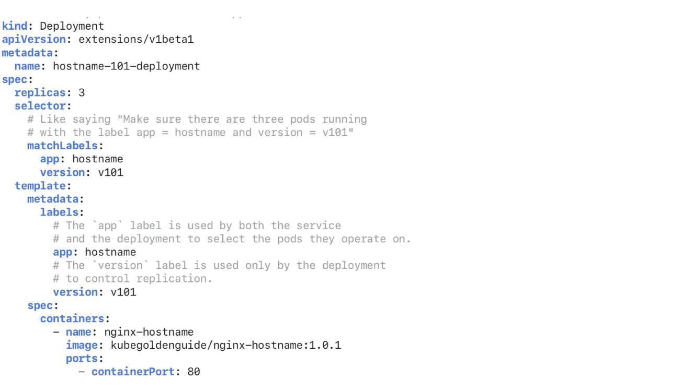

[[Docker]] [[Docker-Compose]] [[Catagories]] [[Kubernetes Troubleshooting]]


# Kubernetes Best Practices 101

Kubernetes is an open-source platform, very often called containers’ orchestrator. Each k8s cluster consists of multiple components, where Master, Nodes and k8s resources (k8s objects) are the most essential ones.


# Kubernetes cluster

Master is the cluster orchestrator, which exposes the k8s API (docs). Every time, when we are deploying the app containers, we are telling something like: “Hey Master! Here is the docker image URL of my application. Please, start the app container for me.”. And then Master schedules the app instances (containers) to run on the Nodes. Kubernetes will choose where to deploy the app based on Nodes’ available resources.

Master manages the cluster. It scales and schedules app containers and rolls out the updates. 
Nodes are k8s workers, which run app containers. 
A Node consists of the following processes:

	• kubelet — it’s an agent for managing the Node. It communicates with the Master using k8s API. It manages the containers and ensures that they are running and are healthy.

	• other tools — Node contains additional tools like Docker, to handle the container operations like pulling the image, running and so on.

Nodes are workers, which run application containers. They consist of the kubelet agent, which manages the Node and comunicates with the Master.


# Kubernetes resources

Pod


# Pod in Kubernetes cluster

Pod is the smallest resource in k8s. It represents a group of one or more application containers and some shared resources (volumes). It runs on a private, isolated network, so containers can talk to each other using localhost. Normally, you would have one container per Pod. But sometimes, we can run multiple containers in one Pod. Typically it happens, when we want to implement side-car


In most cases, you learn to use platforms to meet the current business need or on standalone projects. The silver lining
is the encouragement of learning and at some point this becomes knowledge, however, hands-on work can lead to cuts in
paths that later cause a series of problems in productive environments. Therefore, the purpose of this guide is to help
with the learning curve, helping to prepare a more stable, reliable and functional environment.

## Documentation

* 📙 [Kubernetes Official Documentation](https://kubernetes.io/docs/home/)
* 📙 [Google Kubernetes Engine (GKE)](https://cloud.google.com/kubernetes-engine/docs/how-to)
* 📙 [Amazon Elastic Kubernetes Service (EKS)](https://docs.aws.amazon.com/eks/latest/userguide/getting-started.html)
* 📙 [Azure Kubernetes Service (AKS)](https://docs.microsoft.com/en-us/azure/aks/)

## Table of Contents

- [Container](container/container.md)
- [Cluster](#cluster)
	+ [Infrastructure](#infrastructure)
	+ [Cost Optimization](#cost-optimization)
	+ [Namespace](#namespace)
- [Basics](#basics)
    + [Security](#security)
    + [Labels](#labels)
    + [Liveness](#liveness)
    + [Readiness](#readiness)
    + [Resources](#resources)
    + [Scalability](#scalability)
    + [Deployment](#deployment)
    + [Shutdown](#shutdown)
- [Deployment and Review](#deployment-and-review)

---
---

## Cluster
---

#### Infrastructure

I don't intend to go into infrastructure best practices, but we can say that the standard 'paperwork', private VPC,
multiple networks, firewall rules etc. also apply for a kubernetes cluster. The points that need to be highlighted are:

- **Network**: Set aside a network for the cluster and make sure there is enough space for the pods and services. So
  find out how many pods per node you want to use and make calculations in CIDR based on that. It's worth noting that
  each cloud provider can have its own variation and rules, so check the documentation. Practical example:
  The [GCP](https://cloud.google.com/kubernetes-engine/docs/how-to/flexible-pod-cidr#cidr_ranges_for_clusters) reserves
  double the IP for specific ranges based on the maximum pods per node, starting from 8 to 110. So, a direct translation
  is::
	- Subnetwork range (CIDR): Maximum number of nodes.
	- Range for pods (CIDR): Maximum number of pods based on the maximum number of pods per node. Example: A pod CIDR
	  range /19 supports 256 nodes in a configuration of 16 maximum pods per node. Consequently, a subnetwork range (
	  item above) of at least /24 is required.
	- Range for services (CIDR): Maximum number of services based on maximum number of pods per node.

- **Private**: Leave nodes and API restricted and/or inaccessible on the internet. So, use private clusters and, if your
  team is large enough, separate (project/account, private VPC...) them into different environments (development,
  production...).
- **Infrastructure as Code**: Keep all infrastructure versioned and well-documented with tools
  like [Terraform](https://www.terraform.io/), [CloudFormation](https://aws.amazon.com/cloudformation/?nc1=h_ls)
  or [Ansible](https://www.ansible.com/). For deployment management, I particularly think applications deserve a proper
  CD tool.

#### Cost Optimization

- **Cloud**:
	+ Pay attention to the committed use discounts plans.
	+ Choose the right type of machine, it's quite common to have discounts for specific types. For instance, GCP E2
	  types offer you 31% savings compared to the default N1.
	+ Some processes (like batch/job) don't need to be close to the user, so use the region with the most interesting
	  cost. Of course, be wary of transfers between regions and the entire lifecycle of your processes.
	+ For each application deployed, we need 10 more to monitor it. Jokes aside, be aware of the cost of monitoring.
- **Node-pools**:
	+ If you have a robust environment, create specific node-pools according to the characteristics of the applications.
	  A good example is having node-pools high memory, high cpu, and so on. The main purpose is to direct the
	  applications to the correct nodes and use as much resource as possible, as we don't want to have too much resource
	  idle.
	+ Some applications are not as sensitive or don't need to be 24/7 online. If possible, create spot/preemptible node
	  pools and only pay for a small chunk of the instance. It's important to note that there are lots of cool
	  projects ([estafette](https://github.com/estafette/estafette-gke-preemptible-killer)) to play, it's worth taking a
	  look.
	+ Enable auto-scaling to reduce cost at times with fewer users.

#### Namespace

> Use namespace profusely!

Simply put, the namespace is a way to organize objects, products and teams in Kubernetes. Namespaces provide granularity
to separate teams and/or products, in large companies, it's quite common not to know all teams, as well as development
models. Therefore, it's important to isolate and have the freedom to build a fast and secure development flow,
respecting the limits. Of course, it's important to analyze each environment, in a small company, we don't need so much
logical separation, because everyone knows each other and the cost has to make sense with the business.

Here is an example of how to do it (if possible, set quota for each namespace):

```
kubectl create namespace my-first-namespace
```

```yaml
apiVersion: v1
kind: ResourceQuota
metadata:
  name: my-first-namespace
spec:
  hard:
    requests.cpu: "10"
    requests.memory: 10Gi
    limits.cpu: "20"
    limits.memory: 20Gi
```

# Share a Cluster with Namespaces | Kubernetes

> ## Excerpt
> This page shows how to view, work in, and delete namespaces. The page also shows how to use Kubernetes namespaces to subdivide your cluster.
Before you begin Have an existing Kubernetes cluster. You have a basic understanding of Kubernetes Pods, Services, and Deployments. Viewing namespaces List the current namespaces in a cluster using: kubectl get namespaces NAME STATUS AGE default Active 11d kube-system Active 11d kube-public Active 11d Kubernetes starts with three initial namespaces:

---
This page shows how to view, work in, and delete [namespaces](https://kubernetes.io/docs/concepts/overview/working-with-objects/namespaces). The page also shows how to use Kubernetes namespaces to subdivide your cluster.

## Before you begin

-   Have an [existing Kubernetes cluster](https://kubernetes.io/docs/setup/).
-   You have a basic understanding of Kubernetes [Pods](https://kubernetes.io/docs/concepts/workloads/pods/), [Services](https://kubernetes.io/docs/concepts/services-networking/service/), and [Deployments](https://kubernetes.io/docs/concepts/workloads/controllers/deployment/).

## Viewing namespaces

1.  List the current namespaces in a cluster using:

```
NAME          STATUS    AGE
default       Active    11d
kube-system   Active    11d
kube-public   Active    11d
```

Kubernetes starts with three initial namespaces:

-   `default` The default namespace for objects with no other namespace
-   `kube-system` The namespace for objects created by the Kubernetes system
-   `kube-public` This namespace is created automatically and is readable by all users (including those not authenticated). This namespace is mostly reserved for cluster usage, in case that some resources should be visible and readable publicly throughout the whole cluster. The public aspect of this namespace is only a convention, not a requirement.

You can also get the summary of a specific namespace using:

```
kubectl get namespaces <name>
```

Or you can get detailed information with:

```
kubectl describe namespaces <name>
```

```
Name:           default
Labels:         <none>
Annotations:    <none>
Status:         Active

No resource quota.

Resource Limits
 Type       Resource    Min Max Default
 ----               --------    --- --- ---
 Container          cpu         -   -   100m
```

Note that these details show both resource quota (if present) as well as resource limit ranges.

Resource quota tracks aggregate usage of resources in the _Namespace_ and allows cluster operators to define _Hard_ resource usage limits that a _Namespace_ may consume.

A limit range defines min/max constraints on the amount of resources a single entity can consume in a _Namespace_.

See [Admission control: Limit Range](https://git.k8s.io/design-proposals-archive/resource-management/admission_control_limit_range.md)

A namespace can be in one of two phases:

-   `Active` the namespace is in use
-   `Terminating` the namespace is being deleted, and can not be used for new objects

For more details, see [Namespace](https://kubernetes.io/docs/reference/kubernetes-api/cluster-resources/namespace-v1/) in the API reference.

## Creating a new namespace

1.  Create a new YAML file called `my-namespace.yaml` with the contents:
    
    ```
    apiVersion: v1
    kind: Namespace
    metadata:
      name: <insert-namespace-name-here>
    ```
    
    Then run:
    
    ```
    kubectl create -f ./my-namespace.yaml
    ```
    
2.  Alternatively, you can create namespace using below command:
    
    ```
    kubectl create namespace <insert-namespace-name-here>
    ```
    
## Creating Deployment with namespace 


There are three possible solutions.

1) Specify namespace in the kubectl command:

```
kubectl apply -f https://k8s.io/examples/controllers/nginx-deployment.yaml -n my-namespace   
```


2) Specify namespace in your yaml files:

```
apiVersion: apps/v1
  kind: Deployment
  metadata:
    name: my-deployment
    namespace: my-namespace
    
```
  


3) Change default namespace in ~/.kube/config:


```
apiVersion: v1
kind: Config
clusters:
- name: "k8s-dev-cluster-01"
  cluster:
    server: "https://example.com/k8s/clusters/abc"
    namespace: "my-namespace"

```    
The name of your namespace must be a valid [DNS label](https://kubernetes.io/docs/concepts/overview/working-with-objects/names#dns-label-names).

There's an optional field `finalizers`, which allows observables to purge resources whenever the namespace is deleted. Keep in mind that if you specify a nonexistent finalizer, the namespace will be created but will get stuck in the `Terminating` state if the user tries to delete it.

More information on `finalizers` can be found in the namespace [design doc](https://git.k8s.io/design-proposals-archive/architecture/namespaces.md#finalizers).

## Deleting a namespace

Delete a namespace with

```
kubectl delete namespaces <insert-some-namespace-name>
```

This delete is asynchronous, so for a time you will see the namespace in the `Terminating` state.

## Subdividing your cluster using Kubernetes namespaces

1.  Understand the default namespace
    
    By default, a Kubernetes cluster will instantiate a default namespace when provisioning the cluster to hold the default set of Pods, Services, and Deployments used by the cluster.
    
    Assuming you have a fresh cluster, you can introspect the available namespaces by doing the following:
    
    ```
    NAME      STATUS    AGE
    default   Active    13m
    ```
    
2.  Create new namespaces
    
    For this exercise, we will create two additional Kubernetes namespaces to hold our content.
    
    In a scenario where an organization is using a shared Kubernetes cluster for development and production use cases:
    
    The development team would like to maintain a space in the cluster where they can get a view on the list of Pods, Services, and Deployments they use to build and run their application. In this space, Kubernetes resources come and go, and the restrictions on who can or cannot modify resources are relaxed to enable agile development.
    
    The operations team would like to maintain a space in the cluster where they can enforce strict procedures on who can or cannot manipulate the set of Pods, Services, and Deployments that run the production site.
    
    One pattern this organization could follow is to partition the Kubernetes cluster into two namespaces: `development` and `production`.
    
    Let's create two new namespaces to hold our work.
    
    Create the `development` namespace using kubectl:
    
    ```
    kubectl create -f https://k8s.io/examples/admin/namespace-dev.json
    ```
    
    And then let's create the `production` namespace using kubectl:
    
    ```
    kubectl create -f https://k8s.io/examples/admin/namespace-prod.json
    ```
    
    To be sure things are right, list all of the namespaces in our cluster.
    
    ```
    kubectl get namespaces --show-labels
    ```
    
    ```
    NAME          STATUS    AGE       LABELS
    default       Active    32m       <none>
    development   Active    29s       name=development
    production    Active    23s       name=production
    ```
    
3.  Create pods in each namespace
    
    A Kubernetes namespace provides the scope for Pods, Services, and Deployments in the cluster.
    
    Users interacting with one namespace do not see the content in another namespace.
    
    To demonstrate this, let's spin up a simple Deployment and Pods in the `development` namespace.
    
    ```
    kubectl create deployment snowflake --image=registry.k8s.io/serve_hostname  -n=development --replicas=2
    ```
    
    We have created a deployment whose replica size is 2 that is running the pod called `snowflake` with a basic container that serves the hostname.
    
    ```
    kubectl get deployment -n=development
    ```
    
    ```
    NAME         READY   UP-TO-DATE   AVAILABLE   AGE
    snowflake    2/2     2            2           2m
    ```
    
    ```
    kubectl get pods -l app=snowflake -n=development
    ```
    
    ```
    NAME                         READY     STATUS    RESTARTS   AGE
    snowflake-3968820950-9dgr8   1/1       Running   0          2m
    snowflake-3968820950-vgc4n   1/1       Running   0          2m
    ```
    
    And this is great, developers are able to do what they want, and they do not have to worry about affecting content in the `production` namespace.
    
    Let's switch to the `production` namespace and show how resources in one namespace are hidden from the other.
    
    The `production` namespace should be empty, and the following commands should return nothing.
    
    ```
    kubectl get deployment -n=production
    kubectl get pods -n=production
    ```
    
    Production likes to run cattle, so let's create some cattle pods.
    
    ```
    kubectl create deployment cattle --image=registry.k8s.io/serve_hostname -n=production
    kubectl scale deployment cattle --replicas=5 -n=production
    
    kubectl get deployment -n=production
    ```
    
    ```
    NAME         READY   UP-TO-DATE   AVAILABLE   AGE
    cattle       5/5     5            5           10s
    ```
    
    ```
    kubectl get pods -l app=cattle -n=production
    ```
    
    ```
    NAME                      READY     STATUS    RESTARTS   AGE
    cattle-2263376956-41xy6   1/1       Running   0          34s
    cattle-2263376956-kw466   1/1       Running   0          34s
    cattle-2263376956-n4v97   1/1       Running   0          34s
    cattle-2263376956-p5p3i   1/1       Running   0          34s
    cattle-2263376956-sxpth   1/1       Running   0          34s
    ```
    

At this point, it should be clear that the resources users create in one namespace are hidden from the other namespace.

As the policy support in Kubernetes evolves, we will extend this scenario to show how you can provide different authorization rules for each namespace.

## Understanding the motivation for using namespaces

A single cluster should be able to satisfy the needs of multiple users or groups of users (henceforth a 'user community').

Kubernetes _namespaces_ help different projects, teams, or customers to share a Kubernetes cluster.

It does this by providing the following:

1.  A scope for [Names](https://kubernetes.io/docs/concepts/overview/working-with-objects/names/).
2.  A mechanism to attach authorization and policy to a subsection of the cluster.

Use of multiple namespaces is optional.

Each user community wants to be able to work in isolation from other communities.

Each user community has its own:

1.  resources (pods, services, replication controllers, etc.)
2.  policies (who can or cannot perform actions in their community)
3.  constraints (this community is allowed this much quota, etc.)

A cluster operator may create a Namespace for each unique user community.

The Namespace provides a unique scope for:

1.  named resources (to avoid basic naming collisions)
2.  delegated management authority to trusted users
3.  ability to limit community resource consumption

Use cases include:

1.  As a cluster operator, I want to support multiple user communities on a single cluster.
2.  As a cluster operator, I want to delegate authority to partitions of the cluster to trusted users in those communities.
3.  As a cluster operator, I want to limit the amount of resources each community can consume in order to limit the impact to other communities using the cluster.
4.  As a cluster user, I want to interact with resources that are pertinent to my user community in isolation of what other user communities are doing on the cluster.

## Understanding namespaces and DNS

When you create a [Service](https://kubernetes.io/docs/concepts/services-networking/service/), it creates a corresponding [DNS entry](https://kubernetes.io/docs/concepts/services-networking/dns-pod-service/). This entry is of the form `<service-name>.<namespace-name>.svc.cluster.local`, which means that if a container uses `<service-name>` it will resolve to the service which is local to a namespace. This is useful for using the same configuration across multiple namespaces such as Development, Staging and Production. If you want to reach across namespaces, you need to use the fully qualified domain name (FQDN).

## What's next

-   Learn more about [setting the namespace preference](https://kubernetes.io/docs/concepts/overview/working-with-objects/namespaces/#setting-the-namespace-preference).
-   Learn more about [setting the namespace for a request](https://kubernetes.io/docs/concepts/overview/working-with-objects/namespaces/#setting-the-namespace-for-a-request)
-   See [namespaces design](https://git.k8s.io/design-proposals-archive/architecture/namespaces.md).


## Basics
---

#### Security

Just as we want to separate teams and/or products into namespaces to "walk" freely, we also need to be responsible with
security in the cluster. In other words, we don't want a security breach to happen that spreads all over the cluster,
after all, behind the cluster we have baremetal susceptible to this. Apply
all [security](https://kubernetes.io/docs/concepts/policy/pod-security-policy/) fine tuning and, if possible, don't run
container with root permission.

#### Labels

Build a table with mandatory labels to be used on objects deployed in the cluster. Despite being something simple and
trivial, having descriptive labels helps in the maintenance, visualization and understanding of the resource. Therefore,
create a best practices table with
the [recommended](https://kubernetes.io/docs/concepts/overview/working-with-objects/common-labels/) labels plus what
your team understands is necessary.

```yaml
apiVersion: apps/v1
kind: StatefulSet
metadata:
  labels:
    app.kubernetes.io/name: mysql
    app.kubernetes.io/instance: mysql-abcxzy
    app.kubernetes.io/version: "5.7.21"
    app.kubernetes.io/component: database
    app.kubernetes.io/part-of: wordpress
    app.kubernetes.io/managed-by: helm
    app.kubernetes.io/created-by: controller-manager
```

#### Liveness

In any environment, it's necessary to develop the application thinking about how to check if the health is good. In
Kuberentes, liveliness is responsible for this. The probes constantly check the application's health, in case of failure
the container is restarted and, consequently, stops serving requests. For most cases, an HTTP endpoint */health* with a
return of 200 OK is sufficient, however it is also possible to check by command or TCP.

Here is an example of how to do it:

```yaml
apiVersion: v1
kind: Pod
metadata:
  labels:
    app: liveness
  name: liveness-example
spec:
  containers:
    - name: liveness
      image: gcr.io/google-samples/hello-app:1.0
      ports:
        - containerPort: 8080
      livenessProbe:
        httpGet:
          path: /health
          port: 8080
        initialDelaySeconds: 3
        periodSeconds: 2
```

> For more details, check the [probles](https://kubernetes.io/docs/tasks/configure-pod-container/configure-liveness-readiness-startup-probes/#configure-probes): [HTTP](https://kubernetes.io/docs/tasks/configure-pod-container/configure-liveness-readiness-startup-probes/#define-a-liveness-http-request), [Command](https://kubernetes.io/docs/tasks/configure-pod-container/configure-liveness-readiness-startup-probes/#define-a-liveness-command) or [TCP](https://kubernetes.io/docs/tasks/configure-pod-container/configure-liveness-readiness-startup-probes/#define-a-tcp-liveness-probe).

#### Readiness

Like Liveness, the readiness probe is responsible for controlling whether the application is ready to receive requests.
In short, when the return is positive, it means that all the processes necessary for the application to work have
already been carried out and it is ready to receive a request. For most cases, an HTTP endpoint */ready* with a return
of 200 OK is sufficient, however it is also possible to check by command or TCP.

Here is an example of how to do it:

```yaml
apiVersion: v1
kind: Pod
metadata:
  labels:
    app: readiness
  name: readiness-example
spec:
  containers:
    - name: readiness
      image: gcr.io/google-samples/hello-app:1.0
      ports:
        - containerPort: 8080
      readinessProbe:
        httpGet:
          path: /ready
          port: 8080
        initialDelaySeconds: 3
        periodSeconds: 1
```

> For more details, check the [probles](https://kubernetes.io/docs/tasks/configure-pod-container/configure-liveness-readiness-startup-probes/#configure-probes): [HTTP](https://kubernetes.io/docs/tasks/configure-pod-container/configure-liveness-readiness-startup-probes/#define-a-liveness-http-request), [Command](https://kubernetes.io/docs/tasks/configure-pod-container/configure-liveness-readiness-startup-probes/#define-a-liveness-command) or [TCP](https://kubernetes.io/docs/tasks/configure-pod-container/configure-liveness-readiness-startup-probes/#define-a-tcp-liveness-probe).

#### Resources

Explicitly set resources on each Pod/Deployment, this makes kubernetes have great node and scale management. In
practice, with well defined features, kubernetes will place applications on correct nodes, as well as control the
scalability of node pools and applications, and prevent applications from being killed.

Defining a resource for an application is not a very simple task, however, with time assertiveness starts to appear. A
good way is to use some load testing application, such as [Locust](https://github.com/locustio/locust), and stress the
application and see how resources are being used. At the same time, it is also useful to use a VPA in recommendation
mode to compare the hints with the defined final value.

One suggestion is to set the requested memory value equal to the limit, as for cpu, we can just set the requested value.
This reason is simple, basically memory is a non-compressible resource!

Here is an example of how to do it:

```yaml
apiVersion: v1
kind: Pod
metadata:
  labels:
    app: hello-resource
  name: hello-resource
spec:
  containers:
    - name: hello-resource
      image: gcr.io/google-samples/hello-app:1.0
      ports:
        - containerPort: 8080
      resources:
        requests:
          memory: "64Mi"
          cpu: "250m"
        limits:
          memory: "64Mi"
      livenessProbe:
        httpGet:
          path: /ready
          port: 8080
        initialDelaySeconds: 3
        periodSeconds: 1
```

#### Scalability

Choose the scalability model according to the application's characteristics. In kubernetes, it's very common to use a
Horizontal Pod Autoscaler ([HPA](https://kubernetes.io/docs/tasks/run-application/horizontal-pod-autoscale/)) or
Vertical Pod Autoscaler ([VPA](https://github.com/kubernetes/autoscaler/tree/master/vertical-pod-autoscaler)).

For most cases, HPA is used with the trigger based on CPU usage. In this case, a good practice to define the target is:

```math
(CPU-HB - safety)/(CPU-HB + growth)
```

Where:

- **CPU-HB**: CPU high-bound is the usage limit on the pod. In most cases, the limit is 100%, but for node-pools that
  have a considerable percentage of idle resource, we can increase the limit.
- **safety**: We don't want the resource to reach its limit, so we set a safety threshold.
- **growth**: Percentage of traffic growth that we expect in a few minutes.

A practical example is an application where we set the limit at 100% usage for cpu, a safety threshold of 15% with an
expected traffic growth of 45% in 5 minutes:

```math
(1 - 0.15)/(1 + 0.45) = 0.58
```

Here is an example of how to do it:

```yaml
apiVersion: autoscaling/v2beta2
kind: HorizontalPodAutoscaler
metadata:
  name: my-app
spec:
  scaleTargetRef:
    apiVersion: apps/v1
    kind: Deployment
    name: my-app
  minReplicas: 1
  maxReplicas: 5
  metrics:
    - type: Resource
      resource:
        name: cpu
        target:
          type: Utilization
          averageUtilization: 58
```

#### Deployment

Regarding ReplicaSet deployment strategies, there are:

- **RollingUpdate**: Starts new container's before deleting old ones.
	+ Pro: No Downtime.
	+ Cons: Deployment can be time-consuming and there is no traffic control between versions.
- **Recreate**: Remove all old containers and start new versions simultaneously.
    + Pro: Remove previous ~~problematic~~ versions quickly.
    + Cons: Downtime may be relevant depending on the cold start of applications.


Specifically about the means of deployments, we can highlight:

**Blue-Green**:

A blue/green deployment duplicates the environment with two parallel versions, in other words, two versions will be available. It's a great way to reduce service downtime and ensure all traffic is transferred immediately.

To take advantage of this strategy, you need to use extensions (**recommended**) such as service mesh or knative. However, for small environments, we can also do this manually as this reduces the complexity and again the cost has to make good business sense. The image below shows a way to do this manually, once the versions are online, we just need to switch traffic to the new version (green) with a load balancer/ingress.


**Canary**:

Canary deployment is a relevant way to test new versions without driving all the traffic right away. The idea is to separate a small part of customers for the new version and gradually increase it until the entire flow is validated or discarded.

As well as blue-green, it is also **highly recommended** to use other solutions such as [HaProxy](http://www.haproxy.org/), [Ngnix](https://www.nginx.com/), [Spinnaker](https://spinnaker.io/). However, we can also do this something manually as follows:

```yaml
kind: Service
apiVersion: v1
metadata:
  name: my-app
spec:
  sessionAffinity: ClientIP # It's important to secure the customer's session.
  selector:
    app: my-app
  ports:
    - protocol: TCP
      port: 8080
      targetPort: 8080
  type: NodePort
```
```yaml
apiVersion: apps/v1
kind: Deployment
metadata:
  name: my-app
spec:
  replicas: 9
  strategy:
    type: RollingUpdate
    rollingUpdate:
      maxUnavailable: 1
      maxSurge: 1
  selector:
    matchLabels:
      app: my-app
  template:
    metadata:
      labels:
        app: my-app
        version: 1.0
    spec:
      containers:
        - name: my-app
          image: gcr.io/google-samples/hello-app:1.0
---
apiVersion: apps/v1
kind: Deployment
metadata:
  name: my-app
spec:
  replicas: 1
  strategy:
    type: RollingUpdate
    rollingUpdate:
      maxUnavailable: 1
      maxSurge: 1
  selector:
    matchLabels:
      app: my-app
      version: 2.0
  template:
    metadata:
      labels:
        app: my-app
    spec:
      containers:
        - name: my-app
          image: gcr.io/google-samples/hello-app:2.0
```

In this example, we have a service that exposes two deployment versions (1.0 and 2.0), where the first has 9 instances and the second only 1, so it's expected that a large part of the traffic will be directed to the first version. Anyway, it's important to highlight that in order to guarantee the % of traffic, as well as the automated and smarter implementation, it's necessary to use other solutions like the ones mentioned above. Therefore, the example here is just a solution for specific cases that should not be taken as something definitive and ideal.

#### Shutdown

The kubernetes termination cycle is as follows:

1. Terminating: All flow is stopped and the pod state goes into terminating.
2. PreStop Hook: A termination alert is sent by command or HTTP request to the container to initiate the termination
   process.
3. SIGTERM Signal: A termination event is sent for the purpose of warning that the container will be terminated soon.
4. GracePeriod: Kubernetes waits for the grace period defined.
5. SIGKILL: Well, the timer has run out and the container will be removed.

Based on the cycle above, we need to ensure that our application is prepared to go through with all events and finish in
a good manner without compromising the user experience. Therefore, it's very important to use the preStopp hook, sigterm
and grace period so that we don't process any more requests and finish the ones that are in progress.

Here is an example of how to configure:

```yaml
apiVersion: v1
kind: Pod
metadata:
  name: lifecycle-terminating
spec:
  containers:
    - name: lifecycle-terminating
      image: random-image
      terminationGracePeriodSeconds: 60
      lifecycle:
        preStop:
          exec:
            command: [ "/bin/sh","-c","nginx -s quit; while killall -0 nginx; do sleep 1; done" ]
```

## Deployment and Review

---

Develop a strong CI/CD to ensure all mandatory steps are followed, as well as smooth the deployment flow for all teams.
In a way, we can put as mandatory features:

- Only use images from trusted repositories.
- Use the commit as a tag for the image.
- Use the - -*record* flag to track the version history of deployments and facilitate rollback.
- Make sure all the best practices mentioned here are being followed and disseminated among the teams.


# Introduction to YAML: Creating a Kubernetes deployment via YAML Scripting - adapted from Mirantis
---


## Table of Contents

-   [YAML Basics]
    
-   [YAML Maps]
    
-   [YAML Lists]
    
-   [Creating a Kubernetes Pod using YAML]
    
-   [Creating a Kubernetes Deployment using YAML]
    
-   [Updating a Deployment]
    
-   [Other ways to scale a Deployment]
    
-   [What we’ve seen so far]
    

## YAML Basics

It’s difficult to escape YAML if you’re doing anything related to many software fields — particularly Kubernetes, SDN, and OpenStack. YAML, which stands for Yet Another Markup Language, or YAML Ain’t Markup Language (depending who you ask) is a human-readable text-based format for specifying configuration-type information. For example, in this article, we’ll pick apart the YAML definitions for creating first a Pod, and then a Deployment.

### Defining a Kubernetes Manifest

When defining a **Kubernetes manifest**, YAML gives you a number of advantages, including:

**Convenience**: You’ll no longer have to add all of your parameters to the command line

**Maintenance**: YAML files can be added to source control, such as a Github repository so you can track changes

**Flexibility**: You’ll be able to create much more complex structures using YAML than you can on the command line

YAML is a superset of JSON, which means that any valid JSON file is also a valid YAML file. So on the one hand, if you know JSON and you’re only ever going to write your own YAML (as opposed to reading other people’s) you’re all set. On the other hand, that’s not very likely, unfortunately. Even if you’re only trying to find examples on the web, they’re most likely in (non-JSON) YAML, so we might as well get used to it. Still, there may be situations where the JSON format is more convenient, so it’s good to know that it’s available to you.

Fortunately, YAML is relatively easy to learn. There are only two types of structures you need to know about in YAML:

-   Lists
    
-   Maps
    

That’s it. You might have maps of lists and lists of maps, and so on, but if you’ve got those two structures down, you’re all set. That’s not to say there aren’t [more complex things you can do](http://www.yaml.org/refcard.html), but in general, this is all you need to get started.

## YAML Maps

Let’s start by looking at YAML maps. Maps let you associate name-value pairs, which of course is convenient when you’re trying to set up configuration information. For example, you might have a config file that starts like this:

```
---

apiVersion: v1

kind: Pod
```

The first line is a separator, and is optional unless you’re trying to define multiple structures in a single file. From there, as you can see, we have two values, v1 and Pod, mapped to two keys, apiVersion, and kind.

This kind of thing is pretty simple, of course, and you can think of it in terms of its JSON equivalent:

```
{

   "apiVersion": "v1",

   "kind": "Pod"

}
```

Notice that in our YAML version, the quotation marks are optional; the processor can tell that you’re looking at a string based on the formatting.

You can also specify more complicated structures by creating a key that maps to another map, rather than a string, as in:

```
---

apiVersion: v1

kind: Pod

metadata:

  name: rss-site

  labels:

    app: web
```

In this case, we have a key, metadata, that has as its value a map with 2 more keys, name and labels. The labels key itself has a map as its value. You can nest these as far as you want to.

The YAML processor knows how all of these pieces relate to each other because we’ve indented the lines. In this example I’ve used 2 spaces for readability, but the number of spaces doesn’t matter — as long as it’s at least 1, and as long as you’re CONSISTENT. For example, name and labels are at the same indentation level, so the processor knows they’re both part of the same map; it knows that app is a value for labels because it’s indented further.

Quick note: NEVER use tabs in a YAML file.

So if we were to translate this to JSON, it would look like this:

```
{

  "apiVersion": "v1",

  "kind": "Pod",

  "metadata": {

               "name": "rss-site",

               "labels": {

                          "app": "web"

                         }

              }

}
```

Now let’s look at lists.

## YAML lists

YAML lists are literally a sequence of objects. For example:

```
args:

  - sleep

  - "1000"

  - message

  - "Bring back Firefly!"
```

As you can see here, you can have virtually any number of items in a list, which is defined as items that start with a dash (-) indented from the parent. So in JSON, this would be:

```
{

   "args": ["sleep", "1000", "message", "Bring back Firefly!"]

}
```

And of course, members of the list can also be maps:

```
---

apiVersion: v1

kind: Pod

metadata:

  name: rss-site

  labels:

    app: web

spec:

  containers:

    - name: front-end

      image: nginx

      ports:

        - containerPort: 80

    - name: rss-reader

      image: nickchase/rss-php-nginx:v1

      ports:

        - containerPort: 88
```

So as you can see here, we have a list of container “objects”, each of which consists of a name, an image, and a list of ports (It might also include network information). Each list item under ports is itself a map that lists the containerPort and its value.

For completeness, let’s quickly look at the JSON equivalent:

```
{

  "apiVersion": "v1",

  "kind": "Pod",

  "metadata": {

                "name": "rss-site",

                "labels": {

                            "app": "web" 

                          }

              },

   "spec": {

              "containers": [ 

                              { 

                                "name": "front-end",

                                "image": "nginx",

                                "ports": [

                                           {

                                              "containerPort": "80"

                                           }

                                         ]

                              }, 

                              {

                                "name": "rss-reader",

                                "image": "nickchase/rss-php-nginx:v1",

                                "ports": [

                                           {

                                              "containerPort": "88"

                                           }

                                         ]

                              }

                            ]

           }

}
```

As you can see, we’re starting to get pretty complex, and we haven’t even gotten into anything particularly complicated! No wonder YAML is replacing JSON so fast.

So let’s review. We have:

-   maps, which are groups of name-value pairs
    
-   lists, which are individual items
    
-   maps of maps
    
-   maps of lists
    
-   lists of lists
    
-   lists of maps
    

Basically, whatever structure you want to put together, you can do it with those two structures.

## Creating a Kubernetes Pod using YAML

OK, so now that we’ve got the basics out of the way, let’s look at putting this to use. We’re going to first create a Pod, then a Deployment, using YAML.

If you haven’t set up your cluster and kubectl, go ahead and check out this [article series on setting up Kubernetes](https://www.mirantis.com/blog/creating-accessing-kubernetes-cluster-openstack-part-1-create-cluster/) on your server before you go on. It’s OK, we’ll wait….

Back already? Great! Let’s start with a Pod.

### Creating the Kubernetes Pod YAML deployment file

In our previous example, we described a simple Pod using YAML which we can save locally. Open that file:

```

mkdir kubernetes-yaml

cd kubernetes-yaml

vim deployment.yaml

```

```
---

apiVersion: v1

kind: Pod

metadata:

  name: rss-site

  labels:

    app: web

spec:

  containers:

    - name: front-end

      image: nginx

      ports:

        - containerPort: 80

    - name: rss-reader

      image: nickchase/rss-php-nginx:v1

      ports:

        - containerPort: 88
```

Taking it apart one piece at a time, we start with the API version; here it’s just v1. (When we get to deployments, we’ll have to specify a different version because Deployments don’t exist in v1.)

Next, we’re specifying that we want to create a Pod to hold your application or cloud service; we might specify instead a Deployment, Job, Service, and so on, depending on what we’re trying to achieve.

Next, we specify the metadata. Here we’re specifying the name of the Pod, as well as the label we’ll use to identify the pod to Kubernetes.

Finally, we’ll configure the actual objects that make up the pod. The spec property includes any containers, memory requirements, storage volumes, network or other details that Kubernetes needs to know about, as well as properties such as whether to restart the container if it fails. You can find a [complete list of Kubernetes Pod properties](http://kubernetes.io/docs/api-reference/v1/definitions/#_v1_podspec) in the [Kubernetes API specification](http://kubernetes.io/docs/api/), but let’s take a closer look at a typical container definition:

```
...

 spec:

   containers:

     - name: front-end

       image: nginx

       ports:

         - containerPort: 80

     - name: rss-reader

 ...

```

In this case, we have a simple, fairly minimal definition: a name (front-end), the image on which it’s based (nginx), and one port on which the container will listen internally (80). Of these, only the name is really required, but in general, if you want it to do anything useful, you’ll need more information.

You can also specify more complex properties, such as a command to run when the container starts, arguments it should use, a working directory, or whether to pull a new copy of the image every time it’s instantiated. You can also specify even deeper information, such as the location of the container’s exit log. Here are the properties you can set for a container, which you can find in the [Kubernetes YAML Reference:](http://yaml.org/)

-   name
    
-   image
    
-   command
    
-   args
    
-   workingDir
    
-   ports
    
-   env
    
-   resources
    
-   volumeMounts
    
-   livenessProbe
    
-   readinessProbe
    
-   lifecycle
    
-   terminationMessagePath
    
-   imagePullPolicy
    
-   securityContext
    
-   stdin
    
-   stdinOnce
    
-   tty
    

Now let’s go ahead and actually create the pod.

### Creating the pod using the YAML file

The first step, of course, is to go ahead and create a text file locally. Call it pod.yaml and add the following text, just as we specified earlier:

```
---

 apiVersion: v1

 kind: Pod

 metadata:

   name: rss-site

   labels:

     app: web

 spec:

   containers:

     - name: front-end

       image: nginx

       ports:

         - containerPort: 80

     - name: rss-reader

       image: nickchase/rss-php-nginx:v1

       ports:

         - containerPort: 88
```

Save the file. Now we need to deploy the manifests.

### Kubernetes Deployment Example

Tell Kubernetes to rollout the YAML file’s manifests using the CLI:

```
> kubectl create -f pod.yaml

pod "rss-site" created
```

As you can see, K8s references the name we gave the Pod. You can see that if you ask for a list of the pods in the default namespace:

```
> kubectl get pods

 NAME       READY     STATUS              RESTARTS   AGE

 rss-site   0/2       ContainerCreating   0          6s
```

If you check early enough, while K8s is still deploying, you can see that the workload is still being created. After a few seconds, you should see the pods running:

```
> kubectl get pods

NAME       READY     STATUS    RESTARTS   AGE

rss-site   2/2       Running   0          14s
```

From here, you can test out the Pod (just as we did in the [previous article](https://www.mirantis.com/blog/creating-accessing-kubernetes-cluster-openstack-part-3-run-application/)), but ultimately we want to create a **Kubernetes Deployment example**, so let’s go ahead and delete it so there aren’t any name conflicts:

```
> kubectl delete pod rss-site

pod "rss-site" deleted
```

### Troubleshooting pod creation

Sometimes, of course, things don’t go as you expect. Maybe you’ve got a networking issue, or you’ve mistyped something in your YAML file. You might see an error like this:

```
> kubectl get pods

NAME       READY     STATUS         RESTARTS   AGE

rss-site   1/2       ErrImagePull   0          9s
```

In this case, we can see that one of our containers started up just fine, but there was a problem with the other. To track down the problem, we can ask Kubernetes for more information on the Pod:

```
> kubectl describe pod rss-site

Name:           rss-site

Namespace:      default

Node:           10.0.10.7/10.0.10.7

Start Time:     Sun, 08 Jan 2017 08:36:47 +0000

Labels:         app=web

Status:         Pending

IP:             10.200.18.2

Controllers:    

Containers:

  front-end:

    Container ID:               docker://a42edaa6dfbfdf161f3df5bc6af05e740b97fd9ac3d35317a6dcda77b0310759

    Image:                      nginx

    Image ID:                   docker://sha256:01f818af747d88b4ebca7cdabd0c581e406e0e790be72678d257735fad84a15f

    Port:                       80/TCP

    State:                      Running

      Started:                  Sun, 08 Jan 2017 08:36:49 +0000

    Ready:                      True

    Restart Count:              0

    Environment Variables:      

  rss-reader:

    Container ID:

    Image:                      nickchase/rss-php-nginx

    Image ID:

    Port:                       88/TCP

    State:                      Waiting

      Reason:                   ErrImagePull

    Ready:                      False

    Restart Count:              0

    Environment Variables:      

Conditions:

  Type          Status

  Initialized   True

  Ready         False

  PodScheduled  True

No volumes.

QoS Tier:       BestEffort

Events:

  FirstSeen     LastSeen        Count   From                    SubobjectPath  Type             Reason                  Message

  ---------     --------        -----   ----                    -------------  -------- ------                  -------

  45s           45s             1       {default-scheduler }                   Normal           Scheduled               Successfully assigned rss-site to 10.0.10.7

  44s           44s             1       {kubelet 10.0.10.7}     spec.containers{front-end}      Normal          Pulling                 pulling image "nginx"

  45s           43s             2       {kubelet 10.0.10.7}                    Warning          MissingClusterDNS       kubelet does not have ClusterDNS IP configured and cannot create Pod using "ClusterFirst" policy. Falling back to DNSDefault policy.

  43s           43s             1       {kubelet 10.0.10.7}     spec.containers{front-end}      Normal          Pulled                  Successfully pulled image "nginx"

  43s           43s             1       {kubelet 10.0.10.7}     spec.containers{front-end}      Normal          Created                 Created container with docker id a42edaa6dfbf

  43s           43s             1       {kubelet 10.0.10.7}     spec.containers{front-end}      Normal          Started                 Started container with docker id a42edaa6dfbf

  43s           29s             2       {kubelet 10.0.10.7}     spec.containers{rss-reader}     Normal          Pulling                 pulling image "nickchase/rss-php-nginx"

  42s           26s             2       {kubelet 10.0.10.7}     spec.containers{rss-reader}     Warning         Failed                  Failed to pull image "nickchase/rss-php-nginx": Tag latest not found in repository docker.io/nickchase/rss-php-nginx

  42s           26s             2       {kubelet 10.0.10.7}                    Warning          FailedSync              Error syncing pod, skipping: failed to "StartContainer" for "rss-reader" with ErrImagePull: "Tag latest not found in repository docker.io/nickchase/rss-php-nginx"

  41s   12s     2       {kubelet 10.0.10.7}     spec.containers{rss-reader}    Normal   BackOff         Back-off pulling image "nickchase/rss-php-nginx"

  41s   12s     2       {kubelet 10.0.10.7}                                    Warning  FailedSync      Error syncing pod, skipping: failed to "StartContainer" for "rss-reader" with ImagePullBackOff: "Back-off pulling image \"nickchase/rss-php-nginx\""
```

As you can see, there’s a lot of information here, but we’re most interested in the Events — specifically, once the warnings and errors start showing up. From here I was able to quickly see that I’d forgotten to add the :v1 tag to my image, so by default it was looking for the :latest tag, which didn’t exist.

To fix the problem, I first deleted the Pod, then fixed the YAML file and started again. Instead, I could have fixed the repo so that Kubernetes could find what it was looking for, and it would have continued on as though nothing had happened.

Now that we’ve successfully gotten a Pod running, let’s look at doing the same for a Deployment.

## Creating a Kubernetes Deployment using YAML

Finally, we’re down to creating the actual Kubernetes Deployment. Before we do that, though, it’s worth understanding what it is we’re actually doing.

Kubernetes, remember, manages container-based applications and services. In the case of a K8s Deployment, you’re creating a set of resources to be managed. For example, where we previously created a single instance of the Pod, we might create a **Kubernetes Deployment YAML** example to tell Kubernetes to manage a set of replicas of that Pod — literally, a ReplicaSet — to make sure that a certain number of them are always available.

### Kubernetes Deployment Use Cases

It’s important to understand why you’d want to use a Kuberenetes Deployment in the first place. Some of these use cases include:

-   **Ensuring availability of a workload**: Deployments specify how many copies of a particular workload should always be running, so if a workload dies, Kubernetes will automatically restart it, ensuring that the workload is always available.
    
-   **Scaling workloads**: Kubernetes makes it easy to change how many replicas a Deployment should maintain, making it straightforward to increase or decrease the number of copies running at any given time. It even offers autoscaling!
    
-   **Managing the state of an application**: Deployments can be paused, edited, and rolled back, so you can make changes with a minimum of fuss.
    
-   **Easily exposing a workload outside the cluster**: It might not sound like much, but being able to create a service that connects your application with the outside world with a single command is more than a little convenient.
    

Now let’s look at actually building Deployments.

### Writing a DeploymentSpec

So we might start our Kubernetes Deployment manifest definition YAML like this:

```
---

 apiVersion: apps/v1

 kind: Deployment

 metadata:

   name: rss-site

 spec:

   replicas: 2
```

Here we’re specifying the apiVersion and that we want a Deployment. Next we specify the name. We can also specify any other metadata we want, but let’s keep things simple for now.

Finally, we get into the spec. In the Pod spec, we gave information about what actually went into the Pod; we’ll do the same thing here with the Deployment. We’ll start, in this case, by saying that whatever Pods we deploy, we always want to have 2 replicas. You can set this number however you like, of course, and you can also set properties such as the selector that defines the Pods affected by this Deployment, or the minimum number of seconds a pod must be up without any errors before it’s considered “ready”. You can find a full list of the [Deployment specification properties](http://kubernetes.io/docs/federation/api-reference/extensions/v1beta1/definitions/#_v1beta1_deploymentspec) in the [Kuberenetes v1beta1 API reference.](http://kubernetes.io/docs/federation/api-reference/extensions/v1beta1/definitions/)

OK, so now that we know we want 2 replicas, we need to answer the question: “Replicas of what?” They’re defined by templates:

```
---

apiVersion: apps/v1

kind: Deployment

metadata:

  name: rss-site

  labels:

    app: web

spec:

  replicas: 2

  selector:

    matchLabels:

      app: web

  template:

    metadata:

      labels:

        app: web

    spec:

      containers:

        - name: front-end

          image: nginx

          ports:

            - containerPort: 80

        - name: rss-reader

          image: nickchase/rss-php-nginx:v1

          ports:

            - containerPort: 88
```

Look familiar? It should; this Kubernetes template is virtually identical to the Pod definition in the previous section, and that’s by design. Templates are simply definitions of objects to be replicated — objects that might, in other circumstances, be created on their own.

The difference here is that we’re specifying how we know what objects are part of this deployment; notice that the `Deployment` and the `template` both specify labels of `app: web`, and that the `selector` specifies that as the `matchLabels`.

Now let’s go ahead and rollout the deployment. Add the YAML to a file called deployment.yaml and point Kubernetes at it:

```
> kubectl create -f deployment.yaml

deployment "rss-site" created
```

To see how it’s doing, we can check on the deployments list:

```
> kubectl get deployments

NAME       DESIRED   CURRENT   UP-TO-DATE   AVAILABLE   AGE

rss-site   2         2         2            1           7s
```

As you can see, Kubernetes has started both replicas, but only one is available. You can check the event log by describing the Deployment, as before:

```
> kubectl describe deployment rss-site

Name:                   rss-site

Namespace:              default

CreationTimestamp:      Mon, 09 Jan 2017 17:42:14 +0000=

Labels:                 app=web

Selector:               app=web

Replicas:               2 updated | 2 total | 1 available | 1 unavailable

StrategyType:           RollingUpdate

MinReadySeconds:        0

RollingUpdateStrategy:  1 max unavailable, 1 max surge

OldReplicaSets:         y

Events:

  FirstSeen     LastSeen        Count   From                            SubobjectPath   Type            Reason                  Message

  ---------     --------        -----   ----                            -------------   --------        ------                  -------

  46s           46s             1       {deployment-controller }               Normal           ScalingReplicaSet       Scaled up replica set rss-site-4056856218 to 2
```

As you can see here, there’s no problem, it just hasn’t finished scaling up yet. Another few seconds, and we can see that both Pods are running:

```
> kubectl get deployments

NAME       DESIRED   CURRENT   UP-TO-DATE   AVAILABLE   AGE

rss-site   2         2         2            2           1m
```

Updating a deployment

## Updating a Deployment

The simplest ways of updating the properties of a deployment involve editing the YAML used to create it. To do that, you’ll want to use `apply` rather than `create` when creating the Deployment in the first place, as in:

```
kubectl apply -f deployment.yaml
```

You can then make changes to the YAML file itself and re-run `kubectl apply` to, well, apply them.

The other option is to use the `kubectl edit` command to edit a specific object, as in:

`kubectl edit deployment.v1.apps/rss-site`

You’ll then see an editor that enables you to edit the actual YAML that defines the Deployment. When you save your changes, they’ll be applied to the live object. For example, you can change the number of replicas, and when you save the definition, Kubernetes will ensure that the proper number of replicas is running.

## Other ways for scaling a deployment

You can also scale a deployment directly using `kubectl`, as in:

`kubectl scale deployment.v1.apps/rss-site --replicas=5`

You can even tell Kubernetes to scale the Deployment automatically. For example, you can ensure that your pods are never using more than 60% of their available CPU capacity:

`kubectl autoscale deployment.v1.apps/rss-site --min=3 --max=20 --cpu-percent=60`

Kubernetes provides you with a number of other alternatives for automatically managing Deployments, which we will cover in future updates, so watch this space!

## What we’ve seen so far

OK, so let’s review. We’ve basically covered these topics:

YAML is a human-readable text-based format that lets you easily specify configuration-type information by using a combination of maps of name-value pairs and lists of items (and nested versions of each).

YAML is the most convenient way to work with Kubernetes objects, and in this article we looked at creating Pods and Deployments.

You can get more information on running (or should-be-running) objects by asking Kubernetes to describe them.

That’s our basic YAML tutorial, with a focus on Deployments. We’re going to be tackling a great deal of Kubernetes-related content and documentation in the coming months, so if there’s something specific you want to hear about, let us know in the comments, or tweet us at [@MirantisIT](https://twitter.com/MirantisIT).

## 2nd Deployment Example

# Kubernetes Deployment Tutorial with YAML - Kubernetes Book

> ## Excerpt
> Everyone running applications on Kubernetes cluster uses a deployment.

---
Everyone running applications on Kubernetes cluster uses a deployment.

It’s what you use to scale, roll out, and roll back versions of your applications.

With a deployment, you tell Kubernetes how many copies of a Pod you want running. The deployment takes care of everything else.


## What is a Deployment?

A deployment is an object in Kubernetes that lets you manage a set of identical pods.

Without a deployment, you’d need to create, update, and delete a bunch of pods manually.

With a deployment, you declare a single object in a YAML file. This object is responsible for creating the pods, making sure they stay up to date, and ensuring there are enough of them running

You can also easily autoscale your applications using a Kubernetes deployment.


## YAML reference example

Here’s some YAML that you can use as a template for creating your deployments.

First, take a look at the animation that annotates each section of the deployment YAML. (Scroll down for code that can be copy-and-pasted.)



(You can ignore the additional comments about the "service" here – this deployment was taken from a different example that also incorporated services.)

First, the `replicas` key sets the number of instances of the pod that the deployment should keep alive.

Next, we use a label selector to tell the deployment which pods are part of the deployment. This essentially says "all the pods matching these labels are grouped in our deployment."

After that, we have the `template` object.

This is interesting. It’s essentially a pod template jammed inside our deployment spec. When the deployment creates pods, it will create them using this template!

So everything under the `template` key is a regular pod specification.

In this case, the deployment will create pods that run `nginx-hostname` and with the configured labels.


```
kind: Deployment
apiVersion: extensions/v1beta1
metadata:
  name: nginx-deployment
spec:
  # A deployment's specification really only 
  # has a few useful options
  
  # 1. How many copies of each pod do we want?
  replicas: 3

  # 2. How do want to update the pods?
  strategy: Recreate

  # 3. Which pods are managed by this deployment?
  selector:
    # This must match the labels we set on the pod!
    matchLabels:
      deploy: example
  
  # This template field is a regular pod configuration 
  # nested inside the deployment spec
  template:
    metadata:
      # Set labels on the pod.
      # This is used in the deployment selector.
      labels:
        deploy: example
    spec:
      containers:
        - name: nginx
          image: nginx:1.7.9

 ```         

<table data-hpc="" data-tab-size="8" data-paste-markdown-skip="" data-tagsearch-lang="YAML" data-tagsearch-path="deployment.yaml"><tbody><tr><td id="file-deployment-yaml-L1" data-line-number="1"></td><td id="file-deployment-yaml-LC1"><span>kind</span>: <span>Deployment</span></td></tr><tr><td id="file-deployment-yaml-L2" data-line-number="2"></td><td id="file-deployment-yaml-LC2"><span>apiVersion</span>: <span>extensions/v1beta1</span></td></tr><tr><td id="file-deployment-yaml-L3" data-line-number="3"></td><td id="file-deployment-yaml-LC3"><span>metadata</span>:</td></tr><tr><td id="file-deployment-yaml-L4" data-line-number="4"></td><td id="file-deployment-yaml-LC4"><span>name</span>: <span>nginx-deployment</span></td></tr><tr><td id="file-deployment-yaml-L5" data-line-number="5"></td><td id="file-deployment-yaml-LC5"><span>spec</span>:</td></tr><tr><td id="file-deployment-yaml-L6" data-line-number="6"></td><td id="file-deployment-yaml-LC6"><span><span>#</span> A deployment's specification really only</span></td></tr><tr><td id="file-deployment-yaml-L7" data-line-number="7"></td><td id="file-deployment-yaml-LC7"><span><span>#</span> has a few useful options</span></td></tr><tr><td id="file-deployment-yaml-L8" data-line-number="8"></td><td id="file-deployment-yaml-LC8"></td></tr><tr><td id="file-deployment-yaml-L9" data-line-number="9"></td><td id="file-deployment-yaml-LC9"><span><span>#</span> 1. How many copies of each pod do we want?</span></td></tr><tr><td id="file-deployment-yaml-L10" data-line-number="10"></td><td id="file-deployment-yaml-LC10"><span>replicas</span>: <span>3</span></td></tr><tr><td id="file-deployment-yaml-L11" data-line-number="11"></td><td id="file-deployment-yaml-LC11"></td></tr><tr><td id="file-deployment-yaml-L12" data-line-number="12"></td><td id="file-deployment-yaml-LC12"><span><span>#</span> 2. How do want to update the pods?</span></td></tr><tr><td id="file-deployment-yaml-L13" data-line-number="13"></td><td id="file-deployment-yaml-LC13"><span>strategy</span>: <span>Recreate</span></td></tr><tr><td id="file-deployment-yaml-L14" data-line-number="14"></td><td id="file-deployment-yaml-LC14"></td></tr><tr><td id="file-deployment-yaml-L15" data-line-number="15"></td><td id="file-deployment-yaml-LC15"><span><span>#</span> 3. Which pods are managed by this deployment?</span></td></tr><tr><td id="file-deployment-yaml-L16" data-line-number="16"></td><td id="file-deployment-yaml-LC16"><span>selector</span>:</td></tr><tr><td id="file-deployment-yaml-L17" data-line-number="17"></td><td id="file-deployment-yaml-LC17"><span><span>#</span> This must match the labels we set on the pod!</span></td></tr><tr><td id="file-deployment-yaml-L18" data-line-number="18"></td><td id="file-deployment-yaml-LC18"><span>matchLabels</span>:</td></tr><tr><td id="file-deployment-yaml-L19" data-line-number="19"></td><td id="file-deployment-yaml-LC19"><span>deploy</span>: <span>example</span></td></tr><tr><td id="file-deployment-yaml-L20" data-line-number="20"></td><td id="file-deployment-yaml-LC20"></td></tr><tr><td id="file-deployment-yaml-L21" data-line-number="21"></td><td id="file-deployment-yaml-LC21"><span><span>#</span> This template field is a regular pod configuration</span></td></tr><tr><td id="file-deployment-yaml-L22" data-line-number="22"></td><td id="file-deployment-yaml-LC22"><span><span>#</span> nested inside the deployment spec</span></td></tr><tr><td id="file-deployment-yaml-L23" data-line-number="23"></td><td id="file-deployment-yaml-LC23"><span>template</span>:</td></tr><tr><td id="file-deployment-yaml-L24" data-line-number="24"></td><td id="file-deployment-yaml-LC24"><span>metadata</span>:</td></tr><tr><td id="file-deployment-yaml-L25" data-line-number="25"></td><td id="file-deployment-yaml-LC25"><span><span>#</span> Set labels on the pod.</span></td></tr><tr><td id="file-deployment-yaml-L26" data-line-number="26"></td><td id="file-deployment-yaml-LC26"><span><span>#</span> This is used in the deployment selector.</span></td></tr><tr><td id="file-deployment-yaml-L27" data-line-number="27"></td><td id="file-deployment-yaml-LC27"><span>labels</span>:</td></tr><tr><td id="file-deployment-yaml-L28" data-line-number="28"></td><td id="file-deployment-yaml-LC28"><span>deploy</span>: <span>example</span></td></tr><tr><td id="file-deployment-yaml-L29" data-line-number="29"></td><td id="file-deployment-yaml-LC29"><span>spec</span>:</td></tr><tr><td id="file-deployment-yaml-L30" data-line-number="30"></td><td id="file-deployment-yaml-LC30"><span>containers</span>:</td></tr><tr><td id="file-deployment-yaml-L31" data-line-number="31"></td><td id="file-deployment-yaml-LC31">- <span>name</span>: <span>nginx</span></td></tr><tr><td id="file-deployment-yaml-L32" data-line-number="32"></td><td id="file-deployment-yaml-LC32"><span>image</span>: <span>nginx:1.7.9</span></td></tr></tbody></table>

## Deployment vs service

What’s the difference between a deployment and a service?

A deployment is used to keep a set of pods running by creating pods from a template.

A service is used to allow network access to a set of pods.


Both services and deployments choose which pods they operate on using labels and label selectors. This is where the overlap is.

You can use deployments independent of services. You can use services independent of deployments. They just go together really nicely!

This lets you do canary deployments. You add a new deployment version of a pod and run it alongside your existing deployment, but have both deployments handle requests to the service. Once deployed, you can verify the new deployment on a small proportion of the service's traffic, and gradually scale up the new deployment while decreasing the old one.

## How to delete a deployment in Kubernetes

1.  If you’ve created your deployment from a file, you can use `kubectl delete -f deployment.yaml` to delete your deployment
2.  If you’ve created your deployment from the command line, you can use `kubectl delete deployment my-deployment` to delete your deployment

# Kubernetes - kubectl Cheat Sheet

> ## Excerpt
> Edit This Page

---
[Edit This Page](https://jamesdefabia.github.io/editdocs#docs/user-guide/kubectl-cheatsheet.md)

An assortment of compact kubectl examples

See also: [Kubectl overview](https://jamesdefabia.github.io/docs/user-guide/kubectl-overview/) and [JsonPath guide](https://jamesdefabia.github.io/docs/user-guide/jsonpath).

## Creating Objects

```
$ kubectl create -f ./file.yml                   # create resource(s) in a json or yaml file

$ kubectl create -f ./file1.yml -f ./file2.yaml  # create resource(s) in a json or yaml file

$ kubectl create -f ./dir                        # create resources in all .json, .yml, and .yaml files in dir

# Create from a URL

$ kubectl create -f http://www.fpaste.org/279276/48569091/raw/

# Create multiple YAML objects from stdin
$ cat <<EOF | kubectl create -f -
apiVersion: v1
kind: Pod
metadata:
  name: busybox-sleep
spec:
  containers:
  - name: busybox
    image: busybox
    args:
    - sleep
    - "1000000"
---
apiVersion: v1
kind: Pod
metadata:
  name: busybox-sleep-less
spec:
  containers:
  - name: busybox
    image: busybox
    args:
    - sleep
    - "1000"
EOF

# Create a secret with several keys
$ cat <<EOF | kubectl create -f -
apiVersion: v1
kind: Secret
metadata:
  name: mysecret
type: Opaque
data:
  password: $(echo "s33msi4" | base64)
  username: $(echo "jane" | base64)
EOF

# TODO: kubectl-explain example
```

## Viewing, Finding Resources

```
# Columnar output
$ kubectl get services                          # List all services in the namespace
$ kubectl get pods --all-namespaces             # List all pods in all namespaces
$ kubectl get pods -o wide                      # List all pods in the namespace, with more details
$ kubectl get rc <rc-name>                      # List a particular replication controller
$ kubectl get replicationcontroller <rc-name>   # List a particular RC

# Verbose output
$ kubectl describe nodes <node-name>
$ kubectl describe pods <pod-name>
$ kubectl describe pods/<pod-name>              # Equivalent to previous
$ kubectl describe pods <rc-name>               # Lists pods created by <rc-name> using common prefix

# List Services Sorted by Name
$ kubectl get services --sort-by=.metadata.name

# List pods Sorted by Restart Count
$ kubectl get pods --sort-by=.status.containerStatuses[0].restartCount

# Get the version label of all pods with label app=cassandra
$ kubectl get pods --selector=app=cassandra rc -o 'jsonpath={.items[*].metadata.labels.version}'

# Get ExternalIPs of all nodes
$ kubectl get nodes -o jsonpath='{.items[*].status.addresses[?(@.type=ExternalIP)].address}'

# List Names of Pods that belong to Particular RC
# "jq" command useful for transformations that are too complex for jsonpath
$ sel=$(./kubectl get rc <rc-name> --output=json | jq -j '.spec.selector | to_entries | .[] | "\(.key)=\(.value),"')
$ sel=${sel%?} # Remove trailing comma
$ pods=$(kubectl get pods --selector=$sel --output=jsonpath={.items..metadata.name})`

# Check which nodes are ready
$ kubectl get nodes -o jsonpath='{range .items[*]}{@.metadata.name}:{range @.status.conditions[*]}{@.type}={@.status};{end}{end}'| tr ';' "\n"  | grep "Ready=True" 
```

## Modifying and Deleting Resources

```
$ kubectl label pods <pod-name> new-label=awesome                  # Add a Label
$ kubectl annotate pods <pod-name> icon-url=http://goo.gl/XXBTWq   # Add an annotation

Delete a deployment:

kubectl delete deploy hello-minikube

Delete service:

kubectl delete service hello-minikube

# TODO: examples of kubectl edit, patch, delete, replace, scale, and rolling-update commands.
```

## Interacting with running Pods

```
$ kubectl logs <pod-name>         # dump pod logs (stdout)
$ kubectl logs -f <pod-name>      # stream pod logs (stdout) until canceled (ctrl-c) or timeout

$ kubectl run -i --tty busybox --image=busybox -- sh      # Run pod as interactive shell
$ kubectl attach <podname> -i                             # Attach to Running Container
$ kubectl port-forward <podname> <local-and-remote-port>  # Forward port of Pod to your local machine
$ kubectl port-forward <servicename> <port>               # Forward port to service
$ kubectl exec <pod-name> -- ls /                         # Run command in existing pod (1 container case) 
$ kubectl exec <pod-name> -c <container-name> -- ls /     # Run command in existing pod (multi-container case) 
```

## Deployment vs. Service

-   A deployment is responsible for keeping a set of pods running.
-   A service is responsible for enabling network access to a set of pods.

```
kubectl get deployment hello-minikubekubectl get service hello-minikube
```


To get yaml content for our deployment:

```
kubectl get deployment hello-minikube -o yaml
```


To get yaml content for our service:

```
kubectl get service hello-minikube -o yaml
```


## Minikube Commands

Create the docker group if not exist

```
sudo groupadd docker 

```
Add user to the docker group

```
sudo usermod -aG docker [user]

```
To activate changes to the group

```
newgrp docker

```
start minikube cluster

```
minikube start

```

Start minikube with docker

```
minikube start --force --driver=docker

```

Stop Minikube

```
minikube delete

```

---
created: 2022-12-18T09:33:47 (UTC +00:00)
tags: []
source: https://medium.com/bb-tutorials-and-thoughts/how-to-use-own-local-doker-images-with-minikube-2c1ed0b0968
author: Bhargav Bachina
---

# How to Use Own Local Docker Images With Minikube | by Bhargav Bachina | Bachina Labs | Medium

> ## Excerpt
> We often have this problem while working with minikube on your local machine where minikube not able to find local docker images. When we install minikube it runs on his own virtual machine and when…

---
## A step by step guide with an example project


We often have this problem while working with minikube on your local machine where minikube not able to find local docker images. When we install minikube it runs on his own virtual machine and when we run the deployment and it always pulls the Docker images from public or private docker registry.

In this post, we will see how we can use local docker images instead of pulling from the docker registries, for example, docker hub, etc.

-   **_Example Project_**
-   **_Problem We Are Facing_**
-   **_Solution_**
-   **_Implementation_**
-   **_Summary_**
-   **_Conclusion_**

## Example Project

Here is an example project for this post. This is a simple nodejs express app serving on port 3000 and it has the Dockerfile as well to build the image.

```
// clone the projectgit clone https://github.com/bbachi/local-minikube-docker.git// install and run the projectnpm installnpm start// build the docker imagedocker build -t nodejs-api .
```

Here is the simple nodejs server running on 3000 which returns hello world on path **/** and returns name on the path **/hello?name=name**.

**index.js**

Here is the simple Dockerfile used for this project.

**Dockerfile**

## Problem We Are Facing

When we install minikube on our machine it comes with its own Docker environment. If we build the Docker images on our machine and try to use that image for the Kubernetes Deployment like below. It always tries to pull the image from the Docker registry or Docker hub and produces an error while starting the pod.

Let’s understand the problem by building the image and running the manifest file on the example project above. Let’s build the image with this command `docker build -t nodejs-server .` and list images with this command `docker images`


**Docker Image**

Let’s run the **manifest** file here. This is just a Kubernetes deployment object with the image just built above. Create a deployment with this command `kubectl create -f manifest.yml`

**manifest.yml**

If we just check the deployment whether it is successful or not. It fails because of not being able to pull the image. The reason Kubernetes always try to pull the image from the registry instead of searching locally.


**ImagePullBackOff error**

If we change the **imagePullPolicy** to **never** and add it to the deployment object. see line number 23. Let’s delete the current deployment and create the new one with this updated file.

You get the **ErrImageNeverPull** error now. That’s because Kubernetes can’t find the Image in its own docker environment. Here is the description with the command `kubectl describe <pod name>.`


**ErrImageNeverPull**

If we just run this command `kubectl ssh` and `docker images.` You won’t see the docker image that we just built. **_The reason is the minikube docker daemon and actual docker daemon on your machine are different._**


**minikube ssh and docker images**

## **_Solution_**

We know the problem now. Let's find out the solution by following these below steps.

-   First, we need to set the environment variable with eval command `eval $(minikube docker-env)`
-   Build the docker image with the Minikube’s Docker daemon `docker build -t nodejs-server .`
-   Make sure you tag it with the same name as in the spec file which is **nodejs-server**
-   Make sure that the pods ImagePullPolicy to Never

## **_Implementation_**

Let’s implement the above steps one by one and see whether we can use the local images with the minikube.


**implementation**

If you see the above image we are able to run the deployment with 5 replicas and all the 5 pods are in running state. If you want to check the deployment working properly or not you can follow these steps.

```
// get one of the pod ipkubectl get po -o wide// run the busyboxkubectl run busybox --image=busybox -it --restart=Never -- /bin/sh// shell# wget 172.17.0.5:3000// cat index.html# cat index.html
```


**Deployment working**

## **_Summary_**

-   Minikube comes with its own docker daemon and not able to find images by default
-   We need to set the environment variables with `eval $(minikube docker-env).`
-   We need to build the docker image after we set the environment variables above and make sure to tag the image as same as in the deployment yaml file.
-   We have to set ImagePullPolicy to Never in order to use local docker images with the deployment.
-   We can unset the environment variables with this command `eval $(minikube docker-env -u)`

## **_Conclusion_**

It’s always convenient to use Minikube and own docker images for the local testing. In this way, we don’t have to use Docker hub or some kind of registry to pull the images. We don’t even deploy in some kind of environment to test our workflow.


# Personal Way of Deploying Dockerfile on Minikube Locally


# Requirements

Minikube requires that VT-x/AMD-v virtualization is enabled in BIOS. To check that this is enabled on OSX / macOS run:
```
    sysctl -a | grep machdep.cpu.features | grep VMX
```
If there's output, you're good!

# Prerequisites

- kubectl
- docker (for Mac)
- minikube
- virtualbox

```
brew update && brew install kubectl && brew install --cask docker virtualbox && brew install minikube
```

# Verify

```
    
docker --version                # Docker version 17.09.0-ce, build afdb6d4
docker-compose --version        # docker-compose version 1.16.1, build 6d1ac21
docker-machine --version        # docker-machine version 0.12.2, build 9371605
minikube version                # minikube version: v0.22.3
kubectl version --client        # Client Version: version.Info{Major:"1", Minor:"8", GitVersion:"v1.8.1", GitCommit:"f38e43b221d08850172a9a4ea785a86a3ffa3b3a", GitTreeState:"clean", BuildDate:"2017-10-12T00:45:05Z", GoVersion:"go1.9.1", Compiler:"gc", Platform:"darwin/amd64"}      
  ```  
# Start
```
    minikube start
```    
This can take a while, expected output:

    Starting local Kubernetes cluster...
    Kubectl is now configured to use the cluster.

Great! You now have a running Kubernetes cluster locally. Minikube started a virtual machine for you, and a Kubernetes cluster is now running in that VM.

# Check k8s

```
    kubectl get nodes
```    

Should output something like:

```
    NAME       STATUS    ROLES     AGE       VERSION
    minikube   Ready     <none>    40s       v1.7.5
```    
# Use minikube's built-in docker daemon:

```
    eval $(minikube docker-env)
 ```   

Add this line to `.bash_profile` or `.zshrc` or ... if you want to use minikube's daemon by default (or if you do not want to set this every time you open a new terminal).

You can revert back to the host docker daemon by running:

```
    eval $(docker-machine env -u)
 ```   

If you now run `docker ps`, it should now output something like:

```
CONTAINER ID        IMAGE                                         COMMAND                 CREATED             STATUS              PORTS               NAMES
e97128790bf9        gcr.io/google-containers/kube-addon-manager   "/opt/kube-addons.sh"   22 seconds ago      Up 22 seconds                           k8s_kube-addon-manager_kube-addon-manager-minikube_kube-system_c654b2f084cf26941c334a2c3d6db53d_0
69707e54d1d0        gcr.io/google_containers/pause-amd64:3.0      "/pause"                33 seconds ago      Up 33 seconds                           k8s_POD_kube-addon-manager-minikube_kube-system_c654b2f084cf26941c334a2c3d6db53d_0
```

# Build, deploy and run an image on your local k8s setup

First setup a local registry, so Kubernetes can pull the image(s) from there:

```
    docker run -d -p 5000:5000 --restart=always --name registry registry:2
```
## Namespace
```

1)  Create a directory to hold your Dockerfile and yamls -> a meaningful name

2) Create a namespace yaml to seperate kubernetes resources, before each deployment. 
      - When troubleshooting the deployment use -n <namespace name> at the end of each command. 
      - When writing the yaml if replicas are needed and in with min + max scaling if needed. 
      - Also if the container needs a network connection - create a service and expose it. 
3)  Create Dockerfile and deployment yaml

```
## Build

First of, store all files (Dockerfile, my-app.yml, index.html) in this gist locally in some new (empty) directory.

You can build the Dockerfile below locally if you want to follow this guide to the letter. Store the Dockerfile locally, preferably in an empty directory and run:

```
    docker build . --tag my-app
```    

You should now have an image named 'my-app' locally, check by using `docker images` (or your own image of course). You can then publish it to your local docker registry:

```
    docker tag my-app localhost:5000/my-app:0.1.0
```    
Running `docker images` should now output the following:

```
REPOSITORY                                             TAG                 IMAGE ID            CREATED             SIZE
my-app                                                 latest              cc949ad8c8d3        44 seconds ago      89.3MB
localhost:5000/my-app                                  0.1.0               cc949ad8c8d3        44 seconds ago      89.3MB
httpd                                                  2.4-alpine          fe26194c0b94        7 days ago          89.3MB
```

## Deploy and run

Store the file below `my-app.yml` on your system and run the following:

```
    kubectl create -f my-app.yml
```    
You should now see your pod and your service:

```
    kubectl get all
```
The configuration exposes `my-app` outside of the cluster, you can get the address to access it by running:

```
    minikube service my-app --url
```    
This should give an output like `http://192.168.99.100:30304` (the port will most likely differ). Go there with your favorite browser, you should see "Hello world!". You just accessed your application from outside of your local Kubernetes cluster!
    
# Kubernetes GUI

```
    minikube dashboard
```    
# Delete deployment of my-app

```
    kubectl delete deploy my-app
    kubectl delete service my-app
```    
You're now good to go and deploy other images!

# Reset everything

```
    minikube stop;
    minikube delete;
    rm -rf ~/.minikube ~/.kube;
    brew uninstall kubectl;
    brew cask uninstall docker virtualbox minikube;
```
# Version

Last tested on 2017 October 20th 
macOS Sierra 10.12.6

# Files 

## Dockerfile

~~~~
# Just for demo purposes obviously
FROM httpd:2.4-alpine

COPY ./index.html /usr/local/apache2/htdocs/   
~~~~

## Index.html

~~~~
Hello world!   
~~~~

## Deployment.yaml

~~~~

# APP DEPLOYMENT

apiVersion: apps/v1

kind: Deployment

metadata:

labels:

run: my-app

name: my-app

spec:

replicas: 1

selector:

matchLabels:

run: my-app-exposed

template:

metadata:

labels:

run: my-app-exposed

spec:

containers:

- image: localhost:5000/my-app:0.1.0

name: my-app

ports:

- containerPort: 80

protocol: TCP

---

# APP SERVICE

apiVersion: v1

kind: Service

metadata:

labels:

run: my-app

name: my-app

spec:

ports:

- port: 80

protocol: TCP

targetPort: 80

selector:

run: my-app-exposed

type: NodePort
   
~~~~

## Further explanation on how Docker integrates with Minikube

~~~~
Hi!  
I just realise that you don't actually push the image to the registry. It works because you are still in the docker environment inside minikube.

If you do the docker push: `docker push localhost:5000/my-app:0.1.0` and after that you do: `curl http://localhost:5000/v2/_catalog` you should see the image:  
`{"repositories":["my-app"]}`

Or if you execute `curl http://localhost:5000/v2/my-app/tags/list` should show:  
`{"name":"my-app","tags":["0.1.0"]}`

This is just a clarification. Thanks again for the gist! Very useful.
  ~~~~  


## Jenkins-Kubernetes Example

## Dockerfile

 ```
FROM jenkins/jenkins:lts-jdk11

USER root

RUN apt update && \

    apt install -y --no-install-recommends gnupg curl ca-certificates apt-transport-https && \

    curl -sSfL https://apt.octopus.com/public.key | apt-key add - && \

    sh -c "echo deb https://apt.octopus.com/ stable main > /etc/apt/sources.list.d/octopus.com.list" && \

    apt update && apt install -y octopuscli

USER jenkins

 ```

## Deployment.yaml

```
apiVersion: apps/v1

kind: Deployment

metadata:

  name: jenkins-obi

  labels:

    app: jenkins-obi

spec:

  replicas: 2

  selector:

    matchLabels:

      app: jenkins-obi

  template:

    metadata:

      labels:

        app: jenkins-obi

    spec:

      containers:

      - name: jenkins-obi

        image: jenkins-obi

        resources:

          requests:

            cpu: "100m"

        imagePullPolicy: IfNotPresent

        ports:

        - containerPort: 3002

```

## Commands 

~~~~
eval $(minikube docker-env)
~~~~

```
kubectl get pods 
```


```
mkdir jenkins-kub 

cd jenkins-kub
```

```
vim Dockerfile
```


```
vim Deployment.yaml
```


```
docker build . --tag jenkins-obi
```


```
docker tag my-app localhost:5000/jenkins-obi
```


```
docker images
```


```
eze@eze-virtual-machine:~/jenkins-kub$ kubectl create -f Deployment.yaml
```


```
eze@eze-virtual-machine:~/jenkins-kub$ kubectl get pods

NAME                              READY   STATUS    RESTARTS         AGE

app-deployment-78f774d956-jpx6s   1/1     Running   0                130m

app-deployment-78f774d956-jvvj6   1/1     Running   0                130m

busybox                           0/1     Error     0                5h22m

jenkins-obi-664657b9f5-rqpcf      1/1     Running   0                4s

jenkins-obi-664657b9f5-sgp68      1/1     Running   0                4s

my-app-674df799d7-gw66d           1/1     Running   0                64m

rss-site-5b686ddfbd-7x7r7         2/2     Running   10 (140m ago)    49d

rss-site-5b686ddfbd-8rwl2         2/2     Running   10 (140m ago)    49d

rss-site-5b686ddfbd-r6vpv         2/2     Running   10 (140m ago)    49d

rss-site-5b686ddfbd-vwl45         2/2     Running   10 (4h12m ago)   49d

rss-site-5b686ddfbd-wg868         2/2     Running   10 (4h12m ago)   49d    
```

https://gist.github.com/kevin-smets/b91a34cea662d0c523968472a81788f7

[[Docker]] [[Docker-Compose]] [[Catagories]]