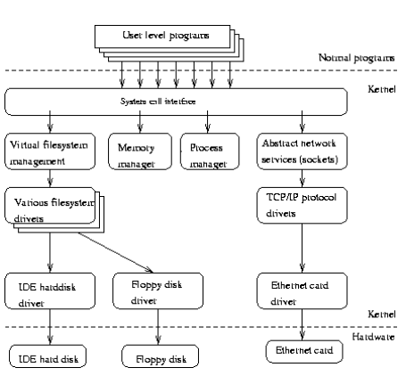
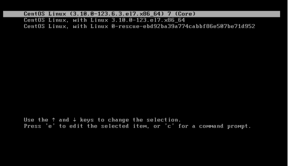
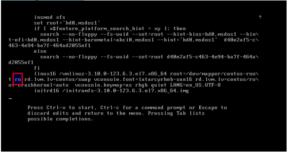
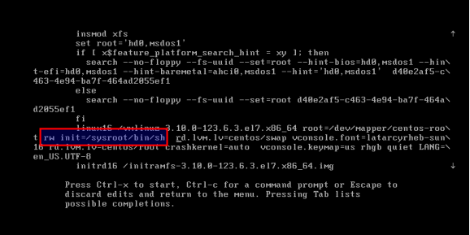
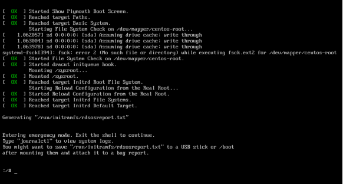

[[Catagories]] 

  

# History of Unix/Linux

  

1965 Bell Laboratories joins with MIT and General Electric in the development effort for the new operating system,Multics, which would provide multi-user, multi-processor, and multi-level (hierarchical) file system, among its many forward-looking features.

  

1969 AT&T was unhappy with the progress and drops out of the Multics project. Some of the Bell Labs

programmers who had worked on this project, Ken Thompson, Dennis Ritchie, Rudd Canaday, and

Doug McIlroy designed and implemented the first version of the Unix File System on a PDP-7 along with

a few utilities. It was given the name UNIX by Brian Kernighan as a pun on Multics.

  

1971 The system now runs on a PDP-11, with 16Kbytes of memory, including 8Kbytes for user programs

and a 512Kbyte disk.

  

Its first real use is as a text processing tool for the patent department at Bell Labs. That utilization justified

further research and development by the programming group. UNIX caught on among programmers

because it was designed with these features:

  

• programmers environment

  

• simple user interface

  

• simple utilities that can be combined to perform powerful functions

  

• hierarchical file system

  

• simple interface to devices consistent with file format

  

• multi-user, multi-process system

  

• architecture independent and transparent to the user.

  

1973 Unix is re-written mostly in C, a new language developed by Dennis Ritchie. Being written in this high-level language greatly decreased the effort needed to port it to new machines.

  

1974 Thompson and Ritchie publish a paper in the Communications of the ACM describing the new Unix OS.This generates enthusiasm in the Academic community which sees a potentially great teaching tool

for studying programming systems development. Since AT&T is prevented from marketing the product

due to the 1956 Consent Decree they license it to Universities for educational purposes and to commercial

entities.

  

1977 There are now about 500 Unix sites world-wide.

  

1980 BSD 4.1 (Berkeley Software Development)

  

1983 SunOS, BSD 4.2, SysV

  

1984 There are now about 100,000 Unix sites running on many different hardware platforms, of vastly

different capabilities.

  

1988 AT&T and Sun Microsystems jointly develop System V Release 4 (SVR4). This would later be

developed into UnixWare and Solaris 2.

  

1993 Novell buys UNIX from AT&T

  

1994 Novell gives the name "UNIX" to X/OPEN

  

1995 Santa Cruz Operations buys UnixWare from Novell. Santa Cruz Operations and Hewlett-Packard

announce that they will jointly develop a 64-bit version of Unix.

  

1996 International Data Corporation forecasts that in 1997 there will be 3 million Unix systems shipped

world-wide.

  
  

# Inside Linux

  

# Kernel

  

The core of the UNIX system. Loaded at system start up (boot). Memory-resident control

program.

Manages the entire resources of the system, presenting them to you and every other user

as a coherent system. Provides service to user applications such as device management,

process scheduling, etc.

Example functions performed by the kernel are:

  

• Managing the machine's memory and allocating it to each process.

  

• Scheduling the work done by the CPU so that the work of each user is carried out as efficiently as is possible.

  

• Accomplishing the transfer of data from one part of the machine to another interpreting and executing instructions from the shell

  

• Enforcing file access permissions  

  

You do not need to know anything about the kernel in order to use a UNIX system. These

details are provided for your information only.

  

# Shell

  

- Whenever you login to a Unix system you are placed in a shell program. The shell's

prompt is usually visible at the cursor's position on your screen. To get your work done,

you enter commands at this prompt.

  

- The shell is a command interpreter; it takes each command and passes it to the operating

system kernel to be acted upon. It then displays the results of this operation on your

screen.

  

- Several shells are usually available on any UNIX system, each with its own strengths and

weaknesses.

  

- Different users may use different shells. Initially, your system adminstrator will supply a

default shell, which can be overridden or changed. The most commonly available shells

are:  

  

• Bourne shell (sh)  

  

• C shell (csh)  

  

• Korn shell (ksh)

  

• TC Shell (tcsh)  

  

• Bourne Again Shell (bash)

  

Each shell also includes its own programming language. Command files, called "shell

scripts" are used to accomplish a series of tasks.

  

# Utilities

  

UNIX provides several hundred utility programs, often referred to as commands.

Accomplish universal functions  

  

• editing

  

• file maintenance

  

• printing

  

• sorting

  

• programming support

  

• online info etc.  

  

Modular: single functions can be grouped to perform more complex tasks

  

# Operating system

  

An operating system or OS is a software program that enables the computer hardware to communicate

and operate with the computer software. Without a computer operating system, a computer and software

programs would be useless.

  

An operating system (sometimes abbreviated as "OS") is the program that, after being initially loaded into the computer by a boot program, manages all the other programs in a computer. The other programs are called applications or application programs. The application programs make use of the operating system by making requests for services through a defined application program interface (API). In addition, users can interact directly with the operating system through a user interface such as a command language or a graphical user interface (GUI).

  

An operating system performs these services for applications:

  

• In a multitasking operating system where multiple programs can be running at the same time,  the operating system determines which applications should run in what order and how much time should be allowed for each application before giving another application a turn.

  

• It manages the sharing of internal memory among multiple applications.

  

• It handles input and output to and from attached hardware devices, such as hard disks, printers, and dial-up ports.

  

• It sends messages to each application or interactive user (or to a system operator) about the status of operation and any errors that may have occurred.

  

• It can offload the management of what are called batch jobs (for example, printing) so that the initiating application is freed from this work.

  

• On computers that can provide parallel processing, an operating system can manage how to divide the program so that it runs on more than one processor at a time.

  

# Various Parts of an Operating System

  

UNIX and 'UNIX-like' operating systems (such as Linux) consist of a kernel and some system programs.

There are also some application programs for doing work. The kernel is the heart of the operating system.

In fact, it is often mistakenly considered to be the operating system itself, but it is not. An operating system provides many more services than a plain kernel.

  

- It keeps track of files on the disk, starts programs and runs them concurrently, assigns memory and other

- resources to various processes, receives packets from and sends packets to the network, and so on. Thekernel does very little by itself, but it provides tools with which all services can be built. It also prevents anyone from accessing the hardware directly, forcing everyone to use the tools it provides. This way the kernel provides some protection for users from each other. The tools provided by the kernel are used via system calls.

  
  

The system programs use the tools provided by the kernel to implement the various services required

from an operating system. System programs, and all other programs, run `on top of the kernel', in what is

called the user mode. The difference between system and application programs is one of intent:

applications are intended for getting useful things done (or for playing, if it happens to be a game),

whereas system programs are needed to get the system working. A word processor is an application;

mount is a system program. The difference is often somewhat blurry, however, and is important only to

compulsive categorizers.

  

An operating system can also contain compilers and their corresponding libraries (GCC and the C library

in particular under Linux), although not all programming languages need be part of the operating

system. Documentation, and sometimes even games, can also be part of it.

  

# Important parts of the kernel

  

The Linux kernel consists of several important parts:

  

- Process management

  

- Memory management

  

- Hardware device drivers

  

- Filesystem drivers

  

- Network management

  

- Various other bits and pieces

  

The following figure shows some of the more important parts of the Linux kernel

  

- Probably the most important parts of the kernel (nothing else works without them) are memory

- management and process management. Memory management takes care of assigning memory areas and

- swap space areas to processes, parts of the kernel, and for the buffer cache. Process management creates

- processes, and implements multitasking by switching the active process on the processor.

  

- At the lowest level, the kernel contains a hardware device driver for each kind of hardware it supports.

- Since the world is full of different kinds of hardware, the number of hardware device drivers is large.

- There are often many otherwise similar pieces of hardware that differ in how they are controlled by

- software. The similarities make it possible to have general classes of drivers that support similar

- operations; each member of the class has the same interface to the rest of the kernel but differs in what it

- needs to do to implement them. For example, all disk drivers look alike to the rest of the kernel, i.e., they

- all have operations like `initialize the drive', `read sector N', and `write sector N'.

  

# Examples of computer operating systems

  

• Redhat – Very popular Linux operating system from Redhat

  

• Microsoft Windows - PC and IBM compatible operating system. Microsoft Windows is the most commonly found and used operating system in PCs

  

• Apple MacOS - Apple computer operating system. The only Apple computer operating system.

  

• Ubuntu Linux - A popular variant of Linux used with PC and IBM compatible computers.

  

• Google Android - operating system used with Android compatible phones.

  

• iOS - Operating system used with the Apple iPhone

  

# Hard Disk

  

A hard disk is part of a unit, often called a "disk drive," "hard drive," or "hard disk drive," that stores and

provides relatively quick access to large amounts of data on an electromagnetically charged surface or set

of surfaces. Today's computers typically come with a hard disk that contains several billion bytes

(gigabytes) of storage.

  

A hard disk is really a set of stacked "disks," each of which, like phonograph records, has data recorded

electromagnetically in concentric circles or "tracks" on the disk. A "head" (something like a phonograph

arm but in a relatively fixed position) records (writes) or reads the information on the tracks. Two heads,

one on each side of a disk, read or write the data as the disk spins. Each read or write operation requires

that data be located, which is an operation called a "seek." (Data already in a disk cache, however, will be

located more quickly.)

  

A hard disk/drive unit comes with a set rotation speed varying from 4500 to 7200 rpm. Disk access time is

measured in milliseconds. Although the physical location can be identified with cylinder, track, and

sector locations, these are actually mapped to a logical block address (LBA) that works with the larger

address range on today's hard disks.

  

# Disk Cache

  

A disk cache is a mechanism for improving the time it takes to read from or write to a hard disk. Today,

the disk cache is usually included as part of the hard disk. A disk cache can also be a specified portion of

random access memory (RAM).

The disk cache holds data that has recently been read and, in some cases, adjacent data areas that are

likely to be accessed next. Write caching is also provided with some disk caches.

  

# Recover/Reset Root Password

  
  

1 – In the boot grub menu select option to edit

  

  
  

2 – Select Option to edit (e).

  

  
  

3 – Go to the line = ro and change it with rw init=/sysroot/bin/sh

  

  
  

4 – Now press Control+x to start on single user mode

  

  
  

5 – Now access the system with this command.

  
  

chroot /sysroot

  
  

6 – Reset the password.

  
  

passwd root

  
  

7 – Exit chroot

  
  

exit

  
  

8 - Reboot your system

  
  
  

reboot

[[Catagories]] 