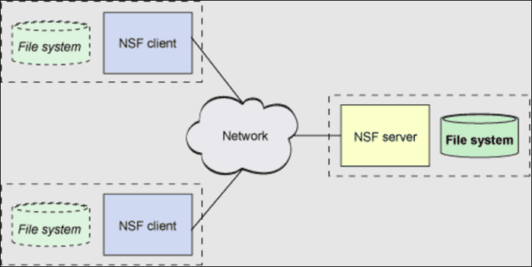

[[Catagories]] 

  

# The df command

  

~~~~

df -h or df -h. or df -h | grep /<file_system_name>

~~~~

  

~~~~    

Filesystem Size Used Avail Use% Mounted on

/dev/sda2 198G 1.7G 196G 1% /

devtmpfs 489M 0 489M 0% /dev

tmpfs 497M 0 497M 0% /dev/shm

tmpfs 497M 6.5M 491M 2% /run

tmpfs 497M 0 497M 0% /sys/fs/cgroup

/dev/sdb3 484G 73M 459G 1% /opt  

~~~~

# Introduction

  

In this quick How-To, a new Linux file system will be created on an existing volume group. For more detailed options and configurations, please refer to the Linux man pages and Red Hat documentation.

The below variables should be replaced with the appropriate values for the local system.

  

# Variable Name Description

  

~~~~

<vgname>      Volume group in which the logical volume for the file system will be placed

  

<lvname>      Logical volume name

  

<size>          Size of the logical volume. Note below commands use the "M" syntax, so <size> is in megabytes.

  

<mount_pt>      Mount point for the new file system.

  

<user>          Operating system user to own the mount point

  

<group>         Operating system group to own the mount point

  

<perm>          Permissions on the mount point. For example, "755".

~~~~

  

# Steps

  

All work will be completed as the root user.

  

Note

  

The following assumes the volume group is activated on the local system and visible with the "vgs" command.  If not activated, then further investigation is required.

If the system is a Linux 7 cluster, then special care is required with any shared volume groups.   Node evictions can occur if a volume group is activated outside of the cluster when that volume group is a resource to Cluster Suite.

  

## 1. Determine if the volume group has enough free space.

  

~~~~

  vgdisplay -s <vgname>

~~~~

  

## 2. Issue the command to create the logical volume.

  

~~~~

  lvcreate -L +<size>M -n <lvname> <vgname>

~~~~

## 3. Issue the command to create the file system. Use ext3 for Linux 5, ext4 for Linux 6, and xfs for Linux 7.

  

### Linux 5 Example ###

~~~~

mkfs.ext3 -j /dev/<vgname>/<lvname>

~~~~

### Linux 6 Example ###

~~~~

mkfs.ext4 /dev/<vgname>/<lvname>

~~~~

### Linux 7 Example ###

  

~~~~

mkfs.xfs /dev/<vgname>/<lvname>  

~~~~

  

## 4. (For ext3 and ext4 file systems only) Set the automatic file system check flags to off to help with boot times.

~~~~

tune2fs -c0 -i0 /dev/<vgname>/<lvname>

~~~~  

## 5. Create the new mount point directory.

 ~~~~

  mkdir <mount_pt>

~~~~

## 6. Add the necessary line to the /etc/fstab so the the new file system is mounted automatically at boot time. Note that Corporate envs recommends the number of counts between file system checks and the interval to be both set to zero for file systems not critical to the operating system. This is done to eliminate hangs at boot time.

## Linux 5 Example 

  ~~~~

  echo "/dev/mapper/<vgname>-<lvname> <mount_pt> ext3 defaults 0 0" >> /etc/fstab

  ~~~~

## Linux 6 Example    

~~~~
echo "/dev/mapper/<vgname>-<lvname> <mount_pt> ext4 defaults 0 0" >> /etc/fstab
~~~~

## Linux 7 Example     

~~~~

  echo "/dev/mapper/<vgname>-<lvname> <mount_pt> xfs defaults,nofail 0 0" >> /etc/fstab  

~~~~

## 7. Linux 7 Only.  After updating /etc/fstab, it is advisable to update systemd's unit files with the following command.

~~~~
 systemctl daemon-reload

~~~~

  

## Mount the new file system.

   ~~~~

   mount <mount_pt>

   ~~~~

## If necessary, modify ownership and permissions on the mount point.

~~~~

  • chown <user>:<group> <mount_pt>

  

  • chmod <perm> <mount_pt>

~~~~

  

## How to Shrink a File System on Linux

  

Note

  

It is not possible to shrink an ext2/ext3/ext4 file system online. The file system must be unmounted, meaning that any applications using that file system must be stopped. Keep this in mind when expanding file systems. There’s no going back unless you want to unmount it! Corruption can occur if a file system shrink operation is performed on a mounted file system.

Make sure you have full backups of any file system to be shrunk. There is an elevated risk of corruption with this type of operation.

  

## 1. Record the original used space of the file system. For this example, consider the /data file system consuming 2.1GB of space.

~~~~

[root@app1 ~]# df -h

  

Filesystem            Size  Used Avail Use% Mounted on

/dev/mapper/VolGroup00-LogVol00

                      7.1G  2.6G  4.2G  38% /

/dev/sda1              99M   12M   82M  13% /boot

tmpfs                 147M     0  147M   0% /dev/shm

/dev/mapper/appvg1-applv01

                      4.0G  2.1G  1.8G  55% /data

~~~~

## 2. Umount the file system. If the file system is not un-mounting, check if there are any processes using it with fuser -cu command. In the example, the interactive session has its current directory as /data, so changing directories is required to unmount /data.

  

~~~~

umount /data

~~~~

~~~~

[root@app1 data]# umount /data

  

umount: /data: device is busy

umount: /data: device is busy

[root@app1 data]#

[root@app1 data]# fuser -cu /data

/data:                5861c(root)

[root@app1 data]# cd /

[root@app1 /]# umount /data

~~~~

  
  

## 3. Run the following command to force an fsck against the file system. This is to verify that the file system is consistent. Note the underlying logical volume name is used. The logical volume name can be obtained from the above df -h output.

  

~~~~

e2fsck –f /dev/mapper/appvg1-applv01

~~~~

  

~~~~

[root@app1 /]# e2fsck -f /dev/mapper/appvg1-applv01

e2fsck 1.39 (29-May-2006)

Pass 1: Checking inodes, blocks, and sizes

Pass 2: Checking directory structure

Pass 3: Checking directory connectivity

Pass 4: Checking reference counts

Pass 5: Checking group summary information

/dev/mapper/appvg1-applv01: 12/524288 files (8.3% non-contiguous), 559713/1047552 blocks

~~~~

  

## 4. Resize the file system to its new size. Be sure to size it to something larger than the used space in Step 1!

  

~~~~

resize2fs /dev/mapper/appvg1-applv01 3G

~~~~

  
~~~~
[root@app1 /]# resize2fs /dev/mapper/appvg1-applv01 3G

resize2fs 1.39 (29-May-2006)

Resizing the filesystem on /dev/mapper/appvg1-applv01 to 786432 (4k) blocks.

The filesystem on /dev/mapper/appvg1-applv01 is now 786432 blocks long.
~~~~
  

## 5. Check the consistency of the file system again.

  

~~~~

e2fsck –f /dev/mapper/appvg1-applv01

~~~~

  

~~~~

[root@app1 /]# e2fsck -f /dev/mapper/appvg1-applv01

e2fsck 1.39 (29-May-2006)

Pass 1: Checking inodes, blocks, and sizes

Pass 2: Checking directory structure

Pass 3: Checking directory connectivity

Pass 4: Checking reference counts

Pass 5: Checking group summary information

/dev/mapper/appvg1-applv01: 12/393216 files (8.3% non-contiguous), 555087/786432 blocks

~~~~

  

## 6. Shrink the underlying logical volume to the same size. It’s important to remember that file systems reside on logical volumes. Logical volumes are not the file systems themselves. This is why we shrank the file system first, then the logical volume.

  

~~~~

lvresize –L3G /dev/mapper/appvg1-applv01

~~~~

  

~~~~

[root@app1 /]# lvresize -L3G /dev/mapper/appvg1-applv01

  WARNING: Reducing active logical volume to 3.00 GB

  THIS MAY DESTROY YOUR DATA (filesystem etc.)

Do you really want to reduce applv01? [y/n]: y

  Reducing logical volume applv01 to 3.00 GB

  Logical volume applv01 successfully resized

~~~~

  

## 7. Remount the file system. The volume group should now have 1 GB less of additional free space.

mount /data

  

~~~~

[root@app1 /]# mount /dev/mapper/appvg1-applv01 /data

[root@app1 /]# df -h

Filesystem            Size  Used Avail Use% Mounted on

/dev/mapper/VolGroup00-LogVol00

                      7.1G  2.6G  4.2G  38% /

/dev/sda1              99M   12M   82M  13% /boot

tmpfs                 147M     0  147M   0% /dev/shm

/dev/mapper/appvg1-applv01

                      3.0G  2.1G  843M  72% /data  

~~~~
  

# Checking File Systems filled above 80%

~~~~

df -Ph | awk '0+$5 >= 80 {print}'

~~~~

  

## Samba

  

~~~~

 

Installing Samba client: dnf install samba-client cifs-utils  

  

Listing Samba shares:    smbclient -L ipaserver.example.com    

  

Creating mount point directory: mkdir -p /samba/smb1    

Mounting share in runtime: mount -o username=smb1 //ipaserver.example.com/samba /samba/smb1

Enter the Samba user password : *********

  

Unmounting share: umount /samba/smb1      

Making entry in fstab file for persistent mount:

vim /etc/fstab                                                  

//ipaserver.example.com/samba /samba/smb1 cifs _netdev,username=smb1,password=password  

0 0

:wq  

  

Mounting through fstab: mount -a  

  

Verifying mounted share: mount    

  

~~~~

  

# NFS (Network File Share)

  

  

A basic system is used in NFS where a mount command will instruct the server to link with several clients. The clients will get access to the files on the server through the proper platform. The design can allow several security protocols to run in a place that will dictate who will have access to certain files, producing a safe and simplified approach to work.

# Benefits of NFS Server (Pros)

  

The NFS server stands for central management.

  

Can be accessed from anywhere and enables multiple computers to use the same files.

  

Reduces storage costs by reducing the need for disk space.

  

The user to log into any server and have access to their files openly.

  

File system is transparent to all users that leads to data consistency and reliability.

  

Reduces administration costs.

  

For more security firewalls and Kerberos can be used.

  

# Disadvantages of NFS Network File System (Cons)

  

File sharing can be highly complex.

  

Parallel file access is not commonly available yet, other than NFSv4.

  

Block size limitations which is a con of NFS and can be easily made larger, but then the timeouts would need to be adjusted too.

  

Security: NFS is based on RPCs which are generally insecure.

  

NFS  in generally can be vulnerable to internet threats.

  

It may be difficult for multiple parties to access a file simultaneously, especially if the file is more massive in size.

  

A firewall is necessary for running Network File System to keep unwanted parties from entering.

  
  
  

Discover the NFS share exported by NFS server ipaserver.example.com.

  

• Mount the share /nfsshare on directory /nfs/share and mount should be persistent.

  

• NFS version 3 should be used.

  

## Command Action Description

~~~~

Installing NFS client: dnf group install “Network File System Client”  

  

Discovering NFS exports: showmount -e ipaserver.example.com            

  

Creating mount point directory: mkdir -p /nfs/share                              

  

Mounting NFS share in run time: mount -o nfsvers=3 ipaserver.example.com:/nfshare /nfs/share  

  

Unmounting NFS share:   umount /nfs/share    

Making entry in fstab file for persistent mount:

  

vim /etc/fstab

ipaserver.example.com:/nfsshare /nfs/share nfs _netdev,nfsvers=3 0 0

:wq                

Mounting through fstab: mount -a        

Verifying the mounted filesystem and version:   mount                                                        

~~~~