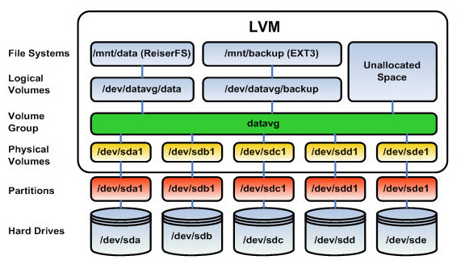
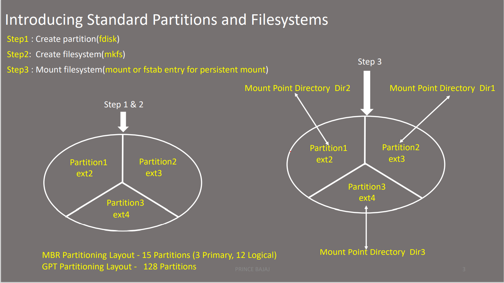
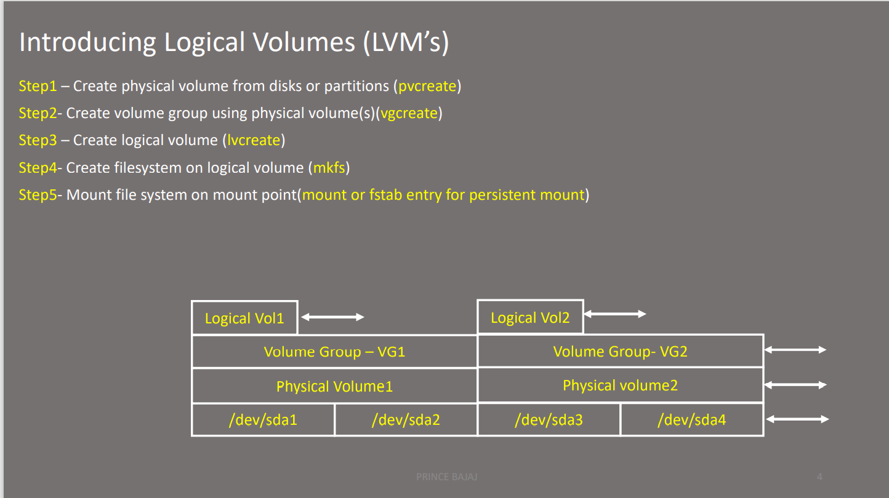

[[Catagories]] 

  

## Disk Management








# Display Physical Volumes (pvs and pvdisplay)

  

~~~~

To display Physical Volumes (PV) on a system you can issue the pvs command:

  

[root@rhel01a ~]# pvs

  PV         VG        Fmt  Attr PSize PFree

  /dev/sda2  vg_rhel01 lvm2 a--  7.51g    0

  /dev/sdb1  vg_rhel01 lvm2 a--  4.99g    0

  

To display more details about a PV, you can issue the pvdisplay command:

  

[root@rhel01a ~]# pvdisplay

  --- Physical volume ---

  PV Name               /dev/sda2

  VG Name               vg_rhel01

  PV Size               7.51 GiB / not usable 3.00 MiB

  Allocatable           yes (but full)

  PE Size               4.00 MiB

  Total PE              1922

  Free PE               0

  Allocated PE          1922

  PV UUID               2fkPz2-8os0-4kJN-3moF-2prj-Z37s-cMC6Rh

  --- Physical volume ---

  PV Name               /dev/sdb1

  VG Name               vg_rhel01

  PV Size               4.99 GiB / not usable 2.41 MiB

  Allocatable           yes (but full)

  PE Size               4.00 MiB

  Total PE              1278

  Free PE               0

  Allocated PE          1278

  PV UUID               Q3lBfV-tDi9-LJOw-nZKj-fge1-pqSQ-l0Cute

~~~~

~~~~

  ► pvdisplay | grep <pv_name> - To grab pv specifically

~~~~

  
  

# Display Volume Groups (vgs and vgdisplay)

  

To display basic information regarding a Volume Group on a Linux system you can issue the vgs command:

~~~~

[root@rhel01a ~]# vgs

  

  VG        #PV #LV #SN Attr   VSize  VFree

  vg_rhel01   2   2   0 wz--n- 12.50g    0  

  

From the above output we can see that there are 2 Physical Volumes (PV) assigned to the Volume Group (VG) vg_rhel01

For a more detailed view of Volume Groups on a Linux system, you can use the command vgdisplay

  

  •  vgdisplay <volume_group_name>

  

[root@rhel01a ~]# vgdisplay vg_rhel01/

  --- Volume group ---

  VG Name               vg_rhel01

  System ID            

  Format                lvm2

  Metadata Areas        2

  Metadata Sequence No  5

  VG Access             read/write

  VG Status             resizable

  MAX LV                0

  Cur LV                2

  Open LV               2

  Max PV                0

  Cur PV                2

  Act PV                2

  VG Size               12.50 GiB

  PE Size               4.00 MiB

  Total PE              3200

  Alloc PE / Size       3200 / 12.50 GiB

  Free  PE / Size       0 / 0  

  VG UUID               ttO0aF-RgCq-OZM7-dKcj-sDr0-vfg1-TDFzj0

~~~~

  

~~~~

  ► vgdisplay | grep <vg_name> - To grab vg specifically

~~~~

  

# Display Logical Volume Information (lvs and lvdisplay)

  

To display Logical Volume (LV) information on a Linux system you can issue the lvs command:

  

~~~~

  ► lvs

~~~~

~~~~

[root@rhel01a ~]# lvs

  

  LV      VG        Attr     LSize  Pool Origin Data%  Move Log Copy%  Convert

  lv_root vg_rhel01 -wi-ao-- 10.53g                                          

  lv_swap vg_rhel01 -wi-ao--  1.97g

~~~~

  

For a more detailed display of Logical Volumes on a Linux system you can use the command lvdisplay:

~~~~

  • lvdisplay /dev/vg_name/<lv_name>

~~~~


~~~~  
[root@rhel01a ~]# lvdisplay /dev/vg_rhel01/lv_root

  

  --- Logical volume ---

  LV Path                /dev/vg_rhel01/lv_root

  LV Name                lv_root

  VG Name                vg_rhel01

  LV UUID                2LwbRo-KMuD-DQne-3NMI-Jndp-gClY-Zj3uL0

  LV Write Access        read/write

  LV Creation host, time rhel01, 2014-02-19 19:54:06 +0000

  LV Status              available

  # open                 1

  LV Size                10.53 GiB

  Current LE             2696

  Segments               2

  Allocation             inherit

  Read ahead sectors     auto

  - currently set to     256

  Block device           253:0

~~~~

  

If you issue the "lvdisplay" command without specifying a specific Logical Volume, then all Logical Volumes on your system will be displayed. In the above example the parameter "/dev/vg_rhel01/lv_root" was passed to the lvdisplay command.

  

~~~~

  • lvdisplay | grep <lv_name> - To grab lv specifically

~~~~

  

# List Partition types on a Linux system

  

Although this command is not a LVM command, it us useful for displaying partition information. To display partition types and disk information on a Linux system, you can use the lsblk command:

  

~~~~

[root@rhel01a ~]# lsblk

  

NAME                         MAJ:MIN RM   SIZE RO TYPE MOUNTPOINT

sr0                           11:0    1  1024M  0 rom  

sda                            8:0    0     8G  0 disk

├─sda1                         8:1    0   500M  0 part /boot

└─sda2                         8:2    0   7.5G  0 part

  ├─vg_rhel01-lv_root (dm-0) 253:0    0  10.5G  0 lvm  /

  └─vg_rhel01-lv_swap (dm-1) 253:1    0     2G  0 lvm  [SWAP]

sdb                            8:16   0     5G  0 disk

└─sdb1                         8:17   0     5G  0 part

  └─vg_rhel01-lv_root (dm-0) 253:0    0  10.5G  0 lvm  /

sdc                            8:32   0     2G  0 disk

~~~~

  

# List Partitions on a Linux system - fdisk

  

~~~~

To display partition information on a Linux system, you can issue the fdisk -l command:

~~~~

  

# List Partitions on a Linux system - fdisk

  

To display partition information on a Linux system, you can issue the fdisk -l command:

  

~~~~

[root@rhel01a ~]# fdisk -l /dev/sda

  

Disk /dev/sda: 8589 MB, 8589934592 bytes

255 heads, 63 sectors/track, 1044 cylinders

Units = cylinders of 16065 * 512 = 8225280 bytes

Sector size (logical/physical): 512 bytes / 512 bytes

I/O size (minimum/optimal): 512 bytes / 512 bytes

Disk identifier: 0x00029be4

Device Boot      Start         End      Blocks   Id  System

/dev/sda1   *           1          64      512000   83  Linux

Partition 1 does not end on cylinder boundary.

/dev/sda2              64        1045     7875584   8e  Linux LVM               8:32   0     2G  0 disk

  

If you issue the command "fdisk -l" without specifying a disk, then all disk information is displayed.

  

Sometimes it is useful to use the command in conjunction with "grep" to limit the output displayed:

  

~~~~

  

~~~~

[root@rhel01a ~]# fdisk -l | grep /dev/sd

  

Disk /dev/sda: 8589 MB, 8589934592 bytes

/dev/sda1   *           1          64      512000   83  Linux

/dev/sda2              64        1045     7875584   8e  Linux LVM

Disk /dev/sdb: 5368 MB, 5368709120 bytes

/dev/sdb1               1         652     5237158+  8e  Linux LVM

Disk /dev/sdc: 2147 MB, 2147483648 bytes

~~~~

  

From the above we can see that we have a spare disk on our Red Hat system "/dev/sdc". This command is useful to help identify a disk that has just been added to a system.

  

~~~~

  ► pvcreate /dev/<pv_name>

~~~~

  

~~~~

[root@rhel01a ~]# pvcreate /dev/sdc

  

  Writing physical volume data to disk "/dev/sdc"

  Physical volume "/dev/sdc" successfully created

  

[root@rhel01a ~]# pvs

  

  PV         VG        Fmt  Attr PSize PFree

  /dev/sda2  vg_rhel01 lvm2 a--  7.51g    0

  /dev/sdb1  vg_rhel01 lvm2 a--  4.99g    0

  /dev/sdc             lvm2 a--  2.00g 2.00g

~~~~

  

# Remove a Physical Volume from a Volume Group (vgreduce)

  

To remove storage from a Volume Group, the command vgreduce is used. This command is the opposite of the vgextend command. IN the following example, we will remove the specified PV from the Volume Group:

  

~~~~

  ► vgreduce <vg_name> /dev/<pv_name>

~~~~

  

~~~~

[root@rhel01a ~]# pvs

  

  PV         VG        Fmt  Attr PSize PFree

  /dev/sda2  vg_rhel01 lvm2 a--  7.51g    0

  /dev/sdb1  vg_rhel01 lvm2 a--  4.99g    0

  /dev/sdc   vg_rhel01 lvm2 a--  2.00g 2.00g

~~~~

~~~~

[root@rhel01a ~]# vgreduce vg_rhel01 /dev/sdc

  

  Removed "/dev/sdc" from volume group "vg_rhel01"

~~~~

~~~~

[root@rhel01a ~]# pvs

  

  PV         VG        Fmt  Attr PSize PFree

  /dev/sda2  vg_rhel01 lvm2 a--  7.51g    0

  /dev/sdb1  vg_rhel01 lvm2 a--  4.99g    0

  /dev/sdc             lvm2 a--  2.00g 2.00g

  

The pvs command is initially used to show the relationship between the Physical Volume and the Volume Group. After the vgreduce command is issued, we use the pvs command to verify that the Physical Volume "/dev/sdc" is no longer attached to the Volume Group "vg_rhel01

~~~~

  

# Remove a Physical Volume (pvremove)

  

To remove a Physical Volume from a system, you use the pvremove command:

~~~~

  ► pvremove  /dev/<pv_name>    

~~~~

  

~~~~

  [root@rhel01a ~]# pvremove /dev/sdc

  

  Labels on physical volume "/dev/sdc" successfully wiped

~~~~

  
  

# Create a New Volume Group (vgcreate)

  

To create a new Volume Group (VG) you must use the vgcreate command. You will also need to specify which Physical Volume (PV) is to be associated with the new Volume Group.

  

In the example below we are using a newly added disk /dev/sdc. Before the newly added disk can be used we use the pvcreate command. The command pvs is used to show that it is not associated with any existing Volume Groups.

  

~~~~

[root@rhel01a ~]# pvcreate /dev/sdc

  

  Writing physical volume data to disk "/dev/sdc"

  Physical volume "/dev/sdc" successfully created

  

[root@rhel01a ~]# pvs

  

  PV         VG        Fmt  Attr PSize PFree

  /dev/sda2  vg_rhel01 lvm2 a--  7.51g    0

  /dev/sdb1  vg_rhel01 lvm2 a--  4.99g    0

  /dev/sdc             lvm2 a--  2.00g 2.00g

  

[root@rhel01a ~]# vgcreate vg01 /dev/sdc

  

  Volume group "vg01" successfully created

Now when the pvs command is issued, we can see that the storage is now associated with the new Volume Group "vg01".

  

[root@rhel01a ~]# pvs

  

  PV         VG        Fmt  Attr PSize PFree

  /dev/sda2  vg_rhel01 lvm2 a--  7.51g    0

  /dev/sdb1  vg_rhel01 lvm2 a--  4.99g    0

  /dev/sdc   vg01      lvm2 a--  2.00g 2.00g

~~~~

  

# Remove a Volume Group

  

To remove a Volume Group, the command vgremove is used:

  

~~~~

  vgremove <vg_name>

~~~~

~~~~

[root@rhel01a ~]# vgremove test_vg01

  

  Volume group "test_vg01" successfully removed

~~~~

  

# Rename a Volume Group (vgrename)

  

To rename an existing Volume Group, the vgrename command is used:

  

~~~~

  vgrename <old_vg_name>< new_vg_name >

~~~~

~~~~

[root@rhel01a ~]# vgs

  

  VG        #PV #LV #SN Attr   VSize  VFree

  vg01        1   0   0 wz--n-  2.00g 2.00g

  vg_rhel01   2   2   0 wz--n- 12.50g    0  

  

[root@rhel01a ~]# vgrename vg01 test_vg01  

  

  Volume group "vg01" successfully renamed to "test_vg01"

  

[root@rhel01a ~]# vgs

  

  VG        #PV #LV #SN Attr   VSize  VFree

  test_vg01   1   0   0 wz--n-  2.00g 2.00g

  vg_rhel01   2   2   0 wz--n- 12.50g    0  

~~~~

  
  

In the above example, we used the vgrename command to rename the existing Volume Group "vg01" to "test_vg01". The command vgs was used to display the before and after results.

  
  

# Extend a Volume Group (vgextend)

  

To add additional space to an existing Volume Group, the command vgextend is used. You also need to supply the name of the Physical Volume (disk) that is going to be added. In the following example, we are going to add 2GB of space to the existing Volume Group vg_rhel01

  

~~~~  

  vgextend <vg_name> /dev/<pg_name>

~~~~

  

~~~~

[root@rhel01a ~]# vgdisplay vg_rhel01

  --- Volume group ---

  VG Name               vg_rhel01

  System ID            

  Format                lvm2

  Metadata Areas        2

  Metadata Sequence No  5

  VG Access             read/write

  VG Status             resizable

  MAX LV                0

  Cur LV                2

  Open LV               2

  Max PV                0

  Cur PV                2

  Act PV                2

  VG Size               12.50 GiB

  PE Size               4.00 MiB

  Total PE              3200

  Alloc PE / Size       3200 / 12.50 GiB

  Free  PE / Size       0 / 0  

  VG UUID               ttO0aF-RgCq-OZM7-dKcj-sDr0-vfg1-TDFzj0

~~~~

  

~~~~  

[root@rhel01a ~]# vgextend vg_rhel01 /dev/sdc

  

  Volume group "vg_rhel01" successfully extended

  

[root@rhel01a ~]# vgdisplay vg_rhel01

  

  --- Volume group ---

  VG Name               vg_rhel01

  System ID            

  Format                lvm2

  Metadata Areas        3

  Metadata Sequence No  6

  VG Access             read/write

  VG Status             resizable

  MAX LV                0

  Cur LV                2

  Open LV               2

  Max PV                0

  Cur PV                3

  Act PV                3

  VG Size               14.50 GiB

  PE Size               4.00 MiB

  Total PE              3711

  Alloc PE / Size       3200 / 12.50 GiB

  Free  PE / Size       511 / 2.00 GiB

  VG UUID               ttO0aF-RgCq-OZM7-dKcj-sDr0-vfg1-TDFzj0

~~~~

  
  

In the above example, we used the vgdisplay command to display the current size and associated Physical Volumes with the Volume Group "vg_rhel01".

  

Next the vgextend command is issued along with the specified Physical Volume to use. After the command was issued, the vgdisplay command was used to display the new attributes of the specified Volume Group. From the output you can see the size and associated PV count has increased.

  

# Create a Logical Volume (lvcreate)

  

To create a Logical Volume on an existing Volume Group, the command lvcreate is used.

  

~~~~  

  lvcreate -n <lv_name> -l <space_to_allocate> <vg_name>

~~~~

~~~~

[root@rhel01a ~]# lvcreate -n lv01 -l 100%VG vg01

  

  Logical volume "lv01" created

~~~~

  

The above example will create a Logical Volume (LV) called lv01 on the Volume Group (VG) vg01. We have also specified that the Logical Volume should utilise all available space within the Volume Group ( 100%VG )

  

# Create a Logical Volume (lvcreate) with a specified size

  

IN the following example, the command lvcreate is used to create a new Logical Volume. This time, we are going to specify the amount of space to be used from the Volume Group. IN the example, we will allocate 1GB of space from the Volume Group.

  

~~~~  

[root@rhel01a ~]# pvs

  

  PV         VG        Fmt  Attr PSize PFree

  /dev/sda2  vg_rhel01 lvm2 a--  7.51g    0

  /dev/sdb1  vg_rhel01 lvm2 a--  4.99g    0

  /dev/sdc   vg01      lvm2 a--  2.00g 2.00g  

  
  

[root@rhel01a ~]# lvcreate -n lv01 -L1G vg01

  

  Logical volume "lv01" created

  

[root@rhel01a ~]# pvs

  PV         VG        Fmt  Attr PSize PFree  

  /dev/sda2  vg_rhel01 lvm2 a--  7.51g       0

  /dev/sdb1  vg_rhel01 lvm2 a--  4.99g       0

  /dev/sdc   vg01      lvm2 a--  2.00g 1020.00m

~~~~

  
  

In the above example we can see that initially there is 2GB of space allocated to the Volume Group vg01. We then issued the command:

  

~~~~

lvcreate -n lv01 -L1G vg01 - The command will create a Logical Volume (LV) called lv01 with an allocation of 1GB from the Volume Group (VG) vg01

~~~~

  
  

# Add Space to a File System with lvextend

  

To add space to an existing file system, the command lvextend is used. In the example below we can see that a file system called testfs exists and currently has 924MB of available space. 

Before we can add space, you must verify that space is available to the Logical Volume. To see the current allocation of space to a file system we use the df command. To view available space we can issue the command pvs. 

IN the example below we can see that there is 1020MB of available space within Volume Group vg01.

~~~~

  lvextend /dev/<vg_name>/<lv_name> -L<+space_to_allocateM> -r

~~~~

~~~~  

  lvextend /dev/<vg_name>/<lv_name> -L<+space_to_allocateM> 

~~~~

~~~~  


[root@rhel01a /]# df -h /testfs

  

Filesystem            Size  Used Avail Use% Mounted on

/dev/mapper/vg01-lv01

                     1008M   34M  924M   4% /testfs

[root@rhel01a /]# pvs

  PV         VG        Fmt  Attr PSize PFree  

  /dev/sda2  vg_rhel01 lvm2 a--  7.51g       0

  /dev/sdb1  vg_rhel01 lvm2 a--  4.99g       0

  /dev/sdc   vg01      lvm2 a--  2.00g 1020.00m

~~~~

  

~~~~

[root@rhel01a /]# lvextend /dev/vg01/lv01 -L+1000M -r

  

  Extending logical volume lv01 to 1.98 GiB

  Logical volume lv01 successfully resized

resize2fs 1.41.12 (17-May-2010)

Filesystem at /dev/mapper/vg01-lv01 is mounted on /testfs; on-line resizing required

old desc_blocks = 1, new_desc_blocks = 1

Performing an on-line resize of /dev/mapper/vg01-lv01 to 518144 (4k) blocks.

The filesystem on /dev/mapper/vg01-lv01 is now 518144 blocks long.

  

The command lvextend /dev/vg01/lv01 -L+1000M -r is used to increase the size of the Logical Volume by 1000MB. the -r option is specified as this will carry out a resize of the file system online.

~~~~

  
  
Now when we use the df command, we can see that the file system has been increased in size.

  

~~~~

[root@rhel01a /]# df -h testfs/

Filesystem            Size  Used Avail Use% Mounted on

/dev/mapper/vg01-lv01

                      2.0G   34M  1.9G   2% /testfs

~~~~

  

# Specify the size of a file system with lvextend

  

If you wanted to specify the size of a file system, we can use the option -L. Here we can then specify the size we require in MB/GB. In the example below we are going to specify a size of 1.5GB should be used with a file system. Currently there is only 435MB of space available to the file system testfs

  

~~~~

[root@rhel01a /]# df -h /testfs/

  

Filesystem            Size  Used Avail Use% Mounted on

/dev/mapper/vg01-lv01

                      492M   33M  435M   8% /testfs

~~~~

  

~~~~

[root@rhel01a /]# lvextend /dev/vg01/lv01 -L1.5GB -r

  

  Extending logical volume lv01 to 1.50 GiB

  Logical volume lv01 successfully resized

resize2fs 1.41.12 (17-May-2010)

~~~~

  

~~~~

Filesystem at /dev/mapper/vg01-lv01 is mounted on /testfs; on-line resizing required

old desc_blocks = 1, new_desc_blocks = 1

Performing an on-line resize of /dev/mapper/vg01-lv01 to 393216 (4k) blocks.

The filesystem on /dev/mapper/vg01-lv01 is now 393216 blocks long.

~~~~

  

# Reduce the size of a file system (lvreduce)

  

To reduce the size of a file system, the lvreduce command is used to change the size of the underlying Logical Volume. WARNING use this command with care as you can loose data if you shrink your file system.

  

~~~~

  ► lvreduce /dev/<vg_name>/<lv_name> <-Lspace_to_allocate_M> -r  

  ► lvreduce /dev/<vg_name>/<lv_name> <-Lspace_to_allocate_M>

~~~~

  

In the example below, we will use the command lvreduce /dev/vg01/lv01 -L500M -r

 ~~~~   
  

[root@rhel01a /]# df -h /testfs/

Filesystem            Size  Used Avail Use% Mounted on

/dev/mapper/vg01-lv01

                      1.5G   34M  1.4G   3% /testfs

[root@rhel01a /]# lvreduce /dev/vg01/lv01 -L500M -r

Do you want to unmount "/testfs"? [Y|n] y

fsck from util-linux-ng 2.17.2

/dev/mapper/vg01-lv01: 11/98304 files (9.1% non-contiguous), 14756/393216 blocks

resize2fs 1.41.12 (17-May-2010)

Resizing the filesystem on /dev/mapper/vg01-lv01 to 128000 (4k) blocks.

The filesystem on /dev/mapper/vg01-lv01 is now 128000 blocks long.

Reducing logical volume lv01 to 500.00 MiB

  Logical volume lv01 successfully resized

[root@rhel01a /]# df -h testfs/

Filesystem            Size  Used Avail Use% Mounted on

/dev/mapper/vg01-lv01

                      492M   33M  435M   8% /testfs


~~~~


## Reduce a file system by a specified amount

  

In the following example, we will specify the amount of size to reduce the file system by:

  

~~~~
[root@rhel01a /]# df -h /testfs/

  

Filesystem            Size  Used Avail Use% Mounted on

/dev/mapper/vg01-lv01

                      492M   33M  435M   8% /testfs

  

[root@rhel01a /]# lvreduce /dev/vg01/lv01 -L-235M -r

  Rounding size to boundary between physical extents: 232.00 MiB

Do you want to unmount "/testfs"? [Y|n] y

fsck from util-linux-ng 2.17.2

/dev/mapper/vg01-lv01: 11/32768 files (9.1% non-contiguous), 10449/128000 blocks

resize2fs 1.41.12 (17-May-2010)

Resizing the filesystem on /dev/mapper/vg01-lv01 to 68608 (4k) blocks.

The filesystem on /dev/mapper/vg01-lv01 is now 68608 blocks long.

Reducing logical volume lv01 to 268.00 MiB

  Logical volume lv01 successfully resized

  
  ~~~~


~~~~
[root@rhel01a /]# df -h /testfs/

Filesystem            Size  Used Avail Use% Mounted on

/dev/mapper/vg01-lv01

                      262M   33M  217M  14% /testfs
~~~~


  


~~~~
 ► lvremove /dev/<vg>/<lv>

  ► lvremove /dev/t1-sub1/082720
  

~~~~

## Creating Swap Space

~~~~
 2545  2020-11-12 01:17:41 lvcreate -L 150M -n swaplv t1-s1

 2546  2020-11-12 01:17:56 swapon -s

 2547  2020-11-12 01:21:19 mkswap /dev/t1-s1/swaplv

 2548  2020-11-12 01:22:07 vim /dev/t1-s1/swaplv swap swap defaults 0 0

 2549  2020-11-12 01:22:51 vim /etc/fstab

 2550  2020-11-12 01:24:05 swapon -va

 2551  2020-11-12 01:24:27 swapon -s
  ~~~~

## Create new volume in HA config

In this quick How-To, a new Linux volume group will be created. For more detailed options or configurations, please see the Linux man pages or the Red Hat documentation.

Note:

Device-mapper is assumed to be configured and in use.

## Variable Name Description

The below variables should be replaced with the appropriate values for the local system.
~~~~
  
<sdX> - SCSI device name associated to the physical disk device or SAN LUN. This device should be UNUSED.

  

<mpathX> - Associated Device-Mapper Multipath device name. This device should be UNUSED and correspond to the underlying SCSI devices <sdX>.

  

<vgname> - Volume group in which the logical volume for the file system will be placed

~~~~

# Steps

## All works should be completed as the root user.

~~~~
Note


The below commands can destroy existing data if completed improperly. Make sure the devices used are those identified for the new volume group.

1. First step is to determine which SCSI device, <sdX>, allocated from the SAN administrator is for the new Linux volume group. A unique identifier, UUID, is typically provided by the SAN administrator for the allocated device.

To find the UUID at the Linux level, issue the following command as the root on each device until the proper UUID is located.

 multipath -ll <mpathX>          ## e.g. <mpathX> = mpath0, mpath1, mpath2, etc . . . 

~~~~


## Linux 5.x and 6.x

  

~~~~

scsi_id -g -u -s /block/<sdX>   ## e.g. <sdX> = sda, sdb, sdb, etc . . .

~~~~

  

## Linux 7.x

  
~~~~

/usr/lib/udev/scsi_id -g -u -d /dev/<sdX>   ## e.g. <sdX> = sda, sdb, sdb, etc . . .  
~~~~

```

The multipath command will return the associated <sdX> for all paths to the SAN LUN.

For example, if the target UUID is 360060e8005aff9000000aff9000012da, then the following commands will find the appropriate Linux device name. Notice that this example is using Device-Mapper Multipath and mpath1 is associated to the /dev/sdf and /dev/sdx SCSI devices.


```

  

## Example

  

~~~~


[root@ipht01 ~]# multipath -ll mpath1

mpath1 (360060e8005aff9000000aff9000012da) dm-33 HP,OPEN-V

[size=25G][features=1 queue_if_no_path][hwhandler=0][rw]

\_ round-robin 0 [prio=0][active]

 \_ 0:0:1:2  sdf  8:80   [active][ready]

 \_ 1:0:1:2  sdx  65:112 [active][ready]

  

[root@ipht01 ~]# scsi_id -g -u -s /block/sdf

360060e8005aff9000000aff9000012da

  

[root@ipht01 ~]# scsi_id -g -u -s /block/sdx

360060e8005aff9000000aff9000012da

~~~~


  
  

## 2. Once the proper SCSI device is located associated to the non-shared UUID, as the root user, execute the command fdisk to create a physical partition on the drive that spans the entire drive. Note that with Device-Mapper Multipath, it is only required to complete this for one of the paths to the SAN.


```
fdisk /dev/mapper/mpath<X> ## <X> = associated Multipath SCSI device name found above

   p       # check the partition table to verify it is empty

   n       # new partition

   p       # primary

   1       # partition number

   <enter> # Take the default starting cylinder

   <enter> # Take the default last cylinder, alternatively +30720M

   t       # LVM type

   8e      # Linux LVM

   w       # Write partition table to disk

```

## 3. Now, issue the following commands on the local node to create the volume group.

  

~~~~

  • partprobe

  

  • kpartx -a /dev/mapper/<mpathX> ## <mpathX> = associated mpath file for the above SCSI device

  

  • pvcreate /dev/mapper/<mpathX>p1

  

  • vgcreate <vgname> /dev/mapper/<mapthX>p1

~~~~

  

Systems with RHCS and HA-LVM (Linux 7)

  

Starting in Linux 7, a true HA-LVM configuration with Red Hat Cluster Suite (RHCS) os used. With HA-LVM, only those volume groups explicitly listed in the volume_list parameter in /etc/lvm/lvm.conf will be activated at boot time.   All other volume groups are assumed to be solely controlled by RHCS.

To determine if the volume_list parameter is configured, then the following command.

  

~~~~

lvmconfig --type diff

~~~~

For example, the following shows the volume groups vg00 and cerner1vg are the only volume groups activated at boot time.

  

Example

~~~~

[root@app01]# lvmconfig --type diff

activation {

        volume_list=["vg00","cerner1vg"]

}

global {

        use_lvmetad=0

}

~~~~

  

If the new volume group is to be activated at boot time, update the /etc/lvm/lvm.conf file.

vi /etc/lvm/lvm.conf

Once done, verify with the lvmconfig command.

  

~~~~

lvmconfig --type diff

~~~~

  

Note

  

WARNING: Failure to properly add the new volume group may lead to the system drop into an emergency shell at the next boot because a file system cannot be properly mounted.  Make sure any SAN-based file systems in /etc/fstab include the "nofail" option.

If the /etc/lvm/lvm.conf file is updated, then re-create the boot image.

cp -p /boot/initramfs-$(uname -r).img /boot/initramfs-$(uname -r).img.$(date +%m-%d-%H%M%S).bak

dracut -f

  
  
  
  


  

NFS client server protocol begins with a “mount” command, a special client and server attributes option. The Network File System also has a file locking system in place that allows many clients to share the same file. The NFS can manage multiple computer threads and applications for operation. It uses multiple hosts that can access the same files. NFS does not require any application for its operation and provides a simple design for handling the content one will read.

  


## Benefits of NFS Server (Pros)

  

The NFS server stands for central management.

  

Can be accessed from anywhere and enables multiple computers to use the same files.

  

Reduces storage costs by reducing the need for disk space.

  

The user to log into any server and have access to their files openly.

  

File system is transparent to all users that leads to data consistency and reliability.

  

Reduces administration costs.

  

For more security firewalls and Kerberos can be used.

  

## Disadvantages of NFS Network File System (Cons)

  

File sharing can be highly complex.

  

Parallel file access is not commonly available yet, other than NFSv4.

  

Block size limitations which is a con of NFS and can be easily made larger, but then the timeouts would need to be adjusted too.

  

Security: NFS is based on RPCs which are generally insecure.

  

NFS  in generally can be vulnerable to internet threats.

  

It may be difficult for multiple parties to access a file simultaneously, especially if the file is more massive in size.

  

A firewall is necessary for running Network File System to keep unwanted parties from entering.
  

Discover the NFS share exported by NFS server ipaserver.example.com.

  

• Mount the share /nfsshare on directory /nfs/share and mount should be persistent.

  
• NFS version 3 should be used.


## Command Action Description

~~~~

Installing NFS client: dnf group install “Network File System Client”  

  

Discovering NFS exports: showmount -e ipaserver.example.com            

  

Creating mount point directory: mkdir -p /nfs/share                              

  

Mounting NFS share in run time: mount -o nfsvers=3 ipaserver.example.com:/nfshare /nfs/share  

  

Unmounting NFS share:   umount /nfs/share    

Making entry in fstab file for persistent mount:

  

vim /etc/fstab

ipaserver.example.com:/nfsshare /nfs/share nfs _netdev,nfsvers=3 0 0

:wq                

Mounting through fstab: mount -a        

Verifying the mounted filesystem and version:   mount                                                        

~~~~