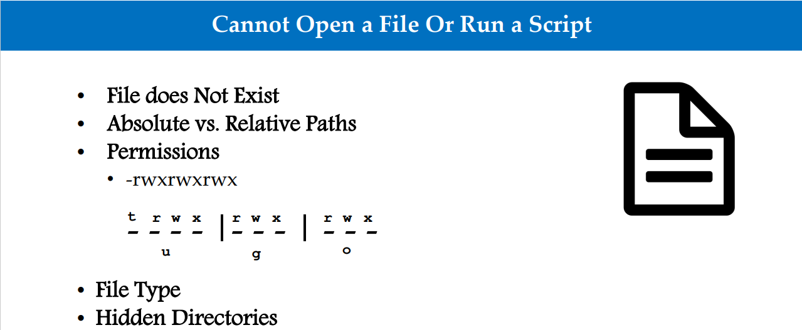

[[Catagories]] 
  

# How to troubleshoot connectivity issues with mysql database

  

~~~

  · Check if IP has been given access the specific table and database  

  · Check if the internal firewall on the server is blocking a connection

  · Check if they have valid IP address  

  · Check if they can connect using localhost or DNS - To check if they have lost access to their DNS

  · stop, start, or restart the SQL Server service as needed using

  · access log files  

  . crash dumps

~~~

# Can't SSH to server as root user

  

  

# Troubleshooting ansible playbook ssh errors

  

~~~~

  

ssh -v <host_name>

  

playbook.yml -vvv -e <var>

  

Both above give better outputs in terms of useful info

  
  
  

~~~~

## SSH Errors

~~~~

permission denied -> points to failed ssh certificate signing -> check the ssh key/token, maybe it's stale and a new one needs to be generated

  

failed to connect -> Firewall/connectivity issue -> sshd or the whole server might be down

~~~~

# Cannot CD into a Directory

  

  

# Cannot Open a File Or Run a Script

 

  

# Cannot Create Links

   

  

# Cannot Write to a File

   

  

# Cannot Change File Permissions / Ownership

   

  

# Cannot View Other Users Files

   

  

# How to Delete Old Files

  

• Delete using rm command

• Find files and then delete old files

  

Command Syntax

~~~~

• find /path/to/files/ -type f -name '*.jpg' -mtime +30 -exec rm {} \;

~~~~

  

# Explanation

  

~~~~

• First part is the path where your files are located.

  

• Second part -type is the file type f stands for files

  

• Third part -name is for using the actual file names

  

• Fourth part -mtime gets how many days the files older then will be listed. +30 is for files older then 30 days.

  

• Fifth part -exec executes a command. In this case rm is the command, {} gets the filelist and \; closes the command

~~~~

  

# Filesystem is Corrupted

  
~~~~
• Filesystem?

  

• Types of filesystem

  

• ext3, ext4, xfs, NTFS etc.

  

• Filesystem Layout and partitions

  

• /var, /etc, /root, /home etc.

  

• Checking filesystem

  

• df, fdisk –l

 ~~~~ 

# Troubleshooting Steps:

  

~~~~

• Check /var/log/messages or /var/log/syslog

  

• Run fsck on the block device (/dev/sda) NOT on mount point

  

• Unmount filesystem and run fsck

~~~~

  

# /etc/fstab Corruption

  
~~~~
• What is /etc/fstab?

  

• OS filesystem table

  

• Understanding /etc/fstab

  

• Device, mount point, filesystem type, Options, backup, filesystem check order

  

• Checking filesystem

  

• df

  

• Checking or verifying /etc/fstab

  

• cat, more, vi, vim etc.

  

• Issue – System is NOT booting

  

• Incorrect entry in /etc/fstab

  

• Accidental deletion of /etc/fstab

 ~~~~ 

# Troubleshooting Steps:

  
~~~~
• Boot in rescue mode by mounting CD / CD ISO image

  

• Chose option 1 to mount root filesystem

  

• Fix the /etc/fstab file

  

• For deleted file = run blkid

  
  
  

Memory (RAM)

• Random-access memory is a form of computer data storage that stores data

and machine code currently being used

  

• Swap (virtual memory)

  

• Memory carved out of a hard disk. It function just like RAM but it is slower

than RAM

  

• Cache

  

• This memory is typically integrated directly into the CPU chip or placed on a

separate chip that has a separate bus interconnect with the CPU. The purpose

of cache memory is to store program instructions and data that are used

repeatedly

  
~~~~

# Troubleshooting Commands:

  

~~~~

• free –m (mega bytes) or –h (human readable)

  

• top

  

• vmstat

  

• dmesg | grep –i "Out of memory“ (/var/log/messages OR /var/log/syslog)

  

• Memory commitment in configuration file /etc/sysctl.conf.

~~~~

  

# Running Out of Memory

  
  

# Troubleshooting Steps:

  

~~~~

• Identify the process causing the memory usage

  

• top, ps

  

• Kill or restart the process causing high memory utilization

  

• kill, service, systemctl

  

• Prioritize the process

  

• nice

  

• Add new swap space

  

• Create a dedicate file for swap

  

• Assign it to swap

  

• Enable swap

  

• Extend swap space

  

• Add additional memory from virtualization

  

• Add additional physical memory.

~~~~

  

# System Rebooted Or Process Restarted

  

~~~~

• System reboot/crash

  

• Memory stress

  

• CPU stress

  

• Kernel panic

  

• Hardware issue

  

• Process restart

  

• System reboot

  

• Process restarted itself (systemctl status process)

  

• Watchdog application

~~~~

  

# Troubleshooting Steps:

  

~~~~

• Login through SSH and the following commands to troubleshoot

  

• uptime, top, dmesg, iostat -xz 1, journalctl

  

• Go through the logs

  

• /var/log/messages, /var/log/syslog, /var/log/boot.log

  

• For application, check app logs

  

• Login through console (iLO, iDRAC, virtual console etc.)

  

• Reach out to the vendor (e.g. Redhat, SUSE, Oracle etc.)

  

• For hardware, check logs from the console and reach out to the vendor.

~~~~

  

# Unable to get an IP Address

  
  

# Troubleshooting Steps:

~~~~

• Check your DHCP server (Modem at home)

  

• Check network setting at virtualization level

  

• Check interface at the hardware level

  

• lspci | egrep -i 'eth|wifi|wireless'

  

• nmcli -p dev

  

• Check your interface (ifconfig or ip addr)

  

• Check whether you are connected as wireless or wired network

  

• Difference between ifup <interface> and ifconfig up <interface>

  

• Restart network service systemctl restart network

  

• For static IP verify the network configuration files

  

• /etc/sysconfig/network-scripts/ifcfg-enp0s3 or ifcfg-eth0

  

• DEVICE=eth0

  

• BOOTPROTO=none

  

• ONBOOT=yes

  

• PREFIX=24

  

• IPADDR=192.168.1.200

~~~~

  

# IP Address Assigned but not Reachable

  

# Troubleshooting Steps:

~~~~

• Check if you are on the correct network interface (ifconfig)

  

• Check to see if you got the right subnet mask or gateway

  

• Ping the gateway

  

• Check if the gateway is assigned (netstat –rnv)

  

• Check with network team if the correct vLAN is assigned on the switch side

  

• Run ethtool or mii-tool to check the NIC status

  

• Run ifup <interface> command to bring the NIC port up

  

• Restart network systemctl restart network

  

• Check on the status of NIC by running ifconfig or ip addr command

  

• Check to see if the IP is assigned to some other device (IP conflict)

  

• Turn off firewall

~~~~

  

# Having Trouble Using vi Editor

  
  

# Troubleshooting Steps:

  

~~~~

• Permissions issues

  

• Ownership

  

• File is already open for editing

  

• Arrow keys vs. hjkl (h=left, j=up, k=down, l=right)

  

• Use vim editor instead of vi.

~~~~

  

# Cannot Run Certain Commands

  
  
  

# Troubleshooting Steps:

~~~~

• Permissions and ownership issues

  

• Relative path vs. Absolute path

  

• Command paths not defined (echo $PATH)

  

• Command packages missing or not installed

  

yum provides pwd

yum search telnet

  

• Command library missing or deleted (whereis).

  

~~~~

  

# Cannot Change Password

  

~~~~

• Two important files for password

(/etc/passwd and /etc/shadow)

  

• Issues:

  

• User is added manually in /etc/passwd file and /etc/shadow

file has no information (passwd user)

  

• /etc/shadow file is corrupted

  

• /etc/shadow file is missing (pwconv will recreate the file)

~~~~

  

# Troubleshooting Steps:

  

~~~~

• Correct user

  

• Provide current password first before entering new password

  

• You have to be root to set other user passwords

  

• Make sure to specify the user after passwd command

  

• Make sure to run pwconv after creating a user in /etc/passwd file

  

• Fix the /etc/shadow file

  

• Run the pwconv command to recreate the /etc/shadow file. (Remember you will have to setup passwords for each user again)

~~~~

  

# User Has No Home Directory

  

• What is home directory?

  

• Issues:

• No home directory when user login

  

# Troubleshooting Steps:

  

~~~~

• Directory does not exist

  

• Directory permissions and ownership

  

• Directory name should match with directory listed in /etc/passwd

~~~~

  

# How to Change Every Instance of a Word in a File

  
  

# Troubleshooting Steps:

  

~~~~

• Manually change every word

  

• vi the file and use :s = for substitution (:1,$s/string/replacingstring/)

  

• Use the sed command (sed 's/string/newstring/g‘)

~~~~

  

# How to Use sed Command

  
  

# Replace a string in a file with a newstring

~~~~

sed 's/string/newstring/g'

~~~~

  

# Replace a string in a file and save it

  

~~~~

sed –i ‘s/string/newstring/g’ filename

~~~~

  

# Remove the first line in a file

  

~~~~

sed ‘1d’ file.out

~~~~

  

# Replace a string during vi :

  

~~~~

1,$s/string/replacingstring/

~~~~

  

# Remove spaces

  

~~~~

sed -i 's/ //g' file.txt

~~~~

  

# Add TAB instead of space

  

~~~~

sed -i 's/ /{--TAB--]/g' file.txt

  

In place of --TAB-- , give CTRL + V

followed by TAB

~~~~

  

# Add a line before the 4th line of the line

  

~~~~

sed ‘4 i\ newstring’ filename

~~~~

  

# Insert a line before matching word

  

~~~~

sed ‘/string/i \newstring’ filename

~~~~

  

# How to Kill a Process, User or Terminal

  
  

# Troubleshooting Steps:

  

~~~~

• Find the process ID (ps –ef)

  

• Run kill PID

  

• Run kill -9 PID

  

• Run pkill ProcessName

  

• Run killall

~~~~

  
  

# System is Running Slow

  

• Understanding the problem

• Processing

• Disk writing

• Networking (file transfer etc.)

• Hardware

  

# Troubleshooting Steps:

  

~~~~

• Check if the right system is reported or you are on the right system

  

• Check disk space (df –h, du)

  

• Check processing (top, free, lsmem, /proc/meminfo, vmstat, pmap <PID>, dmidecode, lscpu or /proc/cpuinf)

  

• Check disk issues (iostat –y 5, lsof)

  

• Check networking (tcpdump –i enps03, lsof -i -P -n | grep -i listen, netstat –plnt or ss –plnt, iftop)

  

  yum install epel-release

  

• Check system uptime (uptime) # yum install iftop

  

• Check logs

  

• Check hardware status by logging into system console

  

• Other tools (htop, iotop, iptraf, psacct)

~~~~

  

# Rollback Updates and Patches

  

~~~~

• Virtual machine

  

• Physical machine

  

• Rollback a package or patch

  

• yum install <package-name>

  

• yum history undo <id>

  

• Rollback an update

  

• Downgrading a system to minor version (ex: RHEL7.1 to RHEL7.0) is not recommended as this might leave the system in undesired or unstable state

  

• yum update= Update will preserve them

  

• yum upgrade = Upgrade will delete obsolete packages

  

• yum history undo <id>

~~~~

  
  
  
  

## Debugging:

  

~~~~

bash -v hello1.sh  

~~~~

  

# Server is not reachable

   

  

# Firewall Issue

   

# Cannot connect to a website or service hosted on server

   

  

  

# Can't ssh to an app Server:  

  

~~~~  

- Ping IP from localhost  

  

- Attempt to ssh from localhost  

- Ping IP from another node in the same/another domain  

  

- Attempt to ssh from that node to node in question  

~~~~

~~~~

If the previous 2 fail attempt to log into the server directly e.g. via ILO if it's a physical server like HP-UX series , or directly from Vsphere if a virtual server. If that issue fails, then it's need to be escalated to the infrastructure team/on site team of engineers to diagnose the issue further.  

~~~~

  

# Tip for diagnosing the issue:  

  

~~~~

Notify all the engineers and teams who have been working on the server and check if any of the changes they made could have caused the server's sshd capabilities to stop functioning. E.g. If a certain config file was edited, then revert the changes made to it and test and so forth  

~~~~

# Slowness on Server:

  

Check CPU, RAM, & Swap usage using top command  

  

~~~~

Based on the results the best option is to identify and kill PIDS that is causing the issue and if that is not resolution reboot the node and free up swap space as it doesn't get released after RAM usage goes down

~~~~

  

# Troubleshooting Jenkins Build failures in pipeline

  

~~~~

 After locating the failed build do the following:

  

 Check the last build failure via the dashboard

  

 Check for any errors in the console output that might provide any further information via ctrl + f and search failed

  

 Check for recent bitbucket commits that were added prior to the build failure in outputs

  

 Search for commit in bitbucket and click on blame to find who made the commit, ask them in the change they made is correct

  

~~~~

  
  

# To learn what a new or running process is doing

  

# Troubleshooting with strace

  

One of options of the strace utility is to help as a troubleshooting utility. If you want to know what a process is doing, or why it hangs, strace will definitely help. By running strace without any parameters, it will already show why a process is doing. You can trace a running process, or instruct strace to start it for you.

   

  

# Monitoring file activity

  

Strace can monitor file related activity. There are two useful parts. The first is file, which shows file interactions. The other one allows tracing file descriptors. Both can be used to monitor for actions like opening files, reading/writing and closing. Usually using “trace=file” provides enough insights. If you really need more insights in the way a program deals with file descriptors, then use the second one.

  

# Monitor opening of files: strace -e open

  
  

# See all file activity:

  

~~~~

strace -e trace=file -p 1234  or

~~~~

  

~~~~

strace -e trace=desc -p 1234

~~~~

  

If you want to track specific paths, use 1 or more times the -P parameter, following by the path.

  

~~~~

sudo strace -P /etc/cups -p 2261

~~~~

  
  

~~~~

Process 2261 attached

— SIGHUP {si_signo=SIGHUP, si_code=SI_USER, si_pid=6149, si_uid=0} —

lstat(“/etc/cups”, {st_mode=S_IFDIR|0755, st_size=4096, …}) = 0

openat(AT_FDCWD, “/etc/cups”, O_RDONLY|O_NONBLOCK|O_DIRECTORY|O_CLOEXEC) = 7

getdents(7, /* 11 entries */, 32768) = 336

getdents(7, /* 0 entries */, 32768) = 0

close(7) = 0

openat(AT_FDCWD, “/etc/cups”, O_RDONLY|O_NONBLOCK|O_DIRECTORY|O_CLOEXEC) = 7

getdents(7, /* 11 entries */, 32768) = 336

getdents(7, /* 0 entries */, 32768) = 0

close(7) = 0

~~~~

  

# Common calls:

  

~~~~

access

  

close (close file handle)

  

fchmod (change file permissions)

  

fchown (change file ownership)

  

fstat (retrieve details)

  

lseek (move through file)

  

open (open file for reading/writing)

  

read (read a piece of data)

  

statfs (retrieve file system related details)

~~~~

  

# A related example screen output:

  
   

screenshot of strace monitoring file access and activity

  
  

# Monitoring file access and activity with strace

  

# Monitoring the network

  

Strace definitely can be useful for revealing more details about network traffic. Very useful to determine what network related connections are used, like when building your Docker image.

  

~~~~

strace -e trace=network

~~~~

  
  

# Common syscalls:

  

~~~~

bind – link the process to a network port

  

listen – allow to receive incoming connections

  

socket – open a local or network socket

  

setsockopt – define options for an active socket

~~~~

  

# Monitoring memory calls

  

~~~~

To get better insights on the memory usage and system calls, strace can monitor for these as well. They are nicely grouped in the memory group.
~~~~

~~~~
strace -e trace=memory

~~~~

  
  

# Common syscalls:

  
~~~~
mmap

munmap
~~~~
  

# Strace Cheat Sheet – Overview

  
  

# Useful options and examples

  

~~~~

-c – See what time is spend and where (combine with -S for sorting)

  

-f – Track process including forked child processes

  

-o my-process-trace.txt – Log strace output to a file

  

-p 1234 – Track a process by PID

  

-P /tmp – Track a process when interacting with a path

  

-T – Display syscall duration in the output

~~~~

  

# Track by specific system call group

  

~~~~

  

-e trace=ipc – Track communication between processes (IPC)

  

-e trace=memory – Track memory syscalls

  

-e trace=network – Track memory syscalls

  

-e trace=process – Track process calls (like fork, exec)

  

-e trace=signal – Track process signal handling (like HUP, exit)

  

-e trace=file – Track file related syscalls

~~~~

## Trace multiple syscalls
 ~~~~ 

strace -e open,close

~~~~  
  
[[Catagories]] 
