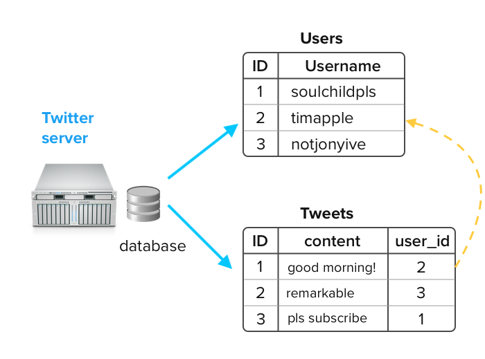
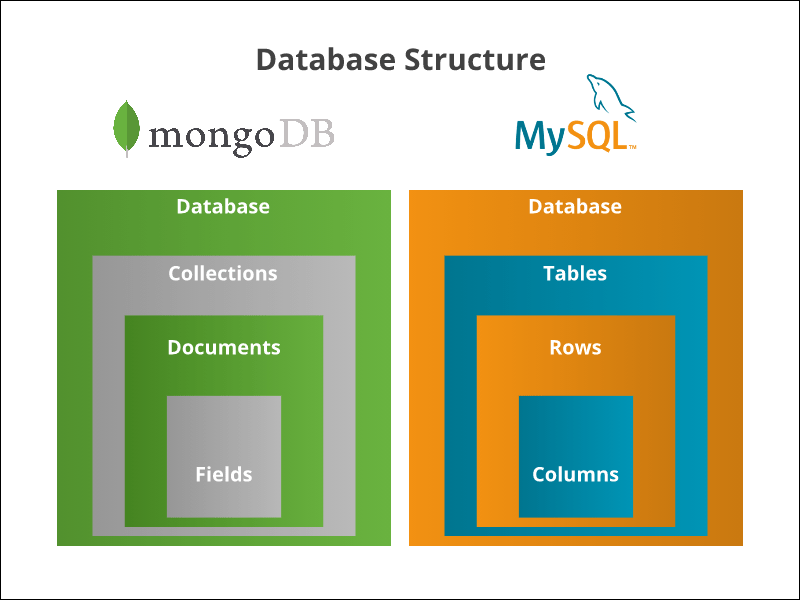

Obtained from https://devhints.io/mysql

 [[Catagories]] 

# Mysql DB Structure

  

    

# Access Monitor

  

~~~~

mysql -u [username] -p;

~~~~

  

# Access Database

~~~~

mysql -u [username] -p [database];

~~~~

  

# Browsing (Show Databases)

  

~~~~

SHOW DATABASES;

SHOW TABLES;

SHOW FIELDS FROM table / DESCRIBE table;

SHOW CREATE TABLE table;

SHOW PROCESSLIST;

KILL process_number;

~~~~

  

# Show Columns from table

  

~~~~

describe db_mgnt;

~~~~

  

# Create new databases

  

~~~~

CREATE DATABASE DatabaseName;

CREATE DATABASE DatabaseName CHARACTER SET utf8;

USE DatabaseName;

DROP DATABASE DatabaseName;

ALTER DATABASE DatabaseName CHARACTER SET utf8;

~~~~

  

# Select Database

  

~~~~

SELECT * FROM table;

  

SELECT * FROM table1, table2;

  

SELECT field1, field2 FROM table1, table2;

  

SELECT ... FROM ... WHERE condition;

  

SELECT ... FROM ... WHERE condition GROUPBY field;

  

SELECT ... FROM ... WHERE condition GROUPBY field HAVING condition2;

  

SELECT ... FROM ... WHERE condition ORDER BY field1, field2;

  

SELECT ... FROM ... WHERE condition ORDER BY field1, field2 DESC;

  

SELECT ... FROM ... WHERE condition LIMIT 10;

  

SELECT DISTINCT field1 FROM …;

  

SELECT DISTINCT field1, field2 FROM …;

  

From <https://devhints.io/mysql>

  
  

~~~~

  
  

# Determine what database is in use

  
  

~~~~

select database();

~~~~

  

# Show all tables

  

~~~~

  

show tables;

  

~~~~

  

# Show table structure

  

~~~~

describe [table];

~~~~

  

# List all indexes on a table

  

~~~~

show index from [table];

~~~~

  

# Create new table with columns

  

~~~~

CREATE TABLE [table] ([column] VARCHAR(120), [another-column] DATETIME)

~~~~

  

# Adding a column

  

~~~~

ALTER TABLE [table] ADD COLUMN [column] VARCHAR(120);

~~~~

  

# Adding a column with an unique auto-incrementing ID:

  

~~~~

ALTER TABLE [table] ADD COLUMN [column] int NOT NULL AUTO_INCREMENT PRIMARY KEY;

~~~~

  

# Inserting a record

  

~~~~

INSERT INTO [table] ([column], [column]) VALUES ('[value]', '[value]');

~~~~

  

# Selecting Records

  

~~~~

    SELECT * FROM table;

    SELECT * FROM table1, table2;

    SELECT field1, field2 FROM table1, table2;

    SELECT ... FROM ... WHERE condition;

    SELECT ... FROM ... WHERE condition GROUPBY field;

    SELECT ... FROM ... WHERE condition GROUPBY field HAVING condition2;

    SELECT ... FROM ... WHERE condition ORDER BY field1, field2;

    SELECT ... FROM ... WHERE condition ORDER BY field1, field2 DESC;

    SELECT ... FROM ... WHERE condition LIMIT 10;

    SELECT DISTINCT field1 FROM …;

    SELECT DISTINCT field1, field2 FROM …;

  

~~~~

  

# MySQL for datetime

  

~~~~

NOW()

~~~~

  

# Explain Records

  

~~~~

EXPLAIN SELECT * FROM [table];

~~~~

  

# Selecting parts of record

  

~~~~

SELECT [column], [another-column] FROM [table];

~~~~

  

# Counting Records

  

~~~~

SELECT COUNT([column]) FROM [table];

~~~~

  

# Counting and selecting grouped Records

  

~~~~

SELECT *, (SELECT COUNT([column]) FROM [table]) AS count FROM [table] GROUP BY [column];

~~~~

  

# Select from table

  

~~~~

SELECT * FROM table;

SELECT * FROM table1, table2;

SELECT field1, field2 FROM table1, table2;

SELECT ... FROM ... WHERE condition

SELECT ... FROM ... WHERE condition GROUPBY field;

SELECT ... FROM ... WHERE condition GROUPBY field HAVING condition2;

SELECT ... FROM ... WHERE condition ORDER BY field1, field2;

SELECT ... FROM ... WHERE condition ORDER BY field1, field2 DESC;

SELECT ... FROM ... WHERE condition LIMIT 10;

SELECT DISTINCT field1 FROM ...

SELECT DISTINCT field1, field2 FROM ...

  

~~~~

  

# Select specific Records

  

~~~~

SELECT * FROM [table] WHERE [column] = [value]; (Selectors: <, >, !=; combine multiple selectors with AND, OR)

~~~~

  

# Select records containing [value]

  

~~~~

SELECT * FROM [table] WHERE [column] LIKE '%[value]%';

~~~~

  

# Select records starting with [value]

  

~~~~

SELECT * FROM [table] WHERE [column] LIKE '[value]%';

~~~~

  

# Select records starting with

  

~~~~

SELECT * FROM [table] WHERE [column] LIKE '[value]';

~~~~

  

# Select a range

  

~~~~

SELECT * FROM [table] WHERE [column] BETWEEN [value1] and [value2];

~~~~

  

# Select with custom order and only limit

  

~~~~

SELECT * FROM [table] WHERE [column] ORDER BY [column] ASC LIMIT [value]; (Order: DESC, ASC)

~~~~

  

# Updating records

  

~~~~

UPDATE [table] SET [column] = '[updated-value]' WHERE [column] = [value]

~~~~

  

# Deleting records

  

~~~~

DELETE FROM [table] WHERE [column] = [value];

~~~~

  

# Delete all records from a table (without dropping the table itself):

  

~~~~

DELETE FROM [table]; (This also resets the incrementing counter for auto generated columns like an id column.)

~~~~

  

# Delete all records in a table

  

~~~~

truncate table [table];

~~~~

  

# Removing table columns

  

~~~~

ALTER TABLE [table] DROP COLUMN [column];

~~~~

  

# Deleting tables

  

~~~~

DROP TABLE table;

DROP TABLE IF EXISTS table;

DROP TABLE table1, table2, ...

~~~~

  

# Delete again

  

~~~~

DELETE FROM table1 / TRUNCATE table1

DELETE FROM table1 WHERE condition

DELETE FROM table1, table2 FROM table1, table2 WHERE table1.id1 =

  table2.id2 AND condition

  

~~~~

  

# Deleting databases

  

~~~~

DROP DATABASE [database];

~~~~

  

# Custom column output names

  

~~~~

SELECT [column] AS [custom-column] FROM [table];

~~~~

  

# Export a database dump

  

~~~~

mysqldump -u [username] -p [database] > db_backup.sql

~~~~

  

# Import a Database Dump

  

~~~~

mysql - u Username -p dbNameYouWant < databasename_backup.sql;

~~~~

  

# Import a database dump (more info here)

  

~~~~

mysql -u [username] -p -h localhost [database] < db_backup.sql

~~~~

  

# Logout

  

~~~~

exit;

~~~~

  

# Select-join

  

~~~~

SELECT ... FROM t1 JOIN t2 ON t1.id1 = t2.id2 WHERE condition;

SELECT ... FROM t1 LEFT JOIN t2 ON t1.id1 = t2.id2 WHERE condition;

SELECT ... FROM t1 JOIN (t2 JOIN t3 ON ...) ON ...

~~~~

  

# Conditions

  

~~~~

field1 = value1

field1 <> value1

field1 LIKE 'value _ %'

field1 IS NULL

field1 IS NOT NULL

field1 IS IN (value1, value2)

field1 IS NOT IN (value1, value2)

condition1 AND condition2

condition1 OR condition2

~~~~

  

# User & Privileges

  

~~~~

CREATE USER 'user'@'localhost';

  

GRANT ALL PRIVILEGES ON base.* TO 'user'@'localhost' IDENTIFIED BY 'password';

  

GRANT SELECT, INSERT, DELETE ON base.* TO 'user'@'localhost' IDENTIFIED BY 'password';

  

REVOKE ALL PRIVILEGES ON base.* FROM 'user'@'host'; -- one permission only

  

REVOKE ALL PRIVILEGES, GRANT OPTION FROM 'user'@'host'; -- all permissions

  

FLUSH PRIVILEGES;

  

SET PASSWORD = PASSWORD('new_pass');

  

SET PASSWORD FOR 'user'@'host' = PASSWORD('new_pass');

  

SET PASSWORD = OLD_PASSWORD('new_pass');

DROP USER 'user'@'host';

  

~~~~

  

# Repair tables after unclean shutdown

  

~~~~

mysqlcheck --all-databases;

mysqlcheck --all-databases --fast;

~~~~

  

# Insert

  

~~~~

INSERT INTO table1 (field1, field2) VALUES (value1, value2);

~~~~

  

# Update

  

~~~~

    UPDATE table1 SET field1=new_value1 WHERE condition;

  

    UPDATE table1, table2 SET field1=new_value1, field2=new_value2, ... WHERE

  table1.id1 = table2.id2 AND condition;

~~~~

  

# Keys

  

~~~~

CREATE TABLE table (..., PRIMARY KEY (field1, field2))

  

CREATE TABLE table (..., FOREIGN KEY (field1, field2) REFERENCES table2

(t2_field1, t2_field2))

  

  

~~~~

  

# Create & Modify Table

  

~~~~

    • CREATE TABLE table (field1 type1, field2 type2);

  

    • CREATE TABLE table (field1 type1, field2 type2, INDEX (field));

  

    • CREATE TABLE table (field1 type1, field2 type2, PRIMARY KEY (field1));

  

    • CREATE TABLE table (field1 type1, field2 type2, PRIMARY KEY (field1,field2));

  
  

    • CREATE TABLE table1 (fk_field1 type1, field2 type2, ...,

  FOREIGN KEY (fk_field1) REFERENCES table2 (t2_fieldA))

    [ON UPDATE|ON DELETE] [CASCADE|SET NULL]

    • CREATE TABLE table1 (fk_field1 type1, fk_field2 type2, ...,

 FOREIGN KEY (fk_field1, fk_field2) REFERENCES table2 (t2_fieldA, t2_fieldB))

    CREATE TABLE table IF NOT EXISTS;

    CREATE TEMPORARY TABLE table;

    CREATE TABLE table IF NOT EXISTS;

    CREATE TEMPORARY TABLE table;

  

~~~~

  

# Alter Table

  

~~~~

  

ALTER TABLE table MODIFY field1 type1

ALTER TABLE table MODIFY field1 type1 NOT NULL ...

ALTER TABLE table CHANGE old_name_field1 new_name_field1 type1

ALTER TABLE table CHANGE old_name_field1 new_name_field1 type1 NOT NULL ...

ALTER TABLE table ALTER field1 SET DEFAULT ...

ALTER TABLE table ALTER field1 DROP DEFAULT

ALTER TABLE table ADD new_name_field1 type1

ALTER TABLE table ADD new_name_field1 type1 FIRST

ALTER TABLE table ADD new_name_field1 type1 AFTER another_field

ALTER TABLE table DROP field1

ALTER TABLE table ADD INDEX (field);

  
  
  
  

ALTER TABLE table MODIFY field1 type1 FIRST

ALTER TABLE table MODIFY field1 type1 AFTER another_field

ALTER TABLE table CHANGE old_name_field1 new_name_field1 type1 FIRST

ALTER TABLE table CHANGE old_name_field1 new_name_field1 type1 AFTER

  another_field

  

~~~~

  

# Data Main Types

  

~~~~

TINYINT (1o: -217+128)

SMALLINT (2o: +-65 000)

MEDIUMINT (3o: +-16 000 000)

INT (4o: +- 2 000 000 000)

BIGINT (8o: +-9.10^18)

Precise interval: -(2^(8*N-1)) -> (2^8*N)-1

⚠ INT(2) = “2 digits displayed” – NOT “number with 2 digits max”

FLOAT(M,D)

DOUBLE(M,D)

FLOAT(D=0->53)

⚠ 8,3 -> 12345,678 – NOT 12345678,123!

TIME (HH:MM)

YEAR (AAAA)

DATE (AAAA-MM-JJ)

DATETIME (AAAA-MM-JJ HH:MM; années 1000->9999)

TIMESTAMP (like DATETIME, but 1970->2038, compatible with Unix)

VARCHAR (single-line; explicit size)

TEXT (multi-lines; max size=65535)

BLOB (binary; max size=65535)

Variants for TEXT&BLOB: TINY (max=255), MEDIUM (max=~16000), and LONG (max=4Go). Ex: VARCHAR(32), TINYTEXT, LONGBLOB, MEDIUMTEXT

ENUM ('value1', 'value2', ...) -- (default NULL, or '' if NOT NULL)

  

~~~~

  

# Reset Root Password

  

~~~~

$ /etc/init.d/mysql stop

$ mysqld_safe --skip-grant-tables

$ mysql # on another terminal

mysql> UPDATE mysql.user SET password=PASSWORD('new_pass') WHERE user='root';

## Switch back to the mysqld_safe terminal and kill the process using Control + \

$ /etc/init.d/mysql start

~~~~

  

# Login

  

~~~~

mysql -u root -h 127.0.0.1 -p

~~~~

  

# Check version of Mysql

  

~~~~

mysql -u root -p -h* -P 3306 -e "select @@version;"

~~~~

  
# MySQL DB backup & Restore

~~~~

  A simple and easy method for creating MySQL backups is to use the mysqldump command. This command will create a simple .sql file of an existing database, which can then be restored to any other empty MySQL database. This article will work for any Linux distribution running MySQL.

~~~~

1. Back up the database using the following command:

~~~~  

mysqldump -u [username] –p[password] [database_name] > [dump_file.sql]

 

The parameters of the said command as follows:

[username] - A valid MySQL username.

[password] - A valid MySQL password for the user.

[database_name] - A valid Database name you want to take backup.

[dump_file.sql] - The name of backup dump file you want to generate.
~~~~

2. Restore the backup to a local database server - the mysql command will let you take the contents of a .sql file backup, and restore it directly to a database. This is the syntax for the command:

  
~~~~
mysql -u [username] –p[password] [database_name] < [dump_file.sql]

~~~~

3. Restore the backup to a remote database server - you can also use the mysql command to restore a .sql file backup to a remote MySQL server. If you have another server running MySQL, and you have the database credentials, you can define a hostname in the command by adding the -h flag to specify a hostname. This changes the syntax of the command to:

  
~~~~
 mysql –h [hostname] –u [username] –p[password] [database_name] < [dump_file.sql]

~~~~  

As long as you have the correct credentials and the remote server is running, you will be able to restore the database remotely.

  

